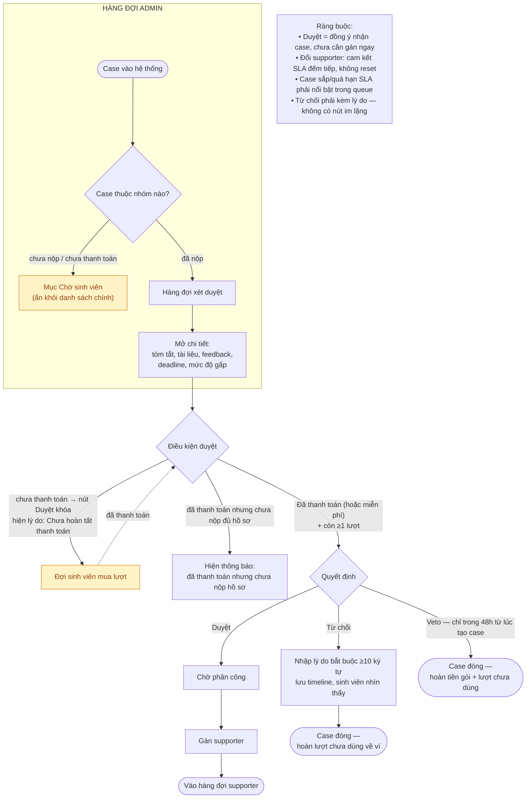

# Flow admin triage and assignment

- PRD reference: [`../prd/core-product-prd.md`](../prd/core-product-prd.md)
- Related requirement: [`../requirements/admin-triage-and-assignment.md`](../requirements/admin-triage-and-assignment.md)
- Trạng thái: đang làm việc

## Mục tiêu

Đảm bảo mỗi case mới được nhận, từ chối, hoặc giao đúng người xử lý thay vì trôi nổi không owner.

## Luồng chính

1. User submit case.
2. Case vào `Admin triage queue`.
3. Admin mở case detail.
4. Admin xem summary, tài liệu, feedback, deadline, urgency.
5. Admin quyết định một trong ba action:
   - `Accept case`
   - `Reject case`
   - `Assign supporter`
6. Nếu admin accept nhưng chưa assign ngay, case ở trạng thái `accepted_unassigned`.
7. Khi assign supporter, case chuyển sang `assigned` và xuất hiện trong queue của supporter.

## Sơ đồ luồng

## Tiêu chí triage tối thiểu

- Có đủ thông tin để hiểu case đang kẹt ở đâu chưa.
- Có đủ tài liệu hoặc link tài liệu để supporter bắt đầu chưa.
- Deadline có quá sát đến mức cần ưu tiên cao không.
- Case có phù hợp phạm vi hỗ trợ hiện tại không.

## Luồng ngoại lệ

- Nếu thiếu dữ liệu quan trọng: admin duyệt rồi để supporter yêu cầu bổ sung (T8), hoặc reject với lý do rõ.
- Nếu case ngoài phạm vi hoặc không nên nhận: admin chọn `Reject case` với lý do rõ.
- Nếu chưa có supporter phù hợp: case ở `accepted_unassigned` cho đến khi được giao.

## Quy tắc UX nội bộ

- Queue phải scan nhanh được mức độ gấp và độ đủ của case.
- Admin không phải mở quá nhiều màn chỉ để quyết định accept/reject/assign.
- Lý do reject (≥ 10 ký tự) phải lưu trong timeline.

## Thiếu / chưa rõ

- Chưa khóa danh mục lý do reject.
- Chưa khóa rule auto-priority từ deadline/urgency.

