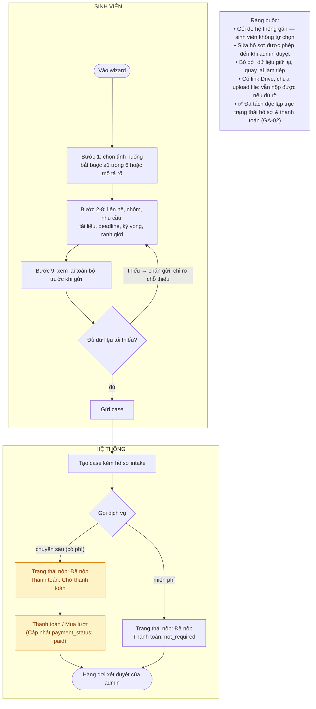

# Flow intake

- PRD reference: [`../prd/core-product-prd.md`](../prd/core-product-prd.md)
- Related requirement: [`../requirements/structured-intake.md`](../requirements/structured-intake.md)
- Trạng thái: đang làm việc

## Mục tiêu

Giúp khách mô tả đúng case để Nexus có đủ bối cảnh audit, không biến bước tạo case thành form hành chính dài dòng.

## Quyết định UX phase 1

- Không làm chat realtime tự do.
- Dùng `guided wizard` với copy thân thiện.
- Sidebar hiển thị tiến độ bước; main panel hiển thị một cụm field ngắn mỗi lần.
- Wizard kết thúc bằng `submit case`, không hứa report ngay lập tức.
- Phase 1 hỗ trợ cả file upload và Drive link.

## Luồng chính

1. User vào landing và bấm CTA bắt đầu.
2. Nếu chưa đăng nhập, hệ thống chuyển sang `Đăng ký / Đăng nhập`.
3. Sau khi vào hệ thống, user được đưa đến `Create new case wizard`.
4. Hệ thống giải thích ngắn Nexus sẽ giúp gì và không làm gì.
5. User chọn tình huống hiện tại.
6. User đi qua các bước nhập thông tin, nhóm, idea, tài liệu, deadline, và kỳ vọng.
7. User xem màn `Review before submit`.
8. User bấm `Gửi case`.
9. Hệ thống tạo case: gói trả phí → trạng thái `Chờ thanh toán`; gói miễn phí → `Đã nộp` và vào thẳng hàng đợi xét duyệt.

## Sơ đồ luồng

> ✅ **Đã khắc phục (GA-02):** Trạng thái hồ sơ (`user_facing_stage`) và trạng thái thanh toán (`payment_status`) đã được tách độc lập hoàn toàn theo `decision-2026-08-25-intake-payment-stage-separation.md`. Việc thanh toán/mua lượt chỉ cập nhật `payment_status` và số dư credit, không làm thay đổi trạng thái nộp hồ sơ, loại bỏ dứt điểm lỗi kẹt hồ sơ intake.
## Tình huống đầu vào chính

- Chưa có idea và cần tìm hướng.
- Có nhiều idea và cần chọn một hướng.
- Có một idea và muốn kiểm tra nó có rõ, thực tế, khả thi không.
- Đã có tài liệu và muốn audit trước khi nộp.
- Đã nhận feedback và cần hiểu nên sửa gì trước.
- Đang gấp hoặc đã fail và cần hỗ trợ sát deadline.

## Cấu trúc màn hình wizard

### Layout chuẩn

- Sidebar trái:
  - danh sách bước
  - step hiện tại
  - trạng thái `chưa làm / đang làm / hoàn tất`
  - nút `Lưu nháp`
- Main panel:
  - tiêu đề bước
  - mô tả ngắn
  - 1-4 field liên quan
  - ví dụ hoặc helper text
- Footer sticky:
  - `Quay lại`
  - `Tiếp tục`
  - `Lưu nháp`
  - bước cuối: `Gửi case`

### Bước 1: Tình huống hiện tại

- 6 cards chọn tình huống chính
- optional text `Mô tả ngắn case của bạn`

### Bước 2: Người liên hệ

- Họ tên
- MSSV
- Vai trò trong nhóm
- Zalo
- Email
- Telegram nếu có

### Bước 3: Nhóm và dự án hiện tại

- Số thứ tự nhóm
- Tên dự án hiện tại nếu có
- Mô tả ngắn năng lực nhóm hoặc trạng thái nhóm

### Bước 4: Nexus cần hỗ trợ việc gì ngay bây giờ

- Chọn nhu cầu hỗ trợ chính
- Mô tả thêm nếu case đặc biệt

### Bước 5: Tài liệu đầu vào

- Upload file hoặc dán link folder Drive
- Chọn loại tài liệu cho từng file/link
- Mô tả ngắn vai trò của tài liệu

### Bước 6: Feedback và deadline

- Feedback giảng viên nếu có
- Deadline gần nhất
- Mức độ gấp

### Bước 7: Kỳ vọng đầu ra

- Team mong nhận được gì sau khi dùng Nexus
- Có cần review lại sau khi sửa không

### Bước 8: Xác nhận ranh giới

- Checkbox xác nhận Nexus không làm bài thay, không chọn idea thay, không cam kết điểm số

### Bước 9: Review before submit

- Tóm tắt toàn bộ thông tin đã điền
- Danh sách tài liệu đã đính kèm
- Phần còn thiếu nếu có

## Dữ liệu tối thiểu để submit case

- thông tin người liên hệ
- vai trò trong nhóm
- ít nhất một tình huống hoặc nhu cầu hỗ trợ rõ ràng
- ít nhất một mô tả idea/tài liệu/vấn đề cần audit
- deadline nếu có
- xác nhận ranh giới hỗ trợ

## Luồng ngoại lệ

- Intake bỏ dở: cho phép quay lại và giữ dữ liệu hợp lý.
- Thiếu dữ liệu cốt lõi: không cho submit case, chỉ rõ phần còn thiếu.
- User có link Drive nhưng chưa upload file trực tiếp: vẫn cho submit nếu link đủ rõ.
- User trả lời quá chung: hệ thống yêu cầu làm rõ trước khi cho qua bước.

## Quy tắc UX

- Mỗi bước phải phục vụ mục tiêu `Nexus hiểu đúng case để audit đúng vấn đề`.
- Không dùng ngôn ngữ kỹ thuật nội bộ như `artifact`, `version`, `assessment` ở wizard.
- CTA cuối phải là `Gửi case`, không phải `Tạo hồ sơ` hay `Hoàn tất biểu mẫu`.

## Thiếu / chưa rõ

- Chưa khóa bộ field mandatory chi tiết cho từng tình huống.
- Locked for phase 1: hỗ trợ cả upload file trực tiếp và Drive link.
