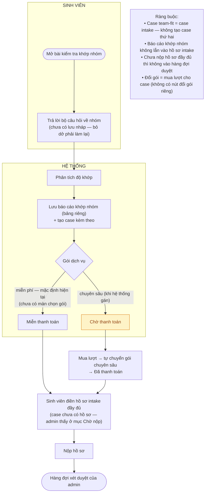

# Flow team-fit (kiểm tra khớp nhóm)

- PRD reference: [`../prd/core-product-prd.md`](../prd/core-product-prd.md)
- Trạng thái: đang làm việc

## Mục tiêu

Sinh viên trả lời bộ câu hỏi về nhóm, hệ thống đánh giá độ khớp của nhóm với dự án và tạo một case kèm báo cáo — case này chính là case tiếp tục luồng intake, không phải case vứt đi.

## Quan hệ với intake

- Lưu báo cáo team-fit xong, hệ thống tạo luôn một case cho nhóm và dẫn sinh viên vào trang case đó.
- Case từ team-fit **chưa có hồ sơ intake đầy đủ** — sinh viên tiếp tục điền hồ sơ rồi nộp như luồng intake thường.
- Gói dịch vụ: mặc định gói miễn phí; nếu nhóm chọn gói chuyên sâu thì case cần thanh toán trước khi duyệt.

## Sơ đồ luồng

## Báo cáo 3 phần (từ bản nâng cấp đơn giản)

- **Phần A — Đã kiểm tra (máy đếm):** số ngành đào tạo khác nhau (tối thiểu 2), mảng Kỹ thuật / Marketing / Kinh doanh – Tài chính mỗi mảng mấy người, mấy người có ghi kinh nghiệm, ô nào còn trống. Muốn đếm được nên mỗi thành viên phải chọn mảng nghề lúc nhập.
- **Phần B — AI nhận định:** kết luận sơ bộ (Sẵn sàng đi tiếp / Cần cân nhắc) + các mảng ổn/yếu kèm lý do và dẫn chứng trích câu nhóm viết + vai trò lĩnh vực còn thiếu + câu hỏi hội đồng có thể hỏi.
- **Phần C — Những câu chưa trả lời được:** 4 câu cố định (khả thi giải pháp, mô hình kinh doanh, khách hàng thật, kỹ thuật làm được) kèm thứ nhóm cần nộp. Luôn hiện kể cả khi AI lỗi.
- Giới hạn: mỗi tài khoản 10 lượt kiểm tra / 10 phút; quá thì báo rõ bằng tiếng Việt.
- File `team_fit_report.md` giao cho buổi audit chỉ còn ý tưởng + đội ngũ — không còn kết quả AI bản free, người chấm đọc với đầu óc trắng.

## Luồng ngoại lệ

- **Nhóm bỏ dở giữa chừng**: báo cáo chưa lưu — nhóm trả lời lại từ đầu (chưa có lưu nháp).
- **Đổi gói sau khi lưu**: sinh viên mua lượt đánh giá cho case — hệ thống tự chuyển gói sang chuyên sâu rồi đánh dấu thanh toán.
- **Case team-fit chưa nộp hồ sơ**: admin thấy case ở mục "Chờ sinh viên nộp hồ sơ", không lẫn vào hàng đợi duyệt.
- **AI lỗi**: vẫn trả Phần A + Phần C, báo rõ "AI chưa đưa ra nhận định".
