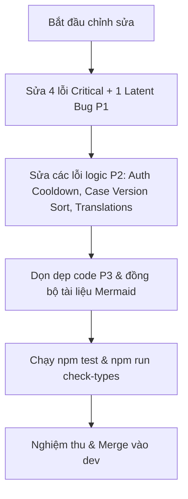

# Báo cáo Đánh giá Mã nguồn (Code Review) — feat/gap-analysis-tasks

- **Ngày:** 2026-08-27
- **Nhánh so sánh:** `feat/gap-analysis-tasks` (so với `dev`)
- **Quy mô thay đổi:** 139 files (`+7,925 / -687` lines)
- **Đánh giá tổng thể:** ⚠️ **REQUEST CHANGES (Yêu cầu chỉnh sửa trước khi merge)**
- **Mục tiêu nhánh:** Khắc phục 22 nhiệm vụ Gap Analysis (GA-01 đến GA-22), sửa dứt điểm bug kẹt hồ sơ intake (GA-02), tích hợp xác thực Email OTP & rolling session (GA-01, GA-07), ví VND & idempotency key nạp tiền, admin triage & CSV export, cùng bộ quy trình chuẩn BPMN 2.0 / DMN 1.3 Camunda 8.

---

## 1. Tóm tắt Đánh giá & Kiến trúc

Nhánh `feat/gap-analysis-tasks` triển khai khối lượng công việc lớn với chất lượng kiến trúc nhìn chung rất cao:
1. **Tách trục Trạng thái Hồ sơ & Thanh toán (GA-02):** Sửa dứt điểm tình trạng hồ sơ trả phí bị kẹt ở `intake_ready` khi thanh toán trước khi nộp. Loại bỏ việc ghi đè trực tiếp `user_facing_stage` trong `create-order` và `verifyPayment`.
2. **Fail-Closed Case State Machine:** Guard `hasPaymentComplete` và `T5_ACCEPT` kiểm tra trạng thái thanh toán bắt buộc phải là `paid` hoặc `not_required` (`COMPLETE_PAYMENT_STATUSES` trong `case.types.ts` và `lib/pricing.ts`).
3. **Xác thực Email OTP & Đặt lại mật khẩu (GA-01, GA-07):** Chuyển đổi toàn diện sang Better Auth `emailOTP`, rolling session (`expiresIn: 7d`, `updateAge: 1d`), form đếm ngược và xác thực OTP.
4. **Account-level Wallet & Idempotency Nạp tiền:** Tự động khởi tạo ví an toàn trong transaction (`getOrCreateWalletInTx`), xử lý race condition `P2002` bằng retry loop, hỗ trợ `idempotency_key` cho deposit.
5. **Admin Case Triage & CSV Export:** Phân trang server-side, bộ lọc debounced, xuất CSV stream an toàn kèm UTF-8 BOM và chống CSV Injection.
6. **Mô hình Camunda 8 (BPMN 2.0 / DMN 1.3):** 5 quy trình BPMN và 3 bảng quyết định DMN chuẩn OMG, vượt qua linter với zero warning.

Tuy nhiên, đợt rà soát phát hiện **4 lỗi Critical (P1) thực tế đang kích hoạt, 1 lỗi tiềm ẩn (Latent Critical) ở hàm ví chưa có caller, 10 lỗi Logic/Độ tin cậy (P2), và 12 điểm cải thiện mã nguồn (P3)** cần được xử lý dứt điểm.

---

## 2. Bảng Phân loại Lỗi theo Mức độ Nghiêm trọng

| Mức độ | Số lượng | Mô tả tóm tắt |
|---|:---:|---|
| **P1 — Critical / Security** | 4 thực tế + 1 tiềm ẩn | Lỗi bảo mật Open Redirect, chặn tính năng quên mật khẩu của user, dính tab trong `.gitignore`, crash script Excel, và lỗi gọi sai method `$transaction` ở hàm ví chưa nối caller. |
| **P2 — Major / Reliability** | 10 | Sai thứ tự version intake trong admin include, rate limit global quá gắt trên auth, lỗi mapping chuỗi dịch lỗi, thiếu cooldown OTP resend, memory leak ở rate limit chat map, thiếu mock trong test. |
| **P3 — Minor / Code Hygiene** | 12 | Kiểm tra file array ở avatar controller, lệch min-length password đăng ký (6 vs 8), dead code ở component reset password, escape số âm CSV, cập nhật tài liệu flow cũ. |

---

## 3. Chi tiết Lỗi P1 — Critical & Security (Bắt buộc sửa)

### 🔴 P1.1: Chặn luồng "Quên mật khẩu" đối với người dùng đã xác minh email
- **Tệp:** `apps/api/src/auth.ts` (dòng 150–165)
- **Vấn đề:** Hook `before` chặn request gửi đến `/email-otp/send-verification-otp` và ném `APIError('CONFLICT', { message: 'EMAIL_ALREADY_VERIFIED' })` nếu tài khoản đã có `email_verified: true`.
- **Hậu quả:** Trong Better Auth plugin `emailOTP`, endpoint `/email-otp/send-verification-otp` được dùng chung cho cả luồng đặt lại mật khẩu (`type: 'forget-password'`), đăng nhập OTP (`type: 'sign-in'`), và đổi email (`type: 'change-email'`). Bất kỳ người dùng hợp lệ nào đã kích hoạt tài khoản khi bấm **Quên mật khẩu** đều bị chặn đứng với mã lỗi 409, không thể nhận được mã OTP reset pass.
- **Giải pháp khắc phục:** Bổ sung điều kiện kiểm tra `body.type`:
  ```ts
  const { path, body } = ctx as unknown as {
    path?: string
    body?: { email?: unknown; type?: unknown }
  }
  if (
    path === '/sign-up/email' ||
    (path === '/email-otp/send-verification-otp' &&
      (body?.type === 'email-verification' || !body?.type))
  ) {
    if (body && typeof body.email === 'string') {
      const existing = await prisma.user.findUnique({
        where: { email: body.email.toLowerCase() },
        select: { email_verified: true },
      })
      if (existing?.email_verified) {
        throw new APIError('CONFLICT', {
          message: 'EMAIL_ALREADY_VERIFIED',
        })
      }
    }
  }
  ```

---

### 🔴 P1.2: Lỗ hổng bảo mật Open Redirect tại `AuthPanel`
- **Tệp:** `apps/web-1/app/auth/_components/AuthPanel.tsx` (dòng 68–83)
- **Vấn đề:** Hàm `getRedirectUrl()` đọc trực tiếp `searchParams.get("returnUrl")` và trả về thẳng cho `router.push(callbackUrl)` hoặc callback OAuth của Google mà không kiểm tra URL nội bộ.
- **Hậu quả:** Kẻ tấn công có thể phát tán đường dẫn lừa đảo dạng `https://nexusforstartup.site/auth?returnUrl=https://evil.com` hoặc `//evil.com`. Sau khi người dùng đăng nhập thành công, trình duyệt sẽ tự động điều hướng sang trang web độc hại của kẻ tấn công.
- **Giải pháp khắc phục:** Chuẩn hóa và chỉ chấp nhận đường dẫn tương đối nội bộ hợp lệ:
  ```ts
  const getRedirectUrl = () => {
    const raw = searchParams.get("returnUrl");
    if (raw && raw.startsWith("/") && !raw.startsWith("//") && !raw.startsWith("/\\")) {
      return raw;
    }

    const packageId = searchParams.get("packageId");
    if (packageId === "pkg_tf_free") return "/dashboard/team-fit";
    if (packageId === "pkg_tf_audit") return `/dashboard/intake?packageId=${packageId}`;
    return "/dashboard";
  };
  ```

---

### 🔴 P1.3: Lỗi cú pháp `.gitignore` làm vô hiệu hóa việc bỏ qua file `*.log`
- **Tệp:** `.gitignore` (dòng 53)
- **Vấn đề:** Dòng 53 bị dính một ký tự tab thụt đầu dòng: `\t*.log`.
- **Hậu quả:** Theo đặc tả của Git, khoảng trắng/tab ở đầu dòng pattern được đối sánh nguyên văn (literal character). Do đó, tất cả các file log thông thường trong dự án (`app.log`, `server.log`, `error.log`) **không được bỏ qua**, dẫn đến nguy cơ commit nhầm file log chứa dữ liệu debug/nhạy cảm lên git.
- **Giải pháp khắc phục:** Xóa bỏ ký tự tab ở đầu dòng 53:
  ```gitignore
  *.log
  ```

---

### 🔴 P1.4: Script sinh Excel Gap Analysis bị Crash do Hardcode Task Count
- **Tệp:** `tasks/build-gap-analysis.py` (dòng 70)
- **Vấn đề:** Đoạn mã chứa assertion cứng: `assert len(TASKS) == 20, f"mong đợi 20 task, có {len(TASKS)}"`.
- **Hậu quả:** Khi thêm 2 task mới `GA-21` và `GA-22` vào file `tasks/gap-analysis-tasks.md`, việc chạy script `build-gap-analysis.py` lập tức văng `AssertionError: mong đợi 20 task, có 22`, làm gãy pipeline đồng bộ dữ liệu sang file Excel `gap-analysis-tasks.xlsx`.
- **Giải pháp khắc phục:** Cập nhật assertion sang kiểm tra độ dài động hoặc `>= 20`:
  ```python
  HEADER, TASKS = parse_master()
  assert len(TASKS) >= 20, f"thiếu task: có {len(TASKS)}"
  ```

---

### 🔴 P1.5 (Tiềm ẩn / Dead-code Bug): Gọi sai phương thức `$transaction` trên `Prisma.TransactionClient` trong `payForOrder`
- **Tệp:** `apps/api/src/modules/wallet/application/wallet.service.ts` (dòng 137–141)
- **Vấn đề:** Trong hàm `payForOrder`, khi một outer transaction `tx` (`Prisma.TransactionClient`) được truyền vào, mã nguồn thực hiện:
  ```ts
  const client = tx ?? prisma;
  return client.$transaction(async (innerTx) => { ... });
  ```
  Đối tượng `Prisma.TransactionClient` **không chứa phương thức `$transaction`**. Nếu hàm này được gọi với tham số `tx`, Node.js sẽ văng lỗi runtime `TypeError: client.$transaction is not a function`.
- **Bối cảnh thực tế (Nuance):** Hiện tại trong `apps/api/src`, hàm `payForOrder` chưa có caller trực tiếp nào (luồng thanh toán đơn hàng đang gọi qua `walletService.withdraw` tại `create-order.usecase.ts:124`). Dù là latent bug / dead code ở thời điểm hiện tại, đây là một "quả mìn" kỹ thuật cần phải gỡ ngay để tránh crash khi có use case mới tái sử dụng.
- **Giải pháp khắc phục:** Áp dụng cấu trúc chuẩn đã làm ở hàm `refund()` (dòng 101):
  ```ts
  async payForOrder(
    userId: string,
    amountVnd: number,
    orderId: string,
    idempotencyKey: string,
    tx?: Prisma.TransactionClient,
  ): Promise<void> {
    if (tx) {
      const wallet = await getOrCreateWalletInTx(tx, userId);
      if (wallet.balance < amountVnd) {
        throw new InsufficientBalanceError(wallet.balance, amountVnd);
      }

      const balanceBefore = wallet.balance;
      const balanceAfter = balanceBefore - amountVnd;

      await createTransaction(tx, {
        walletId: wallet.id,
        type: "service_payment",
        amount: -amountVnd,
        balanceBefore,
        balanceAfter,
        referenceType: "order",
        referenceId: orderId,
        idempotencyKey,
      });

      await updateWalletBalance(tx, wallet.id, balanceAfter);
      return;
    }

    return prisma.$transaction(async (innerTx) => {
      const wallet = await getOrCreateWalletInTx(innerTx, userId);
      if (wallet.balance < amountVnd) {
        throw new InsufficientBalanceError(wallet.balance, amountVnd);
      }

      const balanceBefore = wallet.balance;
      const balanceAfter = balanceBefore - amountVnd;

      await createTransaction(innerTx, {
        walletId: wallet.id,
        type: "service_payment",
        amount: -amountVnd,
        balanceBefore,
        balanceAfter,
        referenceType: "order",
        referenceId: orderId,
        idempotencyKey,
      });

      await updateWalletBalance(innerTx, wallet.id, balanceAfter);
    });
  }
  ```

---

## 4. Chi tiết Lỗi P2 — Major Logic & Độ tin cậy

### 1. `ADMIN_INCLUDE` lấy sai phiên bản intake khi có nhiều revision
- **Vị trí:** `apps/api/src/modules/cases/infrastructure/persistence/case-list.repository.ts` (dòng 19–22)
- **Nguyên nhân:** Truy vấn `lifecycle_units: { where: { unit_type: 'version' }, take: 1 }` không có sắp xếp `orderBy: { version_no: 'asc' }` hoặc điều kiện `unit_code: 'v00'`.
- **Hậu quả:** Đối với hồ sơ đã qua chỉnh sửa nhiều vòng (`v00`, `v01`, `v02`), PostgreSQL có thể trả về bản ghi bất kỳ (ví dụ `v01`), khiến hàm `completenessFromIntake` ở tầng usecase nhận nhầm dữ liệu revision và hiển thị độ hoàn thiện hồ sơ là `0%` trên bảng Admin.
- **Sửa:** Thêm `orderBy: { version_no: "asc" }` hoặc `where: { unit_type: "version", unit_code: "v00" }`.

### 2. Rate Limit toàn cục quá gắt trên Better Auth (`max: 3 / 60s`)
- **Vị trí:** `apps/api/src/auth.ts` (dòng 65–72)
- **Nguyên nhân:** Cấu hình `rateLimit.max: 3` ở cấp cao nhất của `betterAuth({...})` áp dụng làm mặc định cho tất cả các endpoint auth (trừ `/get-session`).
- **Hậu quả:** Người dùng bình thường khi đăng nhập thử lại, đăng xuất, hoặc cập nhật hồ sơ sẽ bị chặn `429 Too Many Requests` chỉ sau 3 request trong 1 phút.
- **Sửa:** Nâng giới hạn toàn cục (ví dụ 60 req/min) và chỉ cấu hình `max: 3` cho các route nhạy cảm trong `customRules` (như `/email-otp/send-verification-otp`, `/sign-in/email`).

### 3. Lệch khớp chuỗi dịch lỗi `EMAIL_ALREADY_VERIFIED`
- **Vị trí:** `apps/web-1/lib/auth-errors.ts` (dòng 10)
- **Nguyên nhân:** Backend throw `EMAIL_ALREADY_VERIFIED` (chuyển chữ thường thành `email_already_verified`), nhưng bảng từ điển ở frontend lại tìm key `"already verified"` (có dấu cách).
- **Hậu quả:** `'email_already_verified'.includes('already verified')` trả về `false`, khiến giao diện hiển thị thông báo lỗi chung chung `"Đã có lỗi xảy ra. Vui lòng thử lại."` thay vì `"Email đã được xác minh. Vui lòng đăng nhập."`.
- **Sửa:** Bổ sung `"email_already_verified"` vào `auth-errors.ts`.

### 4. Thiếu kích hoạt Cooldown khi gửi lại mã OTP thành công
- **Vị trí:** `apps/web-1/app/auth/verify-email/page.tsx` (dòng 42–74) & `OtpStepSection.tsx` (dòng 35–65)
- **Nguyên nhân:** Trong `handleResend`, hàm `setResendCooldown(RESEND_COOLDOWN_SECONDS)` chỉ được gọi khi server trả về lỗi `429`. Khi gửi thành công lần đầu, cooldown không được bật.
- **Hậu quả:** Người dùng có thể click liên tục nhiều lần vào nút "Gửi lại mã", gửi đi hàng loạt email OTP trùng lặp trước khi bị server chặn.
- **Sửa:** Gọi `setResendCooldown(RESEND_COOLDOWN_SECONDS)` ngay sau khi `sendVerificationOtp` trả về kết quả thành công.

### 5. Xử lý thiếu khi truy cập trực tiếp màn hình Đặt lại mật khẩu
- **Vị trí:** `apps/web-1/app/auth/reset-password/_components/ResetPasswordForm.tsx` (dòng 14–21)
- **Nguyên nhân:** Khi người dùng vào thẳng URL `/auth/reset-password` hoặc refresh sau khi `sessionStorage` bị xóa, state `email` bị rỗng.
- **Hậu quả:** Màn hình không có ô nhập email và bấm gửi OTP sẽ báo lỗi thiếu email mà không có cách nào tiếp tục.
- **Sửa:** Kiểm tra nếu `!email`, hiển thị thông báo hướng dẫn kèm nút chuyển hướng quay lại `/auth/forgot-password`.

### 6. Kiểm tra lý do từ chối hồ sơ chưa loại bỏ khoảng trắng
- **Vị trí:** `apps/api/src/modules/admin/application/reject-case.usecase.ts` (dòng 18–21)
- **Nguyên nhân:** `if (reason.length < 10)` không kiểm tra kiểu string và không dùng `.trim()`.
- **Hậu quả:** Nếu admin nhập 10 ký tự khoảng trắng hoặc giá trị không phải chuỗi, validation tầng usecase bị bỏ qua, dẫn đến lỗi xung đột state machine (409) thay vì trả về lỗi validation 400 rõ ràng.
- **Sửa:** Đổi thành `if (typeof reason !== "string" || reason.trim().length < 10)`.

### 7. Nguy cơ Memory Leak ở Map Rate Limit tin nhắn Chat
- **Vị trí:** `apps/api/src/modules/cases/application/message-send-rate-limit.ts` (dòng 1–11)
- **Nguyên nhân:** `lastClaimAt = new Map<string, number>()` lưu giữ `userId` trong bộ nhớ vô hạn mà không có cơ chế dọn dẹp TTL (eviction).
- **Hậu quả:** Trong môi trường server chạy lâu dài với lượng người dùng lớn, Map sẽ liên tục tăng kích thước. Đồng thời, Map này nằm ở bộ nhớ tiến trình cục bộ, không đồng bộ được nếu triển khai chạy nhiều instance phía sau load balancer.
- **Sửa:** Thêm hàm định kỳ dọn các entry có timestamp cũ hơn `COOLDOWN_MS`, hoặc sử dụng Redis/Cache store dùng chung.

### 8. Test `phase-06-core-usecases.test.ts` bị thiếu Mock Database
- **Vị trí:** `apps/api/src/shared/infrastructure/tests/phase-06-core-usecases.test.ts` (dòng 593)
- **Nguyên nhân:** Test `listCasesUseCase - returns paginated` gọi trực tiếp vào usecase mà không mock `prisma.case.findMany` hay `prisma.case.count`.
- **Hậu quả:** Khi chạy test suite trong môi trường CI không bật sẵn PostgreSQL live, test case này sẽ fail với lỗi kết nối `P1001`.
- **Sửa:** Mock `findPagedCasesByRole` hoặc các query Prisma tương ứng trong test.

### 9. Sơ đồ tài liệu luồng chưa đồng bộ với quyết định GA-02
- **Vị trí:** `docs/flows/payment-verification-flow.md` (dòng 48) & `docs/flows/intake-flow.md` (dòng 40)
- **Nguyên nhân:** Sơ đồ Mermaid trong 2 tài liệu này vẫn còn vẽ nhánh chuyển sang `Sẵn sàng nộp (intake_ready)` khi mua lượt/thanh toán.
- **Hậu quả:** Gây mâu thuẫn với Nguyên tắc 4 trong chính tài liệu đó và quyết định kiến trúc đã chốt ở `decision-2026-08-25-intake-payment-stage-separation.md` (mua lượt không thay đổi trạng thái hồ sơ).
- **Sửa:** Cập nhật lại sơ đồ Mermaid để phản ánh đúng luồng: thanh toán chỉ cập nhật trạng thái thanh toán và số dư credit, không can thiệp vào `user_facing_stage`.

### 10. Đóng gói đầy đủ danh sách trạng thái thanh toán hoàn tất
- **Vị trí:** `apps/api/src/modules/cases/domain/case.types.ts:50` & `apps/web-1/lib/pricing.ts:38`
- **Ghi chú xác thực:** Đã xác minh mã nguồn sử dụng đúng hằng số `COMPLETE_PAYMENT_STATUSES = ["paid", "not_required"]`. Cần đảm bảo mọi tài liệu mô tả quy trình đều sử dụng thuật ngữ `not_required` (thay vì thuật ngữ cũ như `waived`) để tránh việc developer tạo sai enum.

---

## 5. Chi tiết Lỗi P3 — Minor & Code Hygiene

1. **Avatar Controller Multipart Guard:** `apps/api/src/modules/profile/http/avatar.controller.ts:20` — Cần kiểm tra `Array.isArray(file)` để trả về lỗi 400 thay vì để văng TypeError 500 khi client gửi nhiều file cùng key `file`.
2. **Đồng bộ độ dài mật khẩu đăng ký:** `apps/web-1/app/auth/_components/AuthPanel.tsx:343` kiểm tra `value.length < 6`, trong khi backend Better Auth và màn hình reset password yêu cầu tối thiểu 8 ký tự (`value.length < 8`). Cần nâng client lên 8 ký tự.
3. **Dọn dẹp Dead Code:** `apps/web-1/app/auth/reset-password/_components/ResetPasswordFields.tsx:12-25` export các component `EmailField`, `OtpField` và validator không được sử dụng ở bất kỳ đâu.
4. **Escape số âm trong xuất CSV:** `apps/api/src/modules/admin/application/csv-serialize.ts:13` thêm dấu nháy đơn `'` trước mọi chuỗi bắt đầu bằng dấu `-`. Nên kiểm tra nếu là số âm thuần túy (`!Number.isNaN(Number(raw))`) thì không thêm `'` để giữ nguyên định dạng số trong Excel.
5. **Token CSS Semantic:** `apps/web-1/app/admin/_components/AdminCaseAssignmentTable.tsx:334` sử dụng class `text-green` không nằm trong theme Tailwind v4. Nên đổi sang `text-success` hoặc `text-green-600`.
6. **Kiểu dữ liệu Sort trong Hook Admin:** `apps/web-1/app/admin/hooks/useAdminCases.ts:132` hàm `setSort` bị thiếu kiểu `"team_name"` trong signature tham số.
7. **Badge số lượng hồ sơ trên Sidebar Admin:** `apps/web-1/app/admin/page.tsx:232` reset badge về 0 khi admin chuyển sang tab lọc con (như triage/unassigned) thay vì tab "Tất cả".
8. **Thứ tự trừ Rate Limit tin nhắn Chat:** `apps/api/src/modules/cases/application/send-message.usecase.ts:28` gọi `claimMessageSendSlot` trước khi kiểm tra case tồn tại hoặc kiểm tra quyền truy cập phòng chat. Nên dời xuống sau khi validate xong.
9. **Cập nhật ghi chú cũ trong tài liệu:** `apps/web-1/AGENTS.md:88` vẫn còn ghi chú cho rằng `/auth/forgot-password` bị hỏng, cần xóa bỏ vì tính năng đã hoàn thiện ở GA-01.
10. **Số lượng Event Type trong tài liệu kiến trúc:** `docs/system-architecture.md:137` mô tả có 14 notification event types trong `@repo/validation`, trong khi schema thực tế hiện định nghĩa 9 loại (5 loại tài chính nằm ở backend). Cần đồng bộ số liệu.
11. **Bổ sung test coverage cho Ví:** `apps/api/src/shared/infrastructure/tests/phase-10-wallet-auto-create.test.ts` đã test auto-create cho `withdraw` và `refund`, nên bổ sung thêm test case cho `payForOrder`.
12. **Đồng bộ chuỗi trong Journal:** `docs/journals/2026-08-21-notification-identity-undefined.md:16` có một câu chữ mô tả template hơi lệch so với template string thực tế trong code.

---

## 6. Kế hoạch Hành động Đề xuất (Action Items)



1. **Bước 1 (Ưu tiên cao nhất):**
   - Sửa hook `before` trong `apps/api/src/auth.ts` để mở khóa tính năng quên mật khẩu.
   - Thêm bộ lọc an toàn cho `returnUrl` trong `AuthPanel.tsx` chống Open Redirect.
   - Xóa ký tự tab ở dòng 53 file `.gitignore`.
   - Cập nhật assertion độ dài task trong `tasks/build-gap-analysis.py`.
   - Chuẩn hóa lại nhánh `tx` trong `wallet.service.ts:payForOrder` giống hàm `refund`.
2. **Bước 2 (Hoàn thiện logic & UX):**
   - Thêm `orderBy: { version_no: 'asc' }` vào `ADMIN_INCLUDE` trong `case-list.repository.ts`.
   - Thêm `setResendCooldown` khi gửi OTP thành công ở các trang Auth.
   - Cập nhật từ điển dịch lỗi trong `auth-errors.ts`.
   - Giới hạn rate limit global trên auth, chỉ siết chặt ở các endpoint nhạy cảm.
3. **Bước 3 (Kiểm thử & Nghiệm thu):**
   - Chạy toàn bộ test suite API: `npm test` trong `apps/api`.
   - Kiểm tra kiểu dữ liệu toàn bộ workspace: `npm run check-types`.
   - Sau khi tất cả pass, tiến hành merge nhánh vào `dev`.
