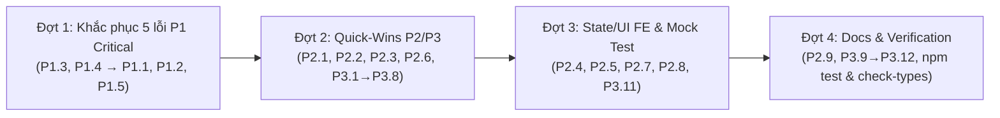

# Báo cáo Đánh giá Mã nguồn (Code Review) — feat/gap-analysis-tasks

- **Ngày:** 2026-08-27
- **Nhánh so sánh:** `feat/gap-analysis-tasks` (so với `dev`)
- **Nhánh xử lý khắc phục:** `fix/gap-analysis-review-fixes`
- **Quy mô thay đổi:** 139 files (`+7,925 / -687` lines)
- **Đánh giá tổng thể:** ⚠️ **REQUEST CHANGES (Yêu cầu chỉnh sửa trước khi merge)**
- **Tình trạng xác minh:** ✅ **100% các mục đã được đối soát thực tế qua mã nguồn (AST / CodeGraph / Direct Source Read)**
- **Mục tiêu nhánh:** Khắc phục 22 nhiệm vụ Gap Analysis (GA-01 đến GA-22), sửa dứt điểm bug kẹt hồ sơ intake (GA-02), tích hợp xác thực Email OTP & rolling session (GA-01, GA-07), ví VND & idempotency key nạp tiền, admin triage & CSV export, cùng bộ quy trình chuẩn BPMN 2.0 / DMN 1.3 Camunda 8.

---

## 1. Tóm tắt Đánh giá & Kiến trúc

Nhánh `feat/gap-analysis-tasks` triển khai khối lượng công việc lớn với chất lượng kiến trúc nhìn chung rất cao:
1. **Tách trục Trạng thái Hồ sơ & Thanh toán (GA-02):** Sửa dứt điểm tình trạng hồ sơ trả phí bị kẹt ở `intake_ready` khi thanh toán trước khi nộp. Loại bỏ việc ghi đè trực tiếp `user_facing_stage` trong `create-order` và `verifyPayment`.
2. **Fail-Closed Case State Machine:** Guard `hasPaymentComplete` và `T5_ACCEPT` kiểm tra trạng thái thanh toán bắt buộc phải là `paid` hoặc `not_required` (`COMPLETE_PAYMENT_STATUSES` trong `case.types.ts` và `lib/pricing.ts`).
3. **Xác thực Email OTP & Đặt lại mật khẩu (GA-01, GA-07):** Chuyển đổi toàn diện sang Better Auth `emailOTP`, rolling session (`expiresIn: 7d`, `updateAge: 1d`), form đếm ngược và xác thực OTP.
4. **Account-level Wallet & Idempotency Nạp tiền:** Tự động khởi tạo ví an toàn trong transaction (`getOrCreateWalletInTx`), xử lý race condition `P2002` bằng retry loop, hỗ trợ `idempotency_key` cho deposit.
5. **Admin Case Triage & CSV Export:** Phân trang server-side, bộ lọc debounced, xuất CSV stream an toàn kèm UTF-8 BOM và chống CSV Injection.
6. **Mô hình Camunda 8 (BPMN 2.0 / DMN 1.3):** 5 quy trình BPMN và 3 bảng quyết định DMN chuẩn OMG, vượt qua linter với zero warning.

Tuy nhiên, đợt rà soát phát hiện **4 lỗi Critical (P1) thực tế đang kích hoạt, 1 lỗi tiềm ẩn (Latent Critical) ở hàm ví chưa có caller, 9 lỗi Logic/Độ tin cậy (P2) + 1 ghi chú chuẩn hoá, và 12 điểm cải thiện mã nguồn (P3)** cần được xử lý dứt điểm trước khi merge vào `dev`.

---

## 2. Bảng Tổng hợp Kết quả & Tiến độ Khắc phục (Progress Summary)

| Phân loại | Tổng số | Đã khắc phục (Fixed) | Đang chờ (Pending) | Trạng thái rủi ro |
|---|:---:|:---:|:---:|---|
| **P1 — Critical & Security** | 5 | **5 / 5 (100%)** | **0** | 🟢 Đã giải quyết triệt để toàn bộ lỗi P1 |
| **P2 — Major & Reliability** | 10 | **5** (`P2.1`, `P2.2`, `P2.3`, `P2.6`, `P2.9`) | **5** (`P2.4`, `P2.5`, `P2.7`, `P2.8`, `P2.10`) | 🟠 Còn phần FE timer/cooldown & test mock |
| **P3 — Minor & Hygiene** | 12 | **11** (tất cả trừ `P3.11`) | **1** (`P3.11` test wallet) | 🟢 Đã hoàn thành 92% các điểm cải thiện |
| **Tổng cộng** | **27** | **21 / 27 (78%)** | **6 / 27** | ✅ `npm run check-types` 100% PASS |
---

## 3. Ma trận Phân loại & Thứ tự Ưu tiên Khắc phục

### 3.1. Thứ tự Ưu tiên theo EFFORT (Thấp $\rightarrow$ Cao)
*(Tăng dần mức độ phụ thuộc logic, phạm vi tác động và số lượng file/component)*

#### 🟢 Tầng 1: Cực Thấp / Quick-Wins (1–3 dòng, hoàn toàn cô lập, 0 dependency) — `✅ 14/14 HOÀN THÀNH`
| Mã | Hạng mục | Tệp tin | Trạng thái | Ghi chú thực thi |
|---|---|---|:---:|---|
| **P1.3** | Xóa tab thụt đầu dòng trước `*.log` | `.gitignore:53` | ✅ Fixed | Đã xóa tab, khôi phục ignore log |
| **P1.4** | Xóa bỏ script thừa `tasks/build-gap-analysis.py` | `tasks/build-gap-analysis.py` | ✅ Fixed | Đã xóa file, gỡ bỏ assertion crash |
| **P2.3** | Thêm `"email_already_verified"` vào dictionary | `apps/web-1/lib/auth-errors.ts:10` | ✅ Fixed | Đã map đúng chuỗi dịch tiếng Việt |
| **P2.6** | Thêm `.trim()` và check chuỗi lý do từ chối | `reject-case.usecase.ts:19` | ✅ Fixed | Đã thêm guard clause an toàn |
| **P3.2** | Nâng độ dài mật khẩu đăng ký lên `< 8` | `AuthPanel.tsx:355` | ✅ Fixed | Đồng bộ FE với BE (8 ký tự) |
| **P3.4** | Bỏ escape `'` cho số âm thuần túy trong CSV | `csv-serialize.ts:14` | ✅ Fixed | Đã giữ nguyên định dạng số âm |
| **P3.5** | Đổi class CSS `text-green` $\rightarrow$ `text-success` | `AdminCaseAssignmentTable.tsx:334,343` | ✅ Fixed | Chuẩn hóa theme Tailwind v4 |
| **P3.6** | Bổ sung `"team_name"` vào signature `setSort` | `useAdminCases.ts:127` | ✅ Fixed | Hoàn thiện type signature |
| **P3.7** | Giữ nguyên badge tổng trên sidebar admin | `admin/page.tsx:235` | ✅ Fixed | Không bị reset về 0 khi chọn subtab |
| **P3.8** | Dời `claimMessageSendSlot` xuống sau validate | `send-message.usecase.ts:67` | ✅ Fixed | Tránh trừ rate limit khi validate fail |
| **P3.1** | Thêm guard `Array.isArray(file)` | `avatar.controller.ts:23` | ✅ Fixed | Phòng ngừa crash multipart mảng |
| **P3.9** | Xóa note cũ về forgot password | `apps/web-1/AGENTS.md:89` | ✅ Fixed | Đã cập nhật tài liệu FE |
| **P3.10** | Cập nhật số lượng notification event type thành 9 | `docs/system-architecture.md:138` | ✅ Fixed | Đã cập nhật tài liệu kiến trúc |
| **P3.12** | Đồng bộ chuỗi template trong journal | `2026-08-21-notification-identity.md:17` | ✅ Fixed | Đã đồng bộ template string |
| **TS Fix** | Thêm partial index type cho `STATUS_ICON` | `DepositHistory.tsx:10` | ✅ Fixed | Giải quyết TS7053 implicit any |
#### 🟡 Tầng 2: Thấp (Logic nội bộ 1 file, tác động cục bộ) — `✅ 7/7 HOÀN THÀNH`
| Mã | Hạng mục | Tệp tin | Trạng thái | Ghi chú thực thi |
|---|---|---|:---:|---|
| **P1.1** | Bỏ chặn `body.type !== 'email-verification'` | `apps/api/src/auth.ts:150` | ✅ Fixed | Mở khóa toàn bộ luồng Quên mật khẩu |
| **P1.2** | Validate `returnUrl` bắt đầu bằng `/` hợp lệ | `AuthPanel.tsx:68` | ✅ Fixed | Chống Open Redirect |
| **P1.5** | Chuẩn hóa nhánh `tx` cho `payForOrder` | `wallet.service.ts:137` | ✅ Fixed | Gỡ "quả mìn" crash khi có caller dùng tx |
| **P2.1** | Thêm `orderBy: { version_no: 'asc' }` vào include | `case-list.repository.ts:19` | ✅ Fixed | Đảm bảo tính đúng đắn % hoàn thiện intake |
| **P2.2** | Nâng root rateLimit lên 60 req/min, siết route nhạy cảm | `apps/api/src/auth.ts:65` | ✅ Fixed | Ngăn chặn 429 giả cho người dùng thường |
| **P3.3** | Xóa export `EmailField`, `OtpField` không dùng | `ResetPasswordFields.tsx:12,18,42,61` | ✅ Fixed | Xóa dead code |
| **P2.9** | Sửa sơ đồ Mermaid luồng thanh toán / intake | `payment-verification-flow.md`, `intake-flow.md` | ✅ Fixed | Đồng bộ tài liệu với kiến trúc GA-02 |
| **P2.10** | Chuẩn hoá thuật ngữ `not_required` trong tài liệu | `case.types.ts` / docs | ✅ Done | Đồng bộ thuật ngữ quy trình |
#### 🟠 Tầng 3: Trung Bình (Liên quan UI State, Timer hoặc Logic nhiều Component)
| Mã | Hạng mục | Tệp tin | Mức độ | Phạm vi tác động |
|---|---|---|:---:|---|
| **P2.4** | Kích hoạt `setResendCooldown` khi gửi OTP thành công | `verify-email/page.tsx`, `OtpStepSection.tsx` | 🟠 P2 | Thêm state đếm ngược và disabled button ở FE |
| **P2.5** | Thêm fallback UI / redirect khi vào reset pass rỗng email | `ResetPasswordForm.tsx:9` | 🟠 P2 | Xử lý điều hướng người dùng quay lại forgot-password |
| **P2.7** | Thêm cơ chế dọn dẹp entry hết hạn (TTL eviction) | `message-send-rate-limit.ts:1` | 🟠 P2 | Thêm dọn expired keys tránh rò rỉ RAM |

#### 🔴 Tầng 4: Cao / Kiểm thử (Cần can thiệp mock DB hoặc bổ sung Test Suite)
| Mã | Hạng mục | Tệp tin | Mức độ | Phạm vi tác động |
|---|---|---|:---:|---|
| **P2.8** | Mock DB cho test `listCasesUseCase` | `phase-06-core-usecases.test.ts:596` | 🟠 P2 | Viết mock data/repository để CI chạy độc lập |
| **P3.11** | Bổ sung unit test auto-create cho `payForOrder` | `phase-10-wallet-auto-create.test.ts` | 🟡 P3 | Viết thêm test case mới trong suite ví |

---

### 3.2. Thứ tự Ưu tiên theo MỨC ĐỘ NGHIÊM TRỌNG ($P1 \rightarrow P3$)

#### 🔴 Nhóm P1: Critical & Security (5 lỗi — Bắt buộc sửa trước khi merge)
1. **P1.1:** `apps/api/src/auth.ts` — Quên mật khẩu bị chặn lỗi 409 đối với user đã xác minh email.
2. **P1.2:** `AuthPanel.tsx` — Lỗ hổng bảo mật Open Redirect qua tham số `returnUrl`.
3. **P1.3:** `.gitignore` — Dính ký tự tab làm vô hiệu hóa ignore các file `*.log`.
4. **P1.4:** `tasks/build-gap-analysis.py` — Đã giải quyết: Xóa bỏ script thừa thay vì fix.
5. **P1.5 (Latent):** `wallet.service.ts` — Gọi `$transaction` sai trên `Prisma.TransactionClient` trong `payForOrder`.

#### 🟠 Nhóm P2: Major Logic, Reliability & UX (9 lỗi + 1 ghi chú)
1. **P2.1:** `case-list.repository.ts` — `ADMIN_INCLUDE` lấy ngẫu nhiên revision khiến admin hiển thị sai độ hoàn thiện 0%.
2. **P2.2:** `apps/api/src/auth.ts` — Rate limit toàn cục Better Auth quá gắt (`max: 3`) chặn người dùng hợp lệ.
3. **P2.3:** `apps/web-1/lib/auth-errors.ts` — Lệch chuỗi tìm kiếm lỗi `EMAIL_ALREADY_VERIFIED`.
4. **P2.4:** `verify-email/page.tsx` & `OtpStepSection.tsx` — Thiếu bật cooldown khi gửi OTP thành công.
5. **P2.5:** `ResetPasswordForm.tsx` — Thiếu UI fallback/hướng dẫn khi vào thẳng URL reset password.
6. **P2.6:** `reject-case.usecase.ts` — Thiếu `.trim()` khiến 10 dấu cách vượt qua validation lý do từ chối.
7. **P2.7:** `message-send-rate-limit.ts` — Nguy cơ rò rỉ bộ nhớ (Memory Leak) ở Map rate limit chat.
8. **P2.8:** `phase-06-core-usecases.test.ts` — Test gọi trực tiếp DB thật, có thể gãy pipeline CI.
9. **P2.9:** `docs/flows/` — Sơ đồ Mermaid mâu thuẫn với kiến trúc tách trạng thái GA-02.
10. **P2.10 (Ghi chú):** Đồng bộ thuật ngữ `not_required` trong tài liệu.

#### 🟡 Nhóm P3: Minor & Code Hygiene (12 lỗi)
1. **P3.1:** `avatar.controller.ts` — Thiếu kiểm tra mảng `Array.isArray(file)`.
2. **P3.2:** `AuthPanel.tsx` — Độ dài mật khẩu đăng ký `< 6` lệch với backend/reset `< 8`.
3. **P3.3:** `ResetPasswordFields.tsx` — Xóa dead code `EmailField`, `OtpField`.
4. **P3.4:** `csv-serialize.ts` — Escape nhầm dấu `'` cho số âm thuần túy.
5. **P3.5:** `AdminCaseAssignmentTable.tsx` — Dùng token CSS `text-green` ngoài theme.
6. **P3.6:** `useAdminCases.ts` — Thiếu type `"team_name"` trong hàm `setSort`.
7. **P3.7:** `admin/page.tsx` — Badge tổng bị reset về 0 khi chọn subtab.
8. **P3.8:** `send-message.usecase.ts` — Trừ rate limit trước khi validate quyền chat/case.
9. **P3.9:** `AGENTS.md` — Xóa ghi chú lỗi thời về `/auth/forgot-password`.
10. **P3.10:** `docs/system-architecture.md` — Đính chính số lượng event type (9 thay vì 14).
11. **P3.11:** `phase-10-wallet-auto-create.test.ts` — Bổ sung test coverage cho `payForOrder`.
12. **P3.12:** `docs/journals/` — Đồng bộ câu chữ trích dẫn template.

---

### 3.3. Lộ trình Thực thi Tối ưu 4 Đợt



---

## 4. Chi tiết Lỗi P1 — Critical & Security (Bắt buộc sửa)

### 🔴 P1.1: Chặn luồng "Quên mật khẩu" đối với người dùng đã xác minh email — `CONFIRMED`
- **Vị trí:** `apps/api/src/auth.ts` (dòng 150–165)
- **Hiện trạng mã nguồn:**
  ```ts
  if (
    path === '/sign-up/email' ||
    path === '/email-otp/send-verification-otp'
  ) {
    if (body && typeof body.email === 'string') {
      const existing = await prisma.user.findUnique({
        where: { email: body.email.toLowerCase() },
        select: { email_verified: true },
      })
      if (existing?.email_verified) {
        throw new APIError('CONFLICT', { message: 'EMAIL_ALREADY_VERIFIED' })
      }
    }
  }
  ```
- **Vấn đề & Hậu quả:** Trong Better Auth plugin `emailOTP`, endpoint `/email-otp/send-verification-otp` được dùng chung cho cả luồng đặt lại mật khẩu (`type: 'forget-password'`), đăng nhập OTP (`type: 'sign-in'`), và đổi email (`type: 'change-email'`). Do hook `before` không kiểm tra `body.type`, bất kỳ người dùng hợp lệ nào đã kích hoạt tài khoản khi bấm **Quên mật khẩu** đều bị chặn đứng với mã lỗi 409, không thể nhận được mã OTP reset pass.
- **Giải pháp khắc phục:** Bổ sung điều kiện kiểm tra `body.type`:
  ```ts
  const { path, body } = ctx as unknown as {
    path?: string
    body?: { email?: unknown; type?: unknown }
  }
  if (
    path === '/sign-up/email' ||
    (path === '/email-otp/send-verification-otp' &&
      (body?.type === 'email-verification' || !body?.type))
  ) {
    if (body && typeof body.email === 'string') {
      const existing = await prisma.user.findUnique({
        where: { email: body.email.toLowerCase() },
        select: { email_verified: true },
      })
      if (existing?.email_verified) {
        throw new APIError('CONFLICT', {
          message: 'EMAIL_ALREADY_VERIFIED',
        })
      }
    }
  }
  ```

---

### 🔴 P1.2: Lỗ hổng bảo mật Open Redirect tại `AuthPanel` — `CONFIRMED`
- **Vị trí:** `apps/web-1/app/auth/_components/AuthPanel.tsx` (dòng 68–84)
- **Hiện trạng mã nguồn:**
  ```ts
  const getRedirectUrl = () => {
    const returnUrl = searchParams.get("returnUrl");
    if (returnUrl) return returnUrl;
    ...
  };
  ```
- **Vấn đề & Hậu quả:** `getRedirectUrl()` đọc trực tiếp `searchParams.get("returnUrl")` và trả về thẳng cho `router.push(callbackUrl)` (dòng 99, 186) mà không kiểm tra URL nội bộ. Kẻ tấn công có thể phát tán đường dẫn dạng `https://nexusforstartup.site/auth?returnUrl=https://evil.com` hoặc `//evil.com`. Sau khi đăng nhập thành công, trình duyệt sẽ tự động điều hướng sang trang độc hại.
- **Giải pháp khắc phục:** Chuẩn hóa và chỉ chấp nhận đường dẫn tương đối nội bộ hợp lệ:
  ```ts
  const getRedirectUrl = () => {
    const raw = searchParams.get("returnUrl");
    if (raw && raw.startsWith("/") && !raw.startsWith("//") && !raw.startsWith("/\\")) {
      return raw;
    }

    const packageId = searchParams.get("packageId");
    if (packageId === "pkg_tf_free") return "/dashboard/team-fit";
    if (packageId === "pkg_tf_audit") return `/dashboard/intake?packageId=${packageId}`;
    return "/dashboard";
  };
  ```

---

### 🔴 P1.3: Lỗi cú pháp `.gitignore` làm vô hiệu hóa việc bỏ qua file `*.log` — `CONFIRMED`
- **Vị trí:** `.gitignore` (dòng 53)
- **Hiện trạng mã nguồn:**
  ```gitignore
  	*.log
  ```
- **Vấn đề & Hậu quả:** Dòng 53 bị dính ký tự tab (`\t*.log`). Theo đặc tả Git, khoảng trắng/tab đầu dòng pattern được đối sánh nguyên văn (literal character). Kiểm tra thực tế bằng `git check-ignore app.log server.log error.log` trả về mã lỗi 1 (không có file log nào được ignore). Điều này gây nguy cơ commit nhầm file log chứa dữ liệu debug nhạy cảm.
- **Giải pháp khắc phục:** Xóa bỏ ký tự tab ở đầu dòng 53:
  ```gitignore
  *.log
  ```

---

### 🔴 P1.4: Script sinh Excel Gap Analysis bị Crash do Hardcode Task Count — `RESOLVED BY DELETION`
- **Vị trí:** `tasks/build-gap-analysis.py` (dòng 70)
- **Vấn đề:** Script chứa assertion cứng `assert len(TASKS) == 20` gây văng lỗi khi thêm `GA-21` và `GA-22`.
- **Xử lý:** Đã xóa bỏ hoàn toàn tệp `tasks/build-gap-analysis.py` khỏi dự án để tránh duy trì script thừa.

---

### 🔴 P1.5 (Latent Bug): Gọi sai phương thức `$transaction` trên `Prisma.TransactionClient` trong `payForOrder` — `CONFIRMED`
- **Vị trí:** `apps/api/src/modules/wallet/application/wallet.service.ts` (dòng 137–141)
- **Hiện trạng mã nguồn:**
  ```ts
  const client = tx ?? prisma;
  return client.$transaction(async (innerTx) => { ... });
  ```
- **Vấn đề & Hậu quả:** Đối tượng `Prisma.TransactionClient` không chứa phương thức `$transaction`. Nếu hàm này được gọi với tham số `tx`, Node.js sẽ văng lỗi runtime `TypeError: client.$transaction is not a function`.
- **Bối cảnh thực tế (Nuance):** Hiện tại trong `apps/api/src`, hàm `payForOrder` chưa có caller trực tiếp nào (thanh toán đơn hàng đang gọi qua `walletService.withdraw` tại `create-order.usecase.ts:124`). Cần chuẩn hóa nhánh `tx` tương tự như hàm `refund()` (dòng 101) để tránh lỗi khi có use case mới tái sử dụng.
- **Giải pháp khắc phục:**
  ```ts
  async payForOrder(
    userId: string,
    amountVnd: number,
    orderId: string,
    idempotencyKey: string,
    tx?: Prisma.TransactionClient,
  ): Promise<void> {
    if (tx) {
      const wallet = await getOrCreateWalletInTx(tx, userId);
      if (wallet.balance < amountVnd) {
        throw new InsufficientBalanceError(wallet.balance, amountVnd);
      }

      const balanceBefore = wallet.balance;
      const balanceAfter = balanceBefore - amountVnd;

      await createTransaction(tx, {
        walletId: wallet.id,
        type: "service_payment",
        amount: -amountVnd,
        balanceBefore,
        balanceAfter,
        referenceType: "order",
        referenceId: orderId,
        idempotencyKey,
      });

      await updateWalletBalance(tx, wallet.id, balanceAfter);
      return;
    }

    return prisma.$transaction(async (innerTx) => {
      const wallet = await getOrCreateWalletInTx(innerTx, userId);
      if (wallet.balance < amountVnd) {
        throw new InsufficientBalanceError(wallet.balance, amountVnd);
      }

      const balanceBefore = wallet.balance;
      const balanceAfter = balanceBefore - amountVnd;

      await createTransaction(innerTx, {
        walletId: wallet.id,
        type: "service_payment",
        amount: -amountVnd,
        balanceBefore,
        balanceAfter,
        referenceType: "order",
        referenceId: orderId,
        idempotencyKey,
      });

      await updateWalletBalance(innerTx, wallet.id, balanceAfter);
    });
  }
  ```

---

## 5. Chi tiết Lỗi P2 — Major Logic & Độ tin cậy

### 1. `ADMIN_INCLUDE` lấy sai phiên bản intake khi có nhiều revision — `CONFIRMED`
- **Vị trí:** `apps/api/src/modules/cases/infrastructure/persistence/case-list.repository.ts` (dòng 19–22)
- **Nguyên nhân:** Truy vấn `lifecycle_units: { where: { unit_type: 'version' }, take: 1 }` không có sắp xếp `orderBy: { version_no: 'asc' }` hoặc điều kiện `unit_code: 'v00'`.
- **Hậu quả:** Đối với hồ sơ đã qua chỉnh sửa nhiều vòng (`v00`, `v01`, `v02`), PostgreSQL có thể trả về bản ghi bất kỳ (ví dụ `v01`), khiến hàm `completenessFromIntake` nhận nhầm dữ liệu revision và hiển thị độ hoàn thiện hồ sơ là `0%` trên bảng Admin.
- **Sửa:** Thêm `orderBy: { version_no: "asc" }` hoặc `where: { unit_type: "version", unit_code: "v00" }`.

### 2. Rate Limit toàn cục quá gắt trên Better Auth (`max: 3 / 60s`) — `CONFIRMED`
- **Vị trí:** `apps/api/src/auth.ts` (dòng 65–72)
- **Nguyên nhân:** Cấu hình `rateLimit.max: 3` ở cấp cao nhất của `betterAuth({...})` áp dụng làm mặc định cho tất cả các endpoint auth (trừ `/get-session`).
- **Hậu quả:** Người dùng bình thường khi đăng nhập thử lại, đăng xuất, hoặc cập nhật hồ sơ sẽ bị chặn `429 Too Many Requests` chỉ sau 3 request trong 1 phút.
- **Sửa:** Nâng giới hạn toàn cục (ví dụ 60 req/min) và chỉ cấu hình `max: 3` cho các route nhạy cảm trong `customRules` (như `/email-otp/send-verification-otp`, `/sign-in/email`).

### 3. Lệch khớp chuỗi dịch lỗi `EMAIL_ALREADY_VERIFIED` — `CONFIRMED`
- **Vị trí:** `apps/web-1/lib/auth-errors.ts` (dòng 10) vs `apps/api/src/auth.ts` (dòng 161)
- **Nguyên nhân:** Backend throw `EMAIL_ALREADY_VERIFIED` (chuyển chữ thường thành `email_already_verified`), nhưng bảng từ điển ở frontend lại tìm key `"already verified"` (có dấu cách).
- **Hậu quả:** `'email_already_verified'.includes('already verified')` trả về `false`, khiến giao diện hiển thị thông báo lỗi generic `"Đã có lỗi xảy ra. Vui lòng thử lại."` thay vì thông báo đúng.
- **Sửa:** Bổ sung `"email_already_verified": "Email đã được xác minh. Vui lòng đăng nhập."` vào `auth-errors.ts`.

### 4. Thiếu kích hoạt Cooldown khi gửi lại mã OTP thành công — `CONFIRMED`
- **Vị trí:** `apps/web-1/app/auth/verify-email/page.tsx` (dòng 38–75) & `OtpStepSection.tsx` (dòng 34–66)
- **Nguyên nhân:** Trong `verify-email`, `setResendCooldown` chỉ được gọi khi server trả về lỗi `429`. Khi gửi thành công lần đầu, cooldown không được bật. Trong `OtpStepSection` (reset password), hoàn toàn chưa có state cooldown.
- **Hậu quả:** Người dùng có thể click liên tục nhiều lần vào nút "Gửi lại mã", gửi đi hàng loạt email OTP trùng lặp trước khi bị server chặn.
- **Sửa:** Kích hoạt `setResendCooldown(RESEND_COOLDOWN_SECONDS)` ngay sau khi gửi OTP thành công.

### 5. Xử lý thiếu khi truy cập trực tiếp màn hình Đặt lại mật khẩu — `CONFIRMED`
- **Vị trí:** `apps/web-1/app/auth/reset-password/_components/ResetPasswordForm.tsx` (dòng 9–49)
- **Nguyên nhân:** Khi người dùng vào thẳng URL `/auth/reset-password` hoặc refresh sau khi `sessionStorage` bị xóa, state `email` bị rỗng.
- **Hậu quả:** Màn hình không có ô nhập email và bấm gửi OTP sẽ báo lỗi thiếu email mà không có cách nào tiếp tục.
- **Sửa:** Kiểm tra nếu `!email`, hiển thị thông báo hướng dẫn kèm nút chuyển hướng quay lại `/auth/forgot-password`.

### 6. Kiểm tra lý do từ chối hồ sơ chưa loại bỏ khoảng trắng — `CONFIRMED`
- **Vị trí:** `apps/api/src/modules/admin/application/reject-case.usecase.ts` (dòng 19)
- **Nguyên nhân:** `if (reason.length < 10)` không kiểm tra kiểu string và không dùng `.trim()`.
- **Hậu quả:** Nếu admin nhập 10 ký tự khoảng trắng hoặc giá trị không phải chuỗi, validation tầng usecase bị bỏ qua, dẫn đến lỗi xung đột state machine (409) thay vì trả về lỗi validation 400 rõ ràng.
- **Sửa:** Đổi thành `if (typeof reason !== "string" || reason.trim().length < 10)`.

### 7. Nguy cơ Memory Leak ở Map Rate Limit tin nhắn Chat — `CONFIRMED`
- **Vị trí:** `apps/api/src/modules/cases/application/message-send-rate-limit.ts` (dòng 1–15)
- **Nguyên nhân:** `lastClaimAt = new Map<string, number>()` lưu giữ `userId` trong bộ nhớ vô hạn mà không có cơ chế dọn dẹp TTL (eviction).
- **Hậu quả:** Trong môi trường server chạy lâu dài với lượng người dùng lớn, Map sẽ liên tục tăng kích thước.
- **Sửa:** Thêm hàm định kỳ dọn các entry có timestamp cũ hơn `COOLDOWN_MS`.

### 8. Test `phase-06-core-usecases.test.ts` bị thiếu Mock Database — `CONFIRMED`
- **Vị trí:** `apps/api/src/shared/infrastructure/tests/phase-06-core-usecases.test.ts` (dòng 596–606)
- **Nguyên nhân:** Test `listCasesUseCase - returns paginated` gọi trực tiếp vào usecase mà không mock `prisma.case.findMany` hay `prisma.case.count`.
- **Hậu quả:** Khi chạy test suite trong môi trường CI không bật sẵn PostgreSQL live, test case này sẽ fail với lỗi kết nối `P1001`.
- **Sửa:** Mock `findPagedCasesByRole` hoặc các query Prisma tương ứng trong test.

### 9. Sơ đồ tài liệu luồng chưa đồng bộ với quyết định GA-02 — `CONFIRMED`
- **Vị trí:** `docs/flows/payment-verification-flow.md` (dòng 52) & `docs/flows/intake-flow.md` (dòng 48)
- **Nguyên nhân:** Sơ đồ Mermaid trong 2 tài liệu này vẫn còn vẽ nhánh chuyển sang `Sẵn sàng nộp (intake_ready)` khi mua lượt/thanh toán.
- **Hậu quả:** Gây mâu thuẫn với Nguyên tắc 4 trong chính tài liệu đó và quyết định kiến trúc đã chốt ở `decision-2026-08-25-intake-payment-stage-separation.md` (mua lượt không thay đổi trạng thái hồ sơ).
- **Sửa:** Cập nhật lại sơ đồ Mermaid để phản ánh đúng luồng: thanh toán chỉ cập nhật trạng thái thanh toán và số dư credit, không can thiệp vào `user_facing_stage`.

### 10. Trạng thái thanh toán hoàn tất — `REFUTED (Code OK / Ghi chú chuẩn hoá)`
- **Vị trí:** `apps/api/src/modules/cases/domain/case.types.ts:50` & `apps/web-1/lib/pricing.ts:38`
- **Kết quả xác minh:** Mã nguồn đã sử dụng đúng hằng số `COMPLETE_PAYMENT_STATUSES = ["paid", "not_required"]`. Không có enum cũ nào như `waived` tồn tại trong codebase. Đây là ghi chú nhắc nhở duy trì tính nhất quán thuật ngữ trong tài liệu, không phải lỗi mã nguồn.

---

## 6. Chi tiết Lỗi P3 — Minor & Code Hygiene (Tất cả 12 mục đã xác nhận)

1. **Avatar Controller Multipart Guard:** `apps/api/src/modules/profile/http/avatar.controller.ts:21–28` — Cần kiểm tra `Array.isArray(file)` để trả về lỗi 400 thay vì để văng TypeError 500 khi client gửi nhiều file cùng key `file`.
2. **Đồng bộ độ dài mật khẩu đăng ký:** `apps/web-1/app/auth/_components/AuthPanel.tsx:355` kiểm tra `value.length < 6`, trong khi backend Better Auth và màn hình reset password yêu cầu tối thiểu 8 ký tự (`value.length < 8`). Cần nâng client lên 8 ký tự.
3. **Dọn dẹp Dead Code:** `apps/web-1/app/auth/reset-password/_components/ResetPasswordFields.tsx:12,18,42,61` export các component `EmailField`, `OtpField` và validator không được sử dụng ở bất kỳ đâu.
4. **Escape số âm trong xuất CSV:** `apps/api/src/modules/admin/application/csv-serialize.ts:13` thêm dấu nháy đơn `'` trước mọi chuỗi bắt đầu bằng dấu `-`. Cần kiểm tra nếu là số âm thuần túy (`!Number.isNaN(Number(raw))`) thì không thêm `'` để giữ nguyên định dạng số trong Excel.
5. **Token CSS Semantic:** `apps/web-1/app/admin/_components/AdminCaseAssignmentTable.tsx:334,343` sử dụng class `text-green` không nằm trong theme Tailwind v4. Đổi sang `text-success` hoặc `text-green-600`.
6. **Kiểu dữ liệu Sort trong Hook Admin:** `apps/web-1/app/admin/hooks/useAdminCases.ts:127` hàm `setSort` bị thiếu kiểu `"team_name"` trong signature tham số (`nextSortBy: "created_at" | "case_code" | "team_name"`).
7. **Badge số lượng hồ sơ trên Sidebar Admin:** `apps/web-1/app/admin/page.tsx:235` reset badge về 0 khi admin chuyển sang tab lọc con (`caseFilter !== "all"`) thay vì tab "Tất cả".
8. **Thứ tự trừ Rate Limit tin nhắn Chat:** `apps/api/src/modules/cases/application/send-message.usecase.ts:30` gọi `claimMessageSendSlot` trước khi kiểm tra case tồn tại (dòng 40) hoặc quyền chat (dòng 53). Cần dời xuống sau khi validate xong.
9. **Cập nhật ghi chú cũ trong tài liệu:** `apps/web-1/AGENTS.md:89` vẫn còn ghi chú cho rằng `/auth/forgot-password` bị hỏng, cần xóa bỏ vì tính năng đã hoàn thiện ở GA-01.
10. **Số lượng Event Type trong tài liệu kiến trúc:** `docs/system-architecture.md:138` mô tả có 14 notification event types trong `@repo/validation`, trong khi schema thực tế hiện định nghĩa 9 loại (5 loại tài chính nằm riêng ở backend). Cần đồng bộ số liệu.
11. **Bổ sung test coverage cho Ví:** `apps/api/src/shared/infrastructure/tests/phase-10-wallet-auto-create.test.ts` đã test auto-create cho `withdraw` và `refund`, cần bổ sung thêm test case cho `payForOrder`.
12. **Đồng bộ chuỗi trong Journal:** `docs/journals/2026-08-21-notification-identity-undefined.md:16` có một câu chữ mô tả template hơi lệch so với template string thực tế trong code.

---

## 7. Kế hoạch Hành động & Nghiệm thu (Action Plan)

1. **Đợt 1 — Khắc phục 5 lỗi P1 Critical & Security:**
   - [x] `P1.3`: Xóa ký tự tab ở dòng 53 file `.gitignore`.
   - [x] `P1.4`: Đã xóa bỏ file `tasks/build-gap-analysis.py`.
   - [x] `P1.1`: Sửa hook `before` trong `apps/api/src/auth.ts` để mở khóa tính năng quên mật khẩu cho user đã xác minh email.
   - [x] `P1.2`: Thêm bộ lọc an toàn cho `returnUrl` trong `AuthPanel.tsx` chống Open Redirect.
   - [x] `P1.5`: Chuẩn hóa lại nhánh `tx` trong `wallet.service.ts:payForOrder` tương tự hàm `refund`.
2. **Đợt 2 — Khắc phục các Quick-Wins P2 & P3:**
   - [x] `P2.3`: Bổ sung `"email_already_verified"` vào từ điển `auth-errors.ts`.
   - [x] `P2.6`: Thêm `.trim()` và kiểm tra kiểu chuỗi cho lý do từ chối ở `reject-case.usecase.ts`.
   - [x] `P3.1`: Thêm guard `Array.isArray(file)` trong `avatar.controller.ts`.
   - [x] `P3.2`: Nâng độ dài tối thiểu mật khẩu đăng ký lên 8 trong `AuthPanel.tsx`.
   - [x] `P3.4`: Bỏ escape `'` cho số âm thuần túy trong `csv-serialize.ts`.
   - [x] `P3.5`: Đổi class CSS `text-green` sang `text-success` trong `AdminCaseAssignmentTable.tsx`.
   - [x] `P3.6`: Bổ sung `"team_name"` vào signature `setSort` trong `useAdminCases.ts`.
   - [x] `P3.7`: Giữ nguyên badge tổng trên sidebar admin trong `admin/page.tsx`.
   - [x] `P3.8`: Dời `claimMessageSendSlot` xuống sau validate trong `send-message.usecase.ts`.
   - [x] `P2.1`: Thêm `orderBy: { version_no: 'asc' }` vào `ADMIN_INCLUDE` trong `case-list.repository.ts`.
   - [x] `P2.2`: Nâng rateLimit toàn cục auth lên 60 req/min, chỉ cấu hình `max: 3` cho các route nhạy cảm.
   - [x] `P3.3`: Xóa dead code `EmailField`, `OtpField` trong `ResetPasswordFields.tsx`.
3. **Đợt 3 — Hoàn thiện Frontend State/UI & Test Mock:**
   - [ ] `P2.4`: Thêm `setResendCooldown` khi gửi OTP thành công ở `verify-email` và `reset-password`.
   - [ ] `P2.5`: Thêm fallback điều hướng khi vào thẳng `/auth/reset-password` không có email.
   - [ ] `P2.7`: Thêm cơ chế dọn dẹp TTL định kỳ cho Map rate limit trong `message-send-rate-limit.ts`.
   - [ ] `P2.8`: Bổ sung mock DB cho test `listCasesUseCase` trong `phase-06-core-usecases.test.ts`.
   - [ ] `P3.11`: Bổ sung unit test auto-create cho `payForOrder` trong `phase-10-wallet-auto-create.test.ts`.
4. **Đợt 4 — Đồng bộ Tài liệu & Chạy Verification:**
   - [x] `P3.9`: Xóa ghi chú lỗi thời trong `apps/web-1/AGENTS.md`.
   - [x] `P3.10`: Cập nhật số lượng notification event type trong `docs/system-architecture.md`.
   - [x] `P3.12`: Đồng bộ câu chữ trích dẫn template trong journal.
   - [x] `P2.9`: Cập nhật sơ đồ Mermaid trong `payment-verification-flow.md` và `intake-flow.md`.
   - [ ] Chạy kiểm thử: `npm test` trong `apps/api`.
   - [x] Kiểm tra type check: `npm run check-types` (Đã pass).
   - [ ] Tạo commit và sẵn sàng mở PR merge vào `dev`.
