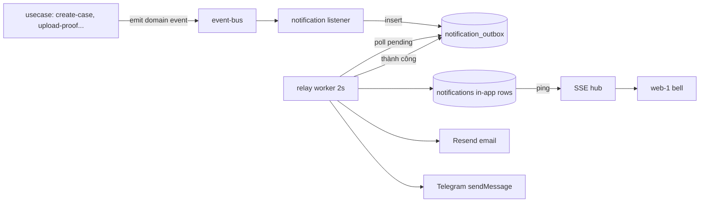

# Research Report: Notification System Architecture (In-app + Email + Telegram)

**Ngày nghiên cứu:** 2026-08-07
**Nguồn:** 5 web searches (best practices 2025-2026, Hono docs, Telegram Bot API, SSE production guides)

## Executive Summary

Industry consensus cho notification system: **asynchronous, event-driven, decoupled** — usecase không bao giờ gửi notification trực tiếp. Hai pattern chuẩn được lặp lại ở mọi nguồn:

1. **Fan-out on write (inbox table)** — mỗi recipient có row notification riêng. Đọc nhanh, đúng cho quy mô nhỏ (hệ này).
2. **Transactional Outbox** — ghi notification task vào DB cùng transaction với business op, worker riêng xử lý sau. Chống mất notification, có retry/replay. Pattern phổ biến nhất cho reliability.

SSE production checklist xác nhận thiết kế hiện tại + bổ sung: heartbeat comment, `X-Accel-Buffering: no`, `retry` field, `stream.aborted` check, CORS credentials.

**Khuyến nghị áp dụng:** giữ event bus + module notifications như brainstorm, THÊM outbox table + relay worker (2 file, không dep mới) — đây là phần duy nhất thiết kế cũ chưa đạt chuẩn industry (in-process emit post-commit dễ mất notification khi crash).

## Key Findings

### 1. Fan-out: ghi trên write (đã đúng)

| Strategy | Cách | Dùng khi |
|---|---|---|
| Fan-out on write | Insert row/recipient ngay khi event | User bình thường, quy mô nhỏ |
| Fan-out on read | Lưu event, aggregate khi đọc | Celebrity/broadcast triệu user |

Hệ này: quy mô nhỏ (case có 2-10 người) → **fan-out on write** đúng. Không cần đổi.

### 2. Unread count

- Anti-pattern: `COUNT(*) WHERE read_at IS NULL` mỗi lần load
- Standard: denormalized counter + atomic increment + async reconciliation (Redis hoặc cột trên user)
- **Áp dụng:** MVP COUNT + index `[user_id, read_at]` đủ (bảng nhỏ, < vài chục nghìn row). Ghi chú upgrade: thêm cột `unread_count` trên user khi cần.

### 3. Transactional Outbox — pattern quan trọng nhất (THÊM VÀO THIẾT KẾ)

Vấn đề: "dual write" — vừa ghi business data vừa gọi email/telegram. Nếu 1 cái fail → mất notification, không nhất quán.

**Pattern chuẩn:**
1. Business op + outbox row ghi cùng transaction (atomic)
2. Relay worker poll outbox, xử lý từng task
3. Chỉ mark processed sau khi thành công; retry exponential backoff; DLQ sau N lần fail
4. Idempotency key chống duplicate

**Áp dụng cho hệ này (đơn giản hóa cho 1 instance, không Kafka):**

```
domain event → event-bus → listener ghi outbox rows (nhanh, không IO ngoài)
                              ↓
              relay worker (setInterval 2s, trong API process)
                              ↓
              fan-out notifications rows (in-app) → mark sent
              Resend email → thành công thì mark sent, fail → attempts++,
              Telegram    →    next_retry_at = now + backoff (2s→8s→32s→2m→10m, max 5, sau đó log + bỏ)
```

Bảng mới: `notification_outbox` — id, type, recipient_spec (user_id/role/chat_id), payload_json, status, attempts, next_retry_at, created_at, processed_at.

Lợi: crash → restart → pending xử lý lại (replay); email/telegram retry không cần code phức tạp; usecase không block. Chi phí: 2 file, 0 dep mới.

### 4. SSE production checklist (cập nhật thiết kế cũ)

| Feature | Chuẩn | Áp dụng |
|---|---|---|
| Heartbeat | Comment `: hb\n\n` mỗi 15-30s | Mỗi 25s |
| Reconnect | `retry: <ms>` field | 5000ms |
| Replay | `id` field + `Last-Event-ID` | Không cần — client refetch REST sau ping |
| Proxy | `X-Accel-Buffering: no`, `proxy_buffering off`, tăng idle timeout > heartbeat | Cần config nginx VPS cho `/api/notifications/stream` |
| Abort | Check `stream.aborted` trong loop | Bắt buộc |
| CORS | Cross-origin (web :3001 → api :8000): EventSource `withCredentials: true` + cors middleware `credentials: true` | Cần — hiện chưa rõ CORS config |

Hono: dùng `streamSSE` từ `hono/streaming` (codebase đã có Hono streaming helpers).

### 5. Telegram Bot API

- Giới hạn: 30 rps bot-wide, ~1 msg/s/chat — không bao giờ chạm ở quy mô này
- 429 → đọc `retry_after`, không retry ngay
- 409 → chỉ 1 process dùng getUpdates (không liên quan, ta dùng sendMessage)
- Không cần thư viện; fetch đủ. Outbox retry lo 429

### 6. Resend

- REST API đơn giản: POST /emails (from, to, subject, html). Không cần search thêm — dùng docs chính thức khi implement.

## Comparative Analysis: thiết kế trước vs sau research

| Khía cạnh | Thiết kế cũ | Sau research | Thay đổi |
|---|---|---|---|
| Decoupling | Event bus in-process ✓ | Giữ | — |
| In-app rows | Fan-out on write ✓ | Giữ | — |
| Email/Telegram | Listener gọi trực tiếp (fire-and-forget) | **Outbox + relay worker + retry** | Thêm 2 file |
| Reliability | Mất nếu crash giữa emit và send | Pending rows xử lý lại sau restart | Cải thiện |
| Unread count | COUNT query | Giữ (note upgrade) | — |
| SSE | ping + refetch | + heartbeat, retry, X-Accel-Buffering, abort check | Bổ sung chi tiết |
| Telegram 429 | — | Outbox backoff tự lo | — |
| Logging | — | `notification_id` correlation trong mọi log | Thêm |

## Implementation Recommendations

### Kiến trúc cuối (mermaid)



### Khác biệt file so với brainstorm cũ

- `modules/notifications/infrastructure/persistence/notification-outbox.repository.ts` (mới)
- `modules/notifications/application/notification-relay.ts` — worker loop + retry backoff (mới)
- Listener: chỉ ghi outbox, không gọi external (đổi từ brainstorm cũ)

### Common pitfalls (từ research)

1. Gửi notification sync trong usecase → block user request. Tránh.
2. Bỏ qua dual-write consistency → mất notification âm thầm. Outbox giải quyết.
3. SSE không heartbeat → proxy cắt kết nối sau 30-60s im lặng. Thêm heartbeat.
4. Quên `X-Accel-Buffering: no` trên nginx → SSE bị buffer, không real-time. Deploy note.
5. Telegram 429 retry ngay → ban tạm thời. Dùng retry_after/backoff.
6. CORS thiếu credentials → EventSource cross-origin fail im lặng. Config trước.

## Resources & References

- Hono streaming/SSE: https://hono.dev/docs/helpers/streaming (streamSSE, writeSSE, sleep, aborted)
- Telegram Bot API: https://core.telegram.org/bots/api (sendMessage, 429 retry_after)
- Resend: https://resend.com/docs (POST /emails)
- SSE production practices: heartbeats (15-30s comment), retry field, X-Accel-Buffering (MDN EventSource spec + nginx docs)
- Outbox pattern: Martin Fowler / microservices.io transactional outbox
- Fan-out: "Designing Data-Intensive Applications" (Kleppmann) — fan-out on write vs read

## Unresolved Questions

1. CORS config hiện tại của Hono API — cho phép credentials với origin :3001 chưa? (kiểm tra khi implement)
2. Nginx VPS config có sẵn cho SSE chưa? (kiểm tra docs/docker-build-push-guide + VPS)
3. Có cần DLQ riêng hay log-error là đủ cho MVP? (đề xuất: log đủ, 5 attempts max)
