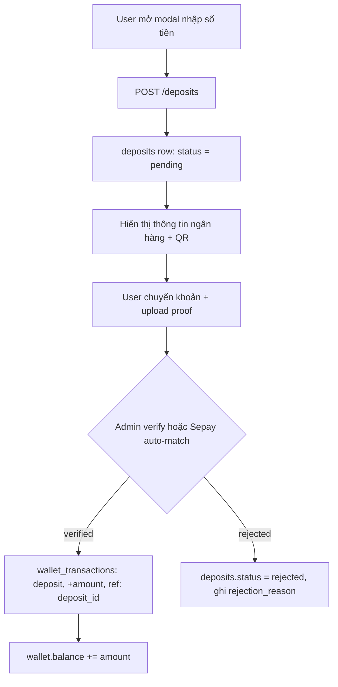
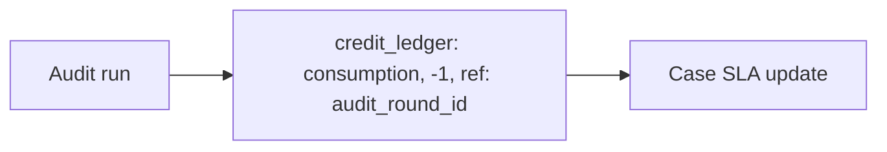
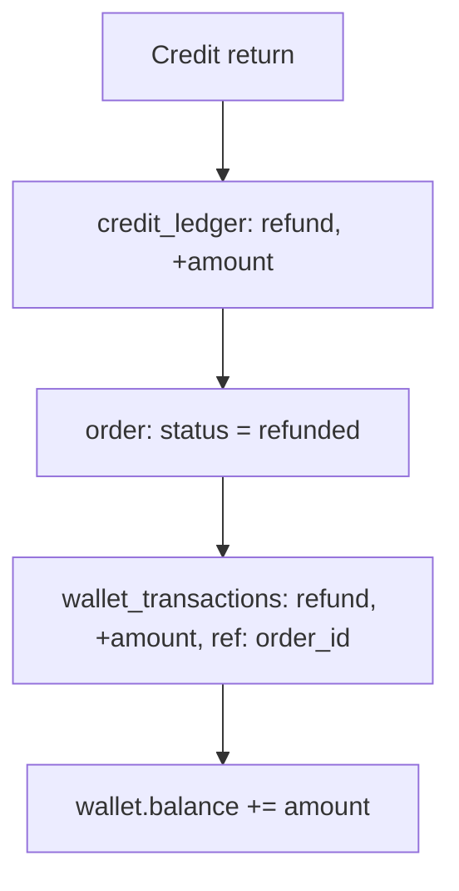

# Financial Domain Redesign

> **Status:** Design proposal — chưa implement
> **Date:** 2026-08-12
> **Scope:** Tách 3 khái niệm đang trộn lẫn (deposit / purchase / consumption) thành 3 domain rõ ràng: Wallet, Order, Service.

---

## 1. Problem

### 1.1 Khái niệm đang trộn lẫn

Schema hiện tại gộp 3 khái niệm **độc lập** vào 3 bảng:

| Khái niệm | Ý nghĩa | Nơi đang chứa |
|---|---|---|
| **Deposit** (nạp tiền) | User chuyển khoản vào ví | `Payment`, `WalletTopup` |
| **Purchase** (mua dịch vụ) | User mua credit bằng ví | `Payment`, `CreditLedger` |
| **Consumption** (tiêu thụ) | Audit tiêu tốn credit | `CreditLedger` |

### 1.2 Các vấn đề cụ thể

1. **`Payment` làm 2 việc cùng lúc** — vừa là minh chứng chuyển khoản (bank transfer proof), vừa là giao dịch mua credit, bị hard-wire vào `case_id` (relation bắt buộc, `onDelete: Cascade`). Không thể dùng cho việc nạp tiền không gắn với case.

2. **`WalletTopup` sao chép `Payment` hoàn toàn** — `transfer_content`, `status`, `verified_by`, `verification_source`, `metadata_json` trùng y hệt. Cùng một feature, hai bảng khác nhau, hai luồng verify khác nhau.

3. **Không truy vết được tiền** — không biết tiền trong ví đến từ đâu (deposit nào?), tiêu vào việc gì (service nào?). `WalletTransaction.source_type`/`source_id` có tồn tại nhưng không được dùng nhất quán, còn `CreditLedger` không link ngược về wallet.

4. **Hai đường mua credit song song**:
   - `Payment` → `CreditLedger` (mua trực tiếp theo case)
   - `WalletTopup` → `Wallet` → `CreditLedger` (nạp ví rồi mua)
   → Logic kép, audit khó, bug dễ trùng.

5. **Thêm service mới phải sửa schema** — vì purchase gắn cứng vào `case_id` + `package_id`, không có khái niệm "line item" trung gian.

---

## 2. Domain Boundary

```
┌─────────────────────────────────────────────────────────┐
│  WALLET DOMAIN                                          │
│  Tiền thật: deposits, số dư ví, chuyển khoản ngân hàng  │
│  1 wallet / 1 user — trả cho MỌI dịch vụ                │
└──────────────────────────┬──────────────────────────────┘
                           │ pays with
┌──────────────────────────▼──────────────────────────────┐
│  ORDER DOMAIN                                           │
│  Cầu nối giữa wallet và dịch vụ                         │
│  User mua gì, giá bao nhiêu → order + order_items       │
└──────────────────────────┬──────────────────────────────┘
                           │ funds
              ┌────────────┴────────────┐
              ▼                         ▼
┌────────────────────────┐  ┌────────────────────────┐
│ SERVICE: CREDIT        │  │ SERVICE: KHÁC (tương lai)│
│ credit_ledger          │  │ team_fit_ledger?         │
│ (ledger audit credits) │  │ document_ledger?         │
│ Nhiều service, 1 wallet│  │ ...                     │
└────────────────────────┘  └────────────────────────┘
```

- **Wallet domain**: tiền thật, 1 ví / user, trả cho tất cả dịch vụ.
- **Order domain**: cầu nối wallet ↔ service — user mua gì, giá bao nhiêu.
- **Service domain**: ledger riêng từng dịch vụ (vd `credit_ledger` cho audit credits). Nhiều service, chung 1 wallet.

---

## 3. New Schema

```prisma
// ==========================================
// WALLET DOMAIN
// ==========================================

// Một lần nạp tiền thật (chuyển khoản). Thay thế Payment + WalletTopup.
model Deposit {
  id                 String   @id @default(uuid())
  user_id            String
  amount             Int                 // VND, smallest unit
  currency           String   @default("VND")
  transfer_content   String   @unique    // nội dung CK, khớp với webhook
  status             String   @default("pending") // pending|verified|rejected
  proof_file_url     String?
  rejection_reason   String?
  bank_transaction_id String?
  bank_credited_at   DateTime?
  verified_by        String?
  verification_source String?             // auto (Sepay) | manual
  metadata_json      Json?
  created_at         DateTime @default(now())
  updated_at         DateTime @updatedAt

  @@index([user_id, created_at])
  @@map("deposits")
}

// Mọi biến động số dư ví — nguồn duy nhất cho balance.
// Thay source_type/source_id hiện tại → reference_type/reference_id.
model WalletTransaction {
  id              String   @id @default(uuid())
  wallet_id       String
  type            WalletTxType  // deposit | service_payment | refund | ...
  amount          Int
  currency        String   @default("VND")
  balance_before  Int
  balance_after   Int
  reference_type  String   // deposit | order | adjustment
  reference_id    String
  idempotency_key String   @unique
  metadata_json   Json?
  created_at      DateTime @default(now())

  @@index([wallet_id, created_at])
  @@map("wallet_transactions")
}

model UserWallet {
  id         String   @id @default(uuid())
  user_id    String   @unique
  balance    Int      @default(0)
  currency   String   @default("VND")
  created_at DateTime @default(now())
  updated_at DateTime @updatedAt

  transactions WalletTransaction[]

  @@map("user_wallets")
}

// ==========================================
// ORDER DOMAIN
// ==========================================

// User mua gì đó từ ví — itemizable, service-agnostic.
model Order {
  id                   String   @id @default(uuid())
  user_id              String
  total_amount         Int
  currency             String   @default("VND")
  status               String   @default("pending") // pending|paid|refunded|cancelled
  wallet_transaction_id String?
  metadata_json        Json?
  created_at           DateTime @default(now())
  updated_at           DateTime @updatedAt

  items OrderItem[]

  @@index([user_id, created_at])
  @@map("orders")
}

model OrderItem {
  id           String   @id @default(uuid())
  order_id     String
  service_type String   // "credit_audit" | "team_fit" | "document" | ...
  quantity     Int
  unit_price   Int
  amount       Int
  metadata_json Json?   // vd { case_id: "..." } cho credit_audit
  created_at   DateTime @default(now())

  order Order @relation(fields: [order_id], references: [id])

  @@map("order_items")
}

// ==========================================
// SERVICE: CREDIT (hiện có, refactor)
// ==========================================

model CreditLedger {
  id              String   @id @default(cuid())
  case_id         String
  amount          Int
  balance_after   Int
  type            String   // purchase | consumption | refund
  reference_type  String?  // order | audit_round | ...  (MỚI)
  reference_id    String?
  idempotency_key String   @unique
  metadata_json   Json?
  created_at      DateTime @default(now())

  case Case @relation(fields: [case_id], references: [id], onDelete: Cascade)

  @@index([case_id, created_at])
  @@map("credit_ledgers")
}
```

> **Note:** `WalletTxType` enum hiện có (`deposit`, `withdrawal`, `refund`, `adjustment`, `migration`) cần thêm `service_payment`.

---

## 4. Standard Flows

### 4.1 DEPOSIT — Nạp tiền vào ví



### 4.2 PURCHASE — Mua credit

```mermaid
flowchart TD
    A[User chọn số lượng credit] --> B[POST /orders]
    B --> C[order_items: service = credit_audit, metadata = { case_id }]
    C --> D{wallet.balance >= total_amount?}
    D -->|No| E[Báo lỗi: số dư không đủ]
    D -->|Yes| F[wallet_transactions: service_payment, -total, ref: order_id]
    F --> G[wallet.balance -= total]
    G --> H[order: status = paid + order_items]
    H --> I[credit_ledger: purchase, +quantity, ref: order_id]
```

### 4.3 CONSUME — Tiêu thụ credit khi chạy audit



### 4.4 REFUND — Hoàn credit



---

## 5. Future Extensibility

- Thêm service trả phí mới (vd **Team Fit**, **Document generation**): chỉ cần tạo `order_items` với `service_type` mới — không đụng schema wallet hay order.
- Mỗi service có ledger riêng, **tất cả được fund từ cùng 1 ví**.
- Mô hình khóa tương lai: nạp 1 lần → mua nhiều service khác nhau → truy vết qua `order → wallet_transaction`.

---

## 6. Before/After Comparison

| Aspect | Old | New |
|--------|-----|-----|
| Nạp ví table | `WalletTopup` (sao chép `Payment`) | `deposits` (unified) |
| Payment page | `Payment` (hard-wire vào case) | `deposits` (pure topup) |
| Credit purchase | `verifyPayment` tự tạo `CreditLedger` | `orders` → tách biệt rõ ràng |
| Trace "tiền từ đâu" | Impossible | `wallet_tx.reference_id` → `deposit` |
| Add new service | Cần sửa schema | 1 dòng `order_items` |
| Proof upload | 2 endpoints riêng biệt | 1 endpoint `deposits` |
| Sepay webhook | 2 branches (topup + payment) | 1 branch (deposits) |

---

## 7. Migration Strategy (high-level)

| Phase | Nội dung |
|---|---|
| **Phase 1** | Thêm bảng mới (`deposits`, `orders`, `order_items`) song song bảng cũ → dual-write period (ghi cả 2 nơi, so sánh) |
| **Phase 2** | Migrate data: `Payment` → `deposits`, `WalletTopup` → `deposits`, CreditLedger mua trực tiếp → `orders` |
| **Phase 3** | Chuyển code sang bảng mới, tắt dual-write |
| **Phase 4** | Deprecate bảng cũ (`Payment`, `WalletTopup`, field cũ trong `credit_ledger`) |

> ⚠️ Tuân thủ [prisma-migration-safety](../.agents/rules/prisma-migration-safety.md): chỉ `--create-only`, không destructive command trên DB production.

---

## 8. Key Naming Decisions

| Tên | Lý do |
|---|---|
| `deposits` (không phải `payments`) | "payment" ngụ ý mua gì đó; **deposits** = chỉ thêm tiền vào ví, không gắn service |
| `orders` (không phải `purchases`) | Là lệnh mua dịch vụ, có thể tách item — "purchase" là kết quả, "order" là quá trình |
| `order_items` | Line item service-agnostic → mở đường cho multi-service |
| `credit_ledger` | Giữ nguyên vì nó đã là service ledger của audit credits — đúng bản chất |

---

## 9. Standards

- Mọi số tiền bằng **VND**, lưu dạng `Int` (đơn vị nhỏ nhất — không dùng float).
- Mọi bảng: `created_at`, `updated_at` (trừ bảng append-only như `wallet_transactions`/`credit_ledger` chỉ cần `created_at`).
- Pattern tham chiếu: `reference_type` + `reference_id` (soft FK) để truy vết cross-domain — tránh hard relation ràng `case_id` kiểu hiện tại.
- `idempotency_key` (unique) trên **mọi** bảng ledger — chống double-spend / double-verify từ webhook retry.

---

## 10. Open Questions

1. **`deposits` có nên có `amount_received`** (số tiền ngân hàng thực nhận) tách biệt với `amount` (số tiền yêu cầu)? — để xử lý partial payment / lệch phí.
2. **`orders` có hỗ trợ partial refund?** (hiện tại: chỉ full refund).
3. **Admin verification**: giữ nguyên UI hiện tại hay redesign theo luồng mới?
4. **Migrate data `Payment`/`WalletTopup` hiện có** hay archive (giữ bảng cũ chỉ-đọc)?

---

## Appendix: Verification Notes

- Claims trên được đối chiếu với `prisma/schema.prisma` hiện tại (2026-08-12):
  - `Payment` relation bắt buộc với `Case` (`case_id`, `onDelete: Cascade`) ✅
  - `WalletTopup` trùng `transfer_content`/`status`/`verified_by`/`verification_source` với `Payment` ✅
  - `WalletTransaction` hiện dùng `source_type`/`source_id` (đề xuất đổi → `reference_type`/`reference_id`) ✅
  - `WalletTxType` hiện thiếu `service_payment` — cần thêm ✅
  - Sepay webhook hiện có nhánh xử lý topup (xem `apps/api/src/modules/payments/application/sepay-webhook.usecase.ts`) ✅
