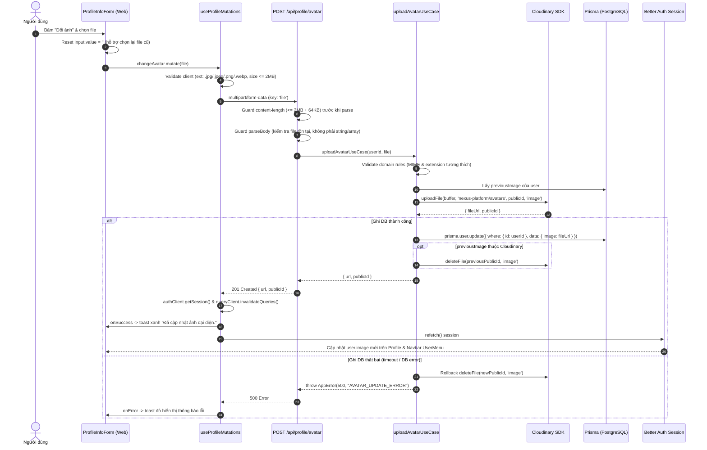

# GA05: Avatar Upload via Cloudinary

## 1. Overview & Mục tiêu

Kế hoạch triển khai và chuẩn hóa tính năng **GA05: Avatar Upload** cho phép người dùng thay đổi ảnh đại diện cá nhân trong hệ thống Nexus Platform:
- Sử dụng hạ tầng **Cloudinary** có sẵn (`apps/api/src/services/cloudinary.ts`) với thư mục chuyên biệt `nexus-platform/avatars`.
- Quản lý vòng đời ảnh đại diện: tải ảnh mới lên Cloudinary với resource type `image`, lưu URL an toàn vào trường `User.image` trong PostgreSQL, tự động xóa ảnh đại diện cũ trên Cloudinary để tối ưu dung lượng và chi phí.
- **Bảo mật & Phòng thủ DoS**: Chặn payload lớn trước khi parse multipart body, kiểm tra chéo MIME type với phần mở rộng để ngăn chặn tệp độc hại giả mạo (MIME spoofing / Double extension).
- **Cơ chế Rollback an toàn**: Nếu quá trình ghi database thất bại sau khi đã upload lên Cloudinary, hệ thống tự động xóa file vừa upload để tránh rác lưu trữ (orphan files).
- **Bỏ qua an toàn Provider ngoài**: Nếu avatar cũ là URL từ Google OAuth hoặc bên thứ 3, hệ thống bỏ qua bước xóa trên Cloudinary.
- **Tích hợp giao diện & Đồng bộ tức thì**: Trang Cài đặt thông tin cơ bản (`/dashboard/settings/profile` và `/supporter/settings/profile`), cập nhật avatar hiển thị ngay lập tức trên form profile và popover menu tài khoản (`UserMenu.tsx`) thông qua cơ chế `refetch()` của Better Auth React client kết hợp TanStack Query cache invalidation.

---

## 2. Kiến trúc kỹ thuật & Luồng xử lý (Sequence Diagram)

---

## 3. Tổng hợp Edge Cases & Giải pháp Kỹ thuật (Scouted Edge Cases)

| STT | Kịch bản Biên (Edge Case) | Rủi ro tiềm ẩn | Giải pháp kiến trúc trong Plan |
|---|---|---|---|
| 1 | **MIME Spoofing / Double Extension** | File độc hại đổi tên `script.php.png` hoặc fake MIME type | `path.extname` lấy extension cuối, `isAllowedAvatarMime` đối chiếu extension với MIME, Cloudinary kiểm tra magic bytes. |
| 2 | **Large File DoS / Body Bomb** | Gửi payload hàng trăm MB làm cạn RAM server | Controller kiểm tra header `content-length` trước khi parse body multipart ($> 2\text{ MB} + 64\text{ KB}$ trả về 400 ngay). |
| 3 | **Multi-file / Invalid Key** | Gửi mảng `file: [f1, f2]` hoặc sai field name | Controller kiểm tra `!file \|\| typeof file === 'string' \|\| Array.isArray(file)` trả về $400\text{ VALIDATION\_ERROR}$. |
| 4 | **DB Failure Rollback** | DB lỗi sau khi upload gây rác lưu trữ trên Cloudinary | Catch lỗi DB, lập tức gọi `deleteFile(uploaded.publicId, 'image')` để dọn dẹp rồi mới ném lỗi 500. |
| 5 | **External Previous Avatar (OAuth)** | Avatar cũ từ Google OAuth bị cố xóa trên Cloudinary gây lỗi | `extractPublicId` trả về `null` với URL ngoài Cloudinary, bỏ qua lệnh xóa an toàn. |
| 6 | **Rapid Click Race Condition** | Bấm đổi ảnh liên tục khi mạng lag | UI disable button + hiển thị loading; mỗi upload sinh `publicId` ngẫu nhiên có `crypto.randomBytes(3)` độc nhất. |
| 7 | **Browser Image Caching** | Trình duyệt cache URL ảnh cũ không hiển thị ảnh mới | URL ảnh mới luôn mang `publicId` ngẫu nhiên độc nhất, tránh dính cache cũ. |
| 8 | **Navbar Session Sync** | Đổi ảnh xong nhưng UserMenu trên Navbar chưa cập nhật | `onSuccess` gọi `authClient.getSession()`, `queryClient.invalidateQueries` và `useSession().refetch()`. |

---

## 4. Cross-Plan Dependencies

| Quan hệ | Kế hoạch | Trạng thái | Ghi chú |
|---|---|---|---|
| Độc lập | `plans/260827-0900-ga04-user-delete-account/` | Completed | Cùng nằm trong module Profile nhưng không chồng lấn logic |

---

## 5. Danh sách các Phase triển khai

| Phase | Tên Phase | Nội dung chính |
|---|---|---|
| **Phase 1** | [Backend Avatar Upload API & Cloudinary Integration](./phase-01-backend-avatar-upload-api.md) | Xây dựng endpoint, guard DoS, domain rules, Cloudinary lifecycle, rollback DB |
| **Phase 2** | [Frontend Settings Avatar UI & Session Sync](./phase-02-frontend-settings-avatar-ui.md) | Form hồ sơ, nút đổi ảnh, TanStack Mutation hook, đồng bộ session Navbar |
| **Phase 3** | [Automated Tests, Regression & Verification](./phase-03-tests-and-verification.md) | Bộ Unit Test DI 8 kịch bản, typecheck toàn bộ monorepo |

---

## 6. Ranh giới & Non-Goals

### Trong phạm vi (In Scope)
- Tải lên ảnh đại diện định dạng `.jpg`, `.jpeg`, `.png`, `.webp`, dung lượng $\le 2\text{ MB}$.
- Upload vào thư mục `nexus-platform/avatars` trên Cloudinary với `resource_type: "image"`.
- Cập nhật trường `User.image` trong PostgreSQL.
- Xóa avatar cũ trên Cloudinary khi upload avatar mới thành công.
- Rollback xóa file vừa upload nếu cập nhật DB thất bại.
- Hiển thị avatar mới ngay lập tức trên Profile Form và Navbar UserMenu.

### Không nằm trong phạm vi (Non-Goals)
- Không thêm tính năng crop/edit ảnh trên client (giữ UI tinh gọn theo KISS).
- Không hỗ trợ ảnh GIF (tránh lạm dụng băng thông và đảm bảo tính thẩm mỹ).
- Không sửa schema database (sử dụng trường `User.image` có sẵn trong Prisma).
