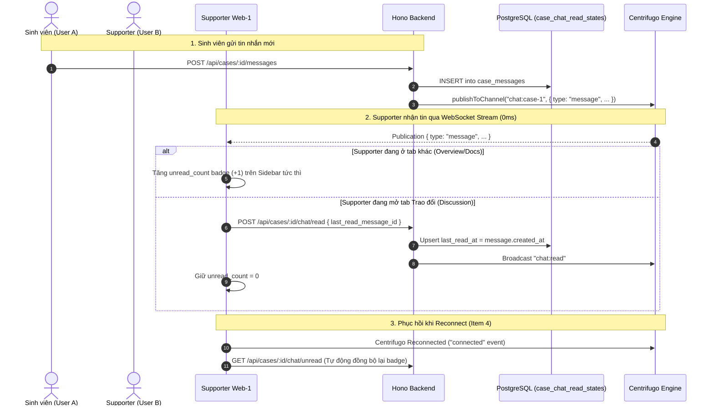

# GA-19: Đếm số tin nhắn chưa đọc theo từng người dùng (Chat Unread-per-User)

## 1. Bối cảnh & Vấn đề (Context & Problem)

Tại trang Case Workspace (`apps/web-1/app/dashboard/case/[id]/page.tsx:116` và `apps/web-1/app/supporter/case/[id]/page.tsx:116`), thanh điều hướng `WorkspaceSidebar` hiện đang nhận prop:
```tsx
messageCount={caseData.messages?.length}
```
Điều này dẫn đến:
- Badge tin nhắn luôn hiển thị **tổng số tin nhắn** đã gửi trong toàn bộ lịch sử trao đổi của case, thay vì số tin nhắn mới mà người dùng hiện tại **chưa đọc**.
- Sinh viên, Supporter và Admin không thể phân biệt được case nào có tin nhắn mới cần phản hồi gấp.

## 2. Trọng tâm Thiết kế Kỹ thuật (Technical Focus)

1. **Phạm vi chuẩn xác (Item 1 — Focused Scope):** Tập trung trực tiếp vào Case Workspace (`/dashboard/case/:id` và `/supporter/case/:id`). Truy vấn `getUnreadMessageCount(caseId, userId)` thực thi 1 câu count duy nhất, tối ưu qua index kép `(case_id, last_read_at)` trên PostgreSQL, không gây over-engineering.
2. **100% Realtime Push & Deduplication (Item 2 & 3):** 
   - Nhận publication event từ Centrifugo channel `chat:${caseId}` cập nhật badge ngay lập tức (0ms).
   - Commit DB bằng `POST /api/cases/:id/chat/read` với `last_read_message_id`. Server neo mốc thời gian `last_read_at` theo `created_at` của message đó trên DB (chống lệch giờ).
   - Client so sánh `latestMessageId !== lastMarkedMessageId` để tránh gửi request dư thừa.
3. **Phục hồi khi Mất mạng / Sleep Reconnection (Item 4 — Reconnection Sync):**
   - Đăng ký listener `client.on("connected", () => refetchUnread())` trên Centrifugo client.
   - Bật `refetchOnWindowFocus: true` trên TanStack Query để tự động bù các tin nhắn bị miss trong lúc máy tính sleep hoặc rớt mạng.

## 3. Kiến trúc & Luồng dữ liệu Realtime (Architecture & Data Flow)



## 4. Danh sách các Phase thực hiện

| Phase | Tên Phase | Trọng tâm | File chi tiết | Ước lượng | Trạng thái |
|---|---|---|---|---|---|
| **Phase 01** | Database & Shared Validation | Model Prisma `CaseChatReadState`, migration `--create-only`, Zod schemas trong `@repo/validation` | `phase-01-database-and-schema.md` | 1.0h | Completed |
| **Phase 02** | Backend API & Realtime Broadcast | Repository `getUnreadMessageCount`, `upsertCaseChatReadState` (timestamp anchor), UseCase `markChatRead`, Endpoint `POST /chat/read`, Centrifugo event `chat:read` | `phase-02-backend-api-and-realtime.md` | 1.0h | Completed |
| **Phase 03** | Frontend Hooks & UI Integration | Hook `useCaseUnreadCount` (Reconnection sync + Focus refetch), cập nhật `useRealtimeChat` stream, cập nhật `WorkspaceSidebar` badge | `phase-03-frontend-hooks-and-ui.md` | 1.0h | Completed |
| **Phase 04** | Tests & Verification | Scoped unit tests (`node:test`), kiểm tra reconnect recovery, DB safety check | `phase-04-tests-and-verification.md` | 0.5h | Completed |
