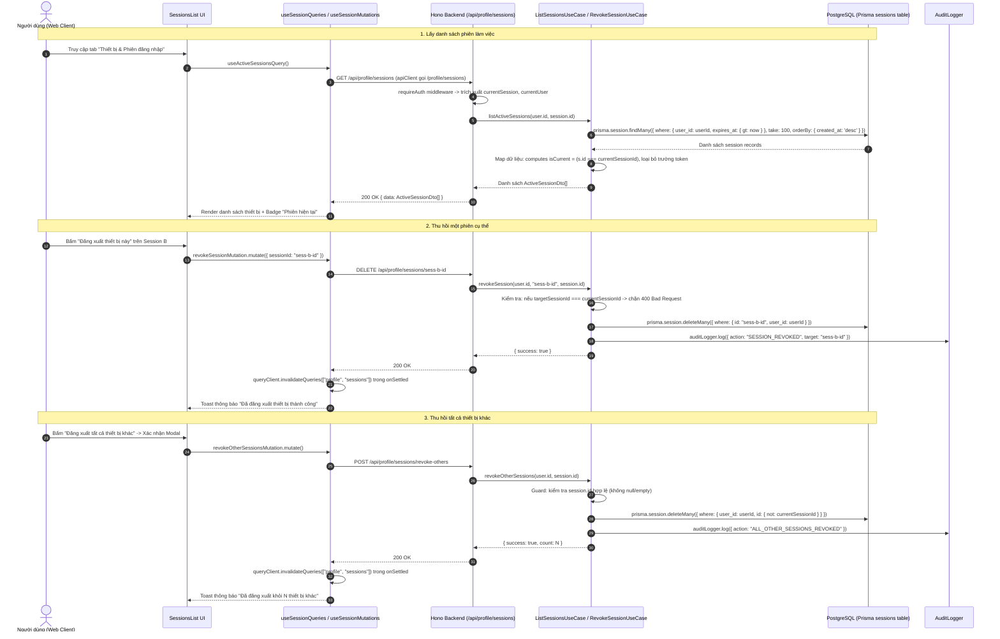

# GA-06: Giao diện quản lý phiên đăng nhập & thiết bị (Session Management UI)

## 1. Overview & Mục tiêu

Kế hoạch triển khai tính năng **GA-06: Session Management UI** nhằm trao quyền cho người dùng kiểm soát các thiết bị và phiên làm việc đang đăng nhập tài khoản trên Nexus Platform theo tiêu chuẩn bảo mật **OWASP Session Management Cheat Sheet**:
- **Hiển thị danh sách thiết bị**: Liệt kê các phiên đăng nhập đang có hiệu lực (`expires_at > NOW()`), trích xuất thông tin hệ điều hành (Windows, macOS, iOS, Android, Linux), trình duyệt (Chrome, Safari, Firefox, Edge, Opera, Coc Coc...) và địa chỉ IP kết nối. Giới hạn phòng thủ tối đa 100 phiên (`take: 100`).
- **Nhận diện phiên hiện tại bất biến**: Tự động đánh dấu nhãn "Phiên hiện tại" cho thiết bị đang truy cập dựa trên việc đối soát khóa chính `session.id === currentSession.id` ở tầng máy chủ (Server-side identification), đảm bảo không bị ảnh hưởng bởi cơ chế xoay vòng token (rolling session `updateAge: 24h`) và tuyệt đối không để lộ token xác thực thô ra ngoài JavaScript frontend.
- **Thu hồi phiên từ xa (Remote Session Revocation)**: Cho phép người dùng chủ động đăng xuất các thiết bị lạ hoặc không còn sử dụng một cách tức thì.
- **Đăng xuất tất cả thiết bị khác**: Hỗ trợ tính năng thu hồi đồng loạt toàn bộ các phiên khác chỉ bằng một thao tác an toàn kèm Modal xác nhận và guard chống xóa nhầm phiên hiện tại, phòng ngừa rủi ro tài khoản bị chiếm đoạt khi quên đăng xuất trên máy công cộng.
- **Tuân thủ Clean Architecture & Mantine UI v9**: Thiết kế giao diện nhất quán với hệ thống Settings hiện có (`/dashboard/settings` và `/supporter/settings`), sử dụng biểu tượng Lucide React, cấu trúc Clean Architecture cho tầng Profile Module và không làm phát sinh nợ kỹ thuật.

---

## 2. Kiến trúc kỹ thuật & Luồng xử lý (Sequence Diagram)

---

## 3. Tổng hợp Edge Cases & Giải pháp Kỹ thuật (Scouted Edge Cases)

| STT | Kịch bản Biên (Edge Case) | Rủi ro tiềm ẩn | Giải pháp kiến trúc trong Plan |
|---|---|---|---|
| 1 | **Rò rỉ Session Token nhạy cảm** | Trả trường `token` ra client có thể bị XSS tấn công chiếm phiên | DTO `ActiveSessionDto` tuyệt đối loại bỏ trường `token`, chỉ trả về `id`, `ipAddress`, `userAgent`, `createdAt`, `expiresAt`, `isCurrent`. |
| 2 | **Session ID không phải UUID (Better Auth format)** | Zod schema dùng `.uuid()` làm crash 100% request | Schema dùng `z.string().min(1)` phù hợp với chuỗi base62/nanoid của Better Auth. |
| 3 | **Prisma Column Naming (Snake_case)** | Dùng camelCase `userId`, `expiresAt` gây lỗi PrismaClientValidationError | Mọi truy vấn Prisma gọi đúng `user_id`, `expires_at`, `created_at`, `ip_address`, `user_agent`. |
| 4 | **Double `/api` prefix trong `apiClient`** | Gọi `/api/profile/sessions` trên `apiClient` gây 404 URL `/api/api/...` | Hook dùng đường dẫn chuẩn `/profile/sessions` tương thích với `baseURL` của Axios. |
| 5 | **Rolling Session Token Desync** | Token thay đổi sau 24h rolling làm lệch `is_current` | So khớp bằng khóa chính bất biến `s.id === currentSession.id` thay vì so sánh token thô. |
| 6 | **Tự xóa phiên hiện tại qua nút đơn lẻ** | Trạng thái client bị mất đồng bộ, cookie vẫn còn nhưng DB đã xóa gây lỗi 401 chập chờn | Phiên hiện tại chỉ hiển thị Badge "Phiên hiện tại" và **không có nút xóa riêng**. Muốn đăng xuất máy hiện tại, người dùng dùng nút "Đăng xuất" chuẩn trên UserMenu. |
| 7 | **Ghost Session do Cache không invalidate khi lỗi** | Phiên đã hết hạn trên server, bấm xóa báo lỗi 404 và không refresh cache | `useSessionMutations` đặt `invalidateQueries` trong `onSettled` để luôn làm mới danh sách phiên. |
| 8 | **Loading State cục bộ theo từng Session Item** | Disable toàn bộ danh sách khi 1 session đang xóa | Scoped loading theo `sessionId` (`isPending && variables === session.id`), không khóa toàn trang. |

---

## 4. Cross-Plan Dependencies

| Quan hệ | Kế hoạch | Trạng thái | Ghi chú |
|---|---|---|---|
| Độc lập | `plans/260827-1400-ga05-avatar-upload/` | Completed | Cùng thuộc Profile Settings nhưng độc lập hoàn toàn về logic |
| Độc lập | `plans/260827-0900-ga04-user-delete-account/` | Completed | Cùng thuộc Profile Settings nhưng xử lý soft-delete riêng biệt |
| Kế thừa | GA-07 (Session Timeout Policy) | Completed | GA-06 kế thừa cấu hình `expiresIn: 7d` và `updateAge: 24h` đã cấu hình ở GA-07 |

---

## 5. Danh sách các Phase triển khai

| Phase | Tên Phase | Trọng tâm | File chi tiết | Ước lượng | Trạng thái |
|---|---|---|---|---|---|
| **Phase 01** | [Backend Session Management API & Validation](./phase-01-backend-session-management-api.md) | Shared Zod schemas (`string().min(1)`), UseCases (List, Revoke, RevokeOthers với snake_case Prisma), Controller & Profile routes, Immutable session.id matching, Guard against total deletion, Audit log | `phase-01-backend-session-management-api.md` | 1.5h | Completed |
| **Phase 02** | [Frontend Session Management UI & Navigation](./phase-02-frontend-session-management-ui.md) | Update `settings-nav.ts`, Utility `ua-parser.ts` (thứ tự ưu tiên regex chính xác), Hooks `useSessionQueries`/`useSessionMutations` (`/profile/sessions` path, `onSettled` invalidation), Trang `/settings/sessions`, Component `SessionItem` (scoped loading), Modal `RevokeOthersModal` | `phase-02-frontend-session-management-ui.md` | 1.5h | Completed |
| **Phase 03** | [Automated Tests & Verification](./phase-03-tests-and-verification.md) | Unit tests cho UseCases & UA Parser, kiểm thử bảo mật IDOR, Self-revoke guard, Non-UUID session ID support, Typecheck toàn bộ Monorepo | `phase-03-tests-and-verification.md` | 0.5h | Completed |

---

## 6. Red Team Review

### Session — 2026-08-27
**Findings:** 8 findings từ 3 hostile reviewers (Security Adversary, Failure Mode Analyst, Assumption Destroyer).
**Severity breakdown:** 2 Critical, 4 High, 2 Medium.

| # | Finding | Severity | Disposition | Applied To |
|---|---------|----------|-------------|------------|
| 1 | Zod UUID constraint crashes Better Auth alphanumeric IDs | Critical | **Accept** | Phase 01 (`ActiveSessionDtoSchema`, `RevokeSessionParamsSchema`) |
| 2 | Prisma camelCase vs schema snake_case column names mismatch | Critical | **Accept** | Phase 01 (`user_id`, `expires_at`, `created_at`, `ip_address`, `user_agent`) |
| 3 | Frontend `apiClient` double `/api` prefix causing 404s | High | **Accept** | Phase 02 (`/profile/sessions` relative paths) |
| 4 | Rolling session token desynchronization during `isCurrent` check | High | **Accept** | Phase 01 & Plan.md (Use immutable `s.id === currentSession.id`) |
| 5 | Stale cache deadlock on concurrent expiration/revocation (404 error) | High | **Accept** | Phase 02 (`onSettled` cache invalidation in React Query) |
| 6 | Unchecked `currentSessionId` causing accidental total session deletion | Medium | **Accept** | Phase 01 (Strict runtime guard in `revoke-other-sessions.usecase.ts`) |
| 7 | Global mutation loading state disabling all action buttons | Medium | **Accept** | Phase 02 (Scoped loading per `sessionId`) |
| 8 | Unbounded database query loading & UA parser test coverage | Medium | **Accept** | Phase 01 (`take: 100`) & Phase 03 (UA Parser unit test suite) |

---

## 7. Ranh giới & Non-Goals

### Trong phạm vi (In Scope)
- Endpoint `GET /api/profile/sessions`: Trả về danh sách phiên còn hạn (tối đa 100), kèm cờ `isCurrent: boolean` (so khớp bằng `session.id`).
- Endpoint `DELETE /api/profile/sessions/:id`: Thu hồi 1 phiên cụ thể của user hiện tại (chặn xóa phiên hiện tại).
- Endpoint `POST /api/profile/sessions/revoke-others`: Thu hồi tất cả phiên khác của user hiện tại kèm guard an toàn.
- Thêm mục "Thiết bị & Phiên đăng nhập" vào navigation cài đặt sinh viên và supporter.
- Trang hiển thị danh sách thiết bị với Icon, Tên thiết bị/OS, Trình duyệt, IP, Ngày đăng nhập, Hạn phiên, Badge phiên hiện tại.
- Modal xác nhận khi đăng xuất toàn bộ thiết bị khác.
- Ghi nhận Audit Log cho các sự kiện thu hồi phiên kèm thông tin actor và target.

### Không nằm trong phạm vi (Non-Goals)
- Không can thiệp sửa đổi bảng `sessions` trong Prisma (giữ nguyên schema hiện có, không chạy migration DB).
- Không cài thêm thư viện nặng bên ngoài như `ua-parser-js` (tự xây dựng lightweight zero-dependency parser).
- Không can thiệp hủy kết nối Centrifugo WebSocket thủ công (JWT của Centrifugo tự hết hạn sau 15 phút).
- Không hỗ trợ đổi tên thiết bị / đặt alias cho thiết bị (tránh over-engineering theo YAGNI/KISS).
