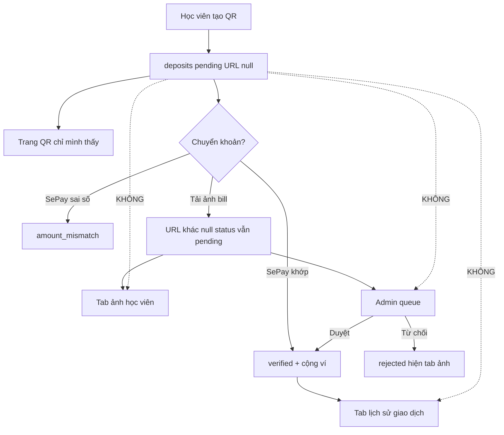

# Pending deposit UX

Cách 1 đã chốt. **Không** thêm `pending_verification`. Discriminator = `proof_file_url`. **Không** Prisma schema / migrate / backfill.

Chi tiết phase: [01 banner](./phase-01-unmount-banner.md) · [02 admin](./phase-02-admin-proof-queue.md) · [03 bảng ảnh](./phase-03-student-proof-album.md)

Báo cáo RCA: [deposit-admin-proof-queue](../reports/260901-2300-deposit-admin-proof-queue.md)

---

## 1. Nghiệp vụ

Hệ thống **không biết** học viên đã chuyển khoản hay chưa cho đến khi (a) SePay webhook khớp hoặc (b) admin duyệt ảnh. Không có field `transferred`. Không được suy từ “đã mở QR”.

### 1.1 Ba việc khác nhau — hiện đang trộn một `pending`

| Việc | Ý nghĩa | Ai thấy | Dữ liệu |
|------|---------|---------|---------|
| Tạo QR | Học viên tự tạo lệnh CK (`CRTOPUP…`). Chưa phải hồ sơ chờ người. Không ai duyệt QR. | Chỉ học viên, `/dashboard/payment?pid=` | `deposits` row `status=pending`, `proof_file_url=null` |
| Tiền vào ví | Ngân hàng đã ghi có **và** hệ thống cộng số dư | Tab **Lịch sử giao dịch** | `wallet_transactions` + deposit `verified` |
| Ảnh bill | Học viên muốn xem lại tấm đã tải (50k hay 60k?) | Tab **Ảnh minh chứng** | `proof_file_url` khác null |
| Admin đối chiếu | Chỉ khi có ảnh (SePay miss / học viên chủ động gửi bill) | Admin “Duyệt minh chứng” | `pending` **và** có URL ảnh |

### 1.2 Bốn case trong tranh luận chat — map hệ thống

Team chốt **chỉ case “đã gửi ảnh”** cần surface riêng. “Đã chuyển” không đo được.

| Chat nói | Hệ thống thấy | Xử lý |
|----------|---------------|--------|
| Chưa chuyển + chưa ảnh (mới mở QR) | `pending`, URL null | Không banner, không ledger, không tab ảnh, không queue admin |
| Đã chuyển + chưa ảnh | SePay happy path **hoặc** SePay miss chưa upload | SePay → tự `verified` + ledger. Miss chưa ảnh: không surface “chờ xác minh” |
| Chưa chuyển + đã ảnh (ảnh rác) | URL có, admin từ chối | Tab ảnh học viên (thấy từ chối). Admin queue rồi reject |
| Đã chuyển + đã ảnh | URL có, pending hoặc verified | Tab ảnh. Admin duyệt nếu còn pending. Ledger khi đã cộng ví |

Cota: tạo QR chưa nạp **đừng** biến thành payment trong lịch sử. Phùng: có thể tab khác. Chốt: tab khác = **bảng ảnh đã gửi**, không phải list mọi QR.

### 1.3 Bug hiện tại (cùng một nhầm)

1. **Banner ví** (`DepositStuckBanner`): lấy deposit `newest` nếu `pending|rejected|amount_mismatch` → copy “Đang chờ xác minh” / “Số dư chưa thay đổi”. Mở QR = banner. Hai đơn 50k rồi 60k: chỉ hiện newest → ảnh 50k biến mất khỏi tầm mắt.
2. **Admin queue**: `deposits.filter(d => d.status === "pending")` → mọi QR vào “Duyệt minh chứng”, cột “Không tìm thấy file”, nút Duyệt vẫn còn.
3. **`verifyDepositUseCase`**: không check ảnh. Admin Duyệt QR trống → `walletService.deposit` → lỗ tiền.
4. **`GET /deposits` list**: DTO không có `proof_file_url` → ví không thể hiện “tôi đã gửi tấm nào”.

Gốc: financial refactor 12/08 gộp Payment (`unpaid` → `pending_verification` lúc upload) thành Deposit một `pending`. FE admin/banner vẫn hiểu `pending` = “cần người”.

### 1.4 Copy / tinh thần UI

- Tạo QR: không chữ “chờ xác minh”.
- Tab 2 tên **Ảnh minh chứng**, không “Đơn chờ duyệt”.
- Tab 2 = Mantine **Table**. Cột: ngày tạo, số tiền, xem ảnh, trạng thái, ⋮ chỉ **Xem chi tiết**. Không grid. Không nút Duyệt. Menu không trùng cột Ảnh.
- Ledger chỉ biến động số dư.

---

## 2. Kiến trúc hiện tại

```
WalletTopupModal
  POST /deposits { amount, idempotency_key }
  → createDepositUseCase
  → deposits.status="pending", proof_file_url=null, transfer_content=CRTOPUP…
  → router.push(/dashboard/payment?pid=)

Payment page
  GET /deposits/:id          (có proof_file_url)
  POST /payments/proof       (chỉ UPDATE proof_file_url, KHÔNG đổi status)
  SePay POST /payments/sepay-webhook
    khớp amount → walletService.deposit + status=verified
    sai amount → status=amount_mismatch

Wallet page hôm nay
  WalletBalanceCard          GET /wallet/balance
  DepositStuckBanner         GET /deposits (list, không có URL ảnh) → newest pending
  WalletTransactionList      GET /wallet/history   ← chỉ sổ cái

Admin
  GET /deposits/admin/all
  filter status===pending
  POST /deposits/:id/verify → verifyDepositUseCase (không đòi ảnh)
```

Bảng `deposits.status` (String, không enum Prisma): `pending | verified | rejected | amount_mismatch`.

Domain TS `DepositStatus` chỉ `pending | verified | rejected` — thiếu `amount_mismatch` (lỗ type, không sửa trong plan trừ khi đụng file đó).

Hai nguồn list:

| API | Ai | Hàng |
|-----|----|------|
| `GET /wallet/history` | học viên | `wallet_transactions` — tiền đã cộng/trừ |
| `GET /deposits` | học viên | mọi deposit user, **thiếu** `proof_file_url` |
| `GET /deposits/admin/all` | admin | mọi deposit, **có** `proof_file_url` |

SePay **không** gọi `verifyDepositUseCase`. Guard ở use case admin không gãy webhook.

---

## 3. Kiến trúc đích

```
WalletPage
  WalletBalanceCard
  Tabs (Mantine)
    "Lịch sử giao dịch" → WalletTransactionList    GET /wallet/history
    "Ảnh minh chứng"    → WalletProofTable         GET /deposits (list chỉ row có ảnh)
  WalletTopupModal
  (không banner)

Admin pending tab
  status==="pending" && proof_file_url.trim()
  ẩn Duyệt nếu không ảnh

verifyDepositUseCase
  verified + không ảnh + không amount_mismatch → 400 PROOF_REQUIRED
```



Không bảng mới. Không cột mới. Không status mới.

---

## 4. Thay đổi kỹ thuật theo lớp

### 4.1 API — additive, không migrate

`DepositHistoryItem` thêm `proof_file_url: string | null`.

Student `GET /deposits` sau phase 3: **chỉ** row `proof_file_url != null`. Consumer duy nhất = tab ảnh (banner chết phase 1). **Không** thêm query `has_proof` — một hành vi, ít nhánh.

Không thêm `total` / pagination trước mắt. `limit` mặc định 20 đủ.

Vì sao lọc SQL: `take: 20`. Lọc client thì 20 QR rác đẩy ảnh 50k khỏi trang.

Proof upload **không đổi**. Không đổi status lúc gửi ảnh.

### 4.2 Domain guard (phase 2)

`deposit.types.ts` — một hàm `canAdminCreditDeposit` (có URL hoặc `amount_mismatch`). Không `hasDepositProof` riêng.

`verifyDepositUseCase`: `verified` && `!canAdminCreditDeposit` → 400 `PROOF_REQUIRED`.

### 4.3 Admin FE (phase 2)

Chỉ `admin/page.tsx` filter + badge. **Không** sửa `AdminDepositVerificationTable.tsx`.

`GET /deposits/admin/all` giữ nguyên.

### 4.4 Wallet FE

Phase 1: bỏ banner, xóa `DepositHistory.tsx`, giữ hook.

Phase 3:
- `useMyDeposits()` — `GET /deposits` (server đã lọc có ảnh)
- `WalletProofTable.tsx` — 5 cột; ⋮ chỉ Xem chi tiết
- Tabs trên `page.tsx`
- Invalidate `["deposits"]` sau upload

---

## 5. Phases và file ownership

| Phase | Files | Phụ thuộc |
|-------|--------|-----------|
| 1 Unmount banner | `wallet/page.tsx`, xóa `DepositHistory.tsx` | — |
| 2 Admin queue + BE guard | `admin/page.tsx`, `deposit.types.ts`, `verify-deposit.usecase.ts`, test helper | độc lập phase 1 |
| 3 Bảng ảnh | dto/repo/list-deposits, `useWallet.ts`, `WalletProofTable.tsx`, `wallet/page.tsx`, invalidate upload | sau phase 1 |

Phase 2 song song phase 1. Phase 3 sau 1 vì cùng `page.tsx`.

## 6. Out of scope

- Status mới, backfill prod, `prisma migrate` / `db push`
- Expire QR bỏ mặc
- Queue riêng `amount_mismatch` (đang trộn tab history admin)
- Đổi SePay
- List mọi QR trên tab 2
- Nút duyệt trên ví học viên

## 7. Definition of done

- Mở QR: không banner, không dòng ledger, không dòng tab ảnh, không badge admin.
- Upload ảnh 50k rồi 60k: tab ảnh **hai hàng** bảng (ngày, tiền, xem ảnh, trạng thái, menu 3 chấm).
- Admin pending chỉ dòng có ảnh. API verify không ảnh → 400, ví không đổi.
- SePay khớp vẫn tự cộng ví.
- Không migration.

