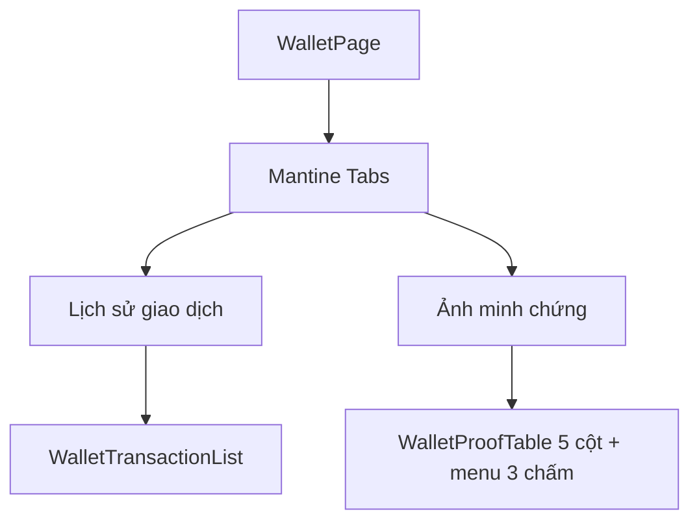

# Diagram: Ví của tôi — tab 2 là bảng

## Tab 1 — Lịch sử giao dịch

```
┌─────────────────────────────────────────────────────────────┐
│  Ví của tôi                              [ + Nạp tiền ]     │
│  Số dư  150,000 VND                                         │
│  [ Lịch sử giao dịch ]   Ảnh minh chứng                     │
│  ════════════════════                                       │
│  Nạp tiền  +60,000 VND   01/09                              │
│  Trừ ví    -39,000 VND   31/08                              │
│  không banner vàng                                          │
└─────────────────────────────────────────────────────────────┘
```

## Tab 2 — Ảnh minh chứng (bảng, trước mắt)

```
┌─────────────────────────────────────────────────────────────────┐
│  Ví của tôi                                  [ + Nạp tiền ]     │
│  Số dư  150,000 VND                                             │
│    Lịch sử giao dịch    [ Ảnh minh chứng ]                      │
│                         ══════════════════                      │
│  Ngày tạo      Số tiền       Ảnh minh chứng   Trạng thái    ⋮   │
│  01/09 15:35   60,000 VND    Xem ảnh          Đã gửi ảnh    ⋮   │
│  01/09 15:20   50,000 VND    Xem ảnh          Đã gửi ảnh    ⋮   │
│                                                                 │
│  ⋮ Menu: Xem chi tiết                                        │
│  QR chưa upload: không có hàng                                  │
└─────────────────────────────────────────────────────────────────┘
```

Empty: `Chưa có ảnh minh chứng.`

## Cột → câu hỏi

- Ngày tạo: `created_at` (không phải giờ bấm gửi ảnh)
- Số tiền: 50k hay 60k
- Ảnh minh chứng: link Xem ảnh
- Trạng thái: đã gửi ảnh / đã vào ví / từ chối
- ⋮ : Menu — chỉ Xem chi tiết (`/dashboard/payment?pid=`)
## Mermaid layout


