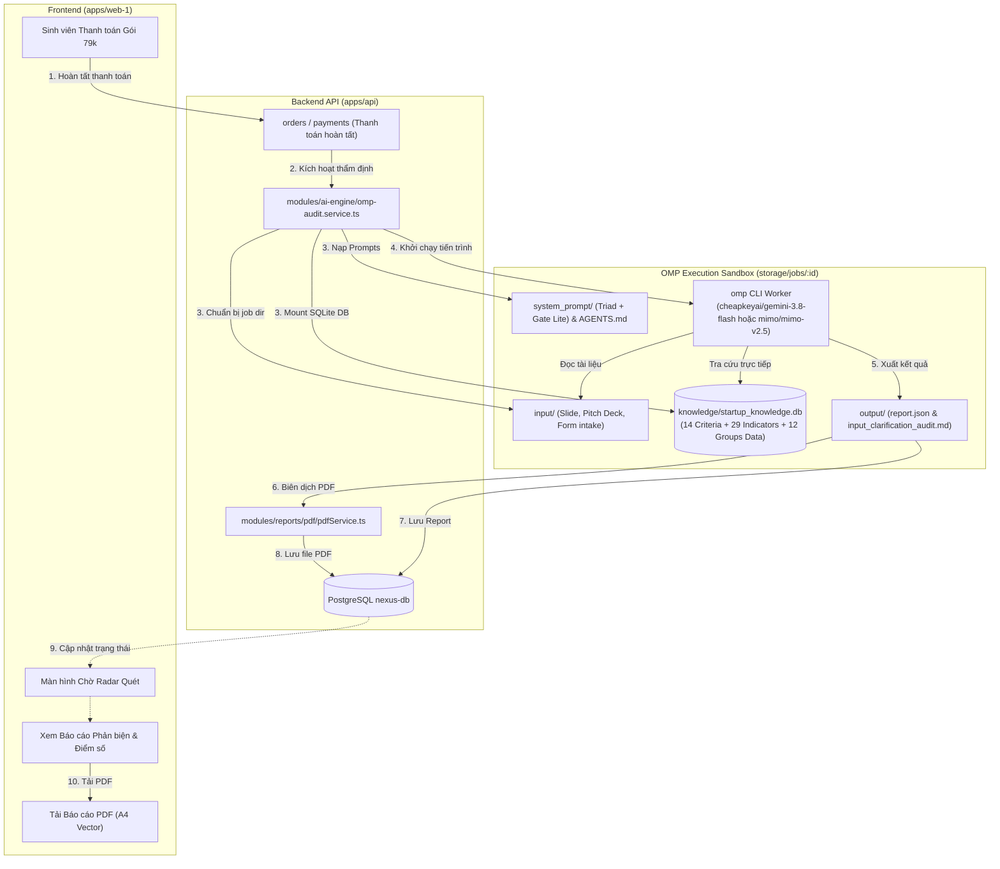

# Di chuyển Lõi AI Thẩm định 79k: OMP Worker, SQLite DB và Typst PDF Engine (Phương án Tinh giản)

## 1. Định hướng Thiết kế Cốt lõi (Core Principles)

Theo đúng định hướng: **"Cho toàn bộ data các nhóm vào SQLite, OMP Worker truy vấn trực tiếp SQLite, không cần nhiều file TS phức tạp, đơn giản và chạy được ngay cho khách dùng":**

1. **SQLite Database là Trung tâm Tri thức Duy nhất (`startup_knowledge.db`):**
   - Lưu toàn bộ tiêu chí (`evaluation_criteria`), bẫy lỗi (`evaluation_indicators`), hồ sơ vi phạm và dữ liệu trích xuất từ 12 nhóm sinh viên FPT trực tiếp vào file SQLite cục bộ `data/knowledge/startup_knowledge.db`.
   - Không phân rã thành các file `.ts` trung gian phức tạp. Cần cập nhật thêm nhóm 13, 14 chỉ việc nạp thẳng vào SQLite.
2. **Kế thừa Nguyên xi Lõi OMP Worker từ Sandbox:**
   - Tận dụng cơ chế chạy `omp` CLI (Oh My Pi / Pi Agent) mà bạn đã tinh chỉnh hoàn hảo ở sandbox.
   - Khi có yêu cầu thẩm định: Thiết lập thư mục job (`input/` chứa tài liệu sinh viên, `knowledge/startup_knowledge.db`, `system_prompt/`, `AGENTS.md`) $\rightarrow$ Gọi `omp` CLI chạy tự động (`--auto-approve --no-session -p "..."`).
   - OMP Agent tự dùng công cụ tra cứu trực tiếp file `startup_knowledge.db`, phân tích tài liệu và xuất thẳng ra `output/report.json` cùng `output/input_clarification_audit.md`.
3. **Bảo tồn Tuyệt đối Typst PDF Pipeline:**
   - Biên dịch trực tiếp `output/input_clarification_audit.md` sang file PDF vector A4 bằng Typst CLI với template `report.typ` và font `Merriweather`.
4. **Lưu Báo cáo & Cập nhật Giao diện:**
   - Đọc kết quả từ `output/` lưu vào bảng `reports` của Case.
   - Giao diện sinh viên hiển thị kết quả trực quan từ `report.json` và nút tải file PDF A4.

---

## 2. Kiến trúc Tinh giản (Simplified Architecture)



---

## 3. Danh mục 4 Giai đoạn Tinh giản (Lean Implementation Phases)

| Phase | Nội dung Triển khai | Tệp Kế hoạch | Trạng thái |
|:---:|---|---|:---:|
| **01** | **SQLite Knowledge Base & Multi-Provider OMP Setup:**<br/>- Copy `startup_knowledge.db` (toàn bộ 12 nhóm, criteria, indicators) vào `data/knowledge/`<br/>- Cấu hình provider keys (`cheapkeyai` & `mimo`) cho OMP CLI<br/>- Copy `system_prompt/` và `AGENTS.md` | [`phase-01-sqlite-knowledge-and-omp-setup.md`](./phase-01-sqlite-knowledge-and-omp-setup.md) | **Completed** |
| **02** | **OMP Audit Runner & Typst PDF Engine:**<br/>- Bê `worker-omp` runner sang `apps/api/src/modules/ai-engine/omp-audit.service.ts`<br/>- Bê Typst PDF Engine (`mdNormalizer.ts`, `mdToTypst.ts`, `report.typ`, font `Merriweather`) sang `apps/api/src/modules/reports/infrastructure/pdf/` | [`phase-02-omp-worker-and-typst-runner.md`](./phase-02-omp-worker-and-typst-runner.md) | **Completed** |
| **03** | **Dây nối Thanh toán & Lưu Báo cáo:**<br/>- Kích hoạt `omp-audit.service` khi đơn hàng gói 79k hoàn tất<br/>- Đọc `output/report.json` và `output/input_clarification_audit.md` lưu vào bảng `reports`<br/>- Mở route tải PDF `GET /api/reports/:caseId/pdf` | [`phase-03-order-trigger-and-report-persistence.md`](./phase-03-order-trigger-and-report-persistence.md) | **Completed** |
| **04** | **Giao diện Người dùng & Tải PDF:**<br/>- Mount tab Báo cáo phản biện trong `WorkspaceSidebar`<br/>- Render báo cáo 14 tiêu chí, điểm số và lỗi Blocker/Major từ `report.json`<br/>- Nút tải file PDF A4 sắc nét từ Typst Engine | [`phase-04-frontend-report-and-pdf-download.md`](./phase-04-frontend-report-and-pdf-download.md) | **Completed** |

---

## 4. Lệnh Thực thi Handoff (Cook Command)

```bash
/ck:cook E:/FPT/Semester_7/EXE101/product-workspace/nexus-platform/plans/260911-1700-ai-core-and-pdf-migration/plan.md
```
