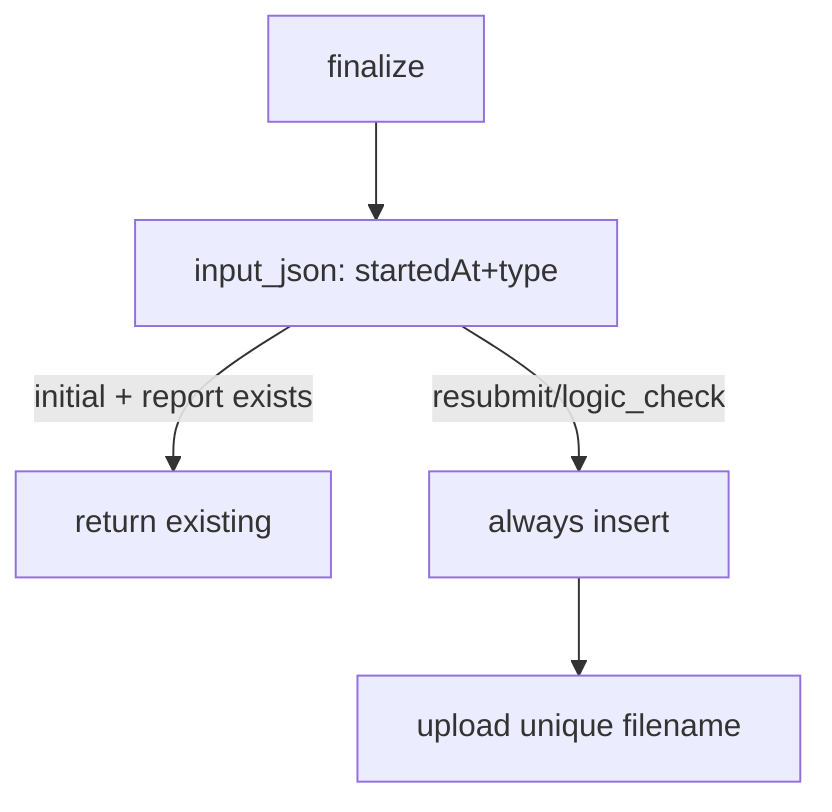

# Phase 01 — Guard Finalizer (T3+4) — ✅ Done

- **Status:** ✅ Done (`545bdcb`)
- **Commit:** `545bdcb fix(ai-engine): finalize dedupe + credit race + persist unit`

## Context

2 trigger `initial` sát nhau → 2 finalizer cùng đọc latest unit → double-insert report + upload Cloudinary cùng tên `audit_report_v00` ghi đè. Tx guard hiện tại (`omp-audit-finalizer.ts:188-201`) chỉ check `lifecycle_unit_id`, không phân biệt trigger nào.

## Overview

Guard theo trigger identity (`startedAt` trong `aiJob.input_json`): `initial` trùng trigger trả report cũ; `resubmit`/`logic_check` luôn tạo mới. Filename Cloudinary thêm timestamp chống ghi đè.

## Key Insights

- `reportId` chưa tồn tại lúc upload (upload 141-149 trước save 202-211) → không dùng làm suffix.
- `startedAt` đã có trong `input_json` (coordinator:330-334) → identity rẻ, không migration.
- Tx hiện tại đã lock `cases FOR UPDATE` (189) → chỉ cần thêm điều kiện, không đổi isolation.

## Requirements

1. Đọc `triggerStartedAt` + `submission_type` từ `aiJob.input_json` (hiện 71-72).
2. `initial` + report đã tồn tại cho (unit, trigger) → return report cũ, update job `completed`, không insert.
3. `resubmit`/`logic_check` → luôn insert mới (bỏ qua guard trùng).
4. Filename Cloudinary: `audit_report_vNN_<startedAt-timestamp>` thay vì `audit_report_vNN`.

## Architecture

Giữ signature `finalizeOmpAuditResult(caseId: string): Promise<boolean>` — caller không đổi. Nhận thêm `lifecycleUnitId?` optional để forward-compatible với phase-03 (job.data).

## Related files

- `apps/api/src/modules/ai-engine/application/omp-audit-finalizer.ts:24` — signature (giữ nguyên)
- `.../omp-audit-finalizer.ts:71-76` — đọc `aiJobInput` (thêm `startedAt`)
- `.../omp-audit-finalizer.ts:78-99` — fallback latest unit (thêm guard identity)
- `.../omp-audit-finalizer.ts:141-142` — `cloudinaryName` (thêm timestamp)
- `.../omp-audit-finalizer.ts:188-201` — tx guard (phân nhánh theo type)
- `.../omp-audit-coordinator.ts:96-115` — QueueEvents completed caller
- `.../omp-audit-status.ts:23-24` — self-heal caller

## Steps

1. Parse `startedAt` + `submission_type` từ `aiJobInput` sau dòng 72; normalize `startedAt` thành `Date | null`.
2. Trong tx (188-201): nếu `submission_type === 'initial'` và `existing` → return existing (giữ log); else (`resubmit`/`logic_check`) → skip check, `saveOmpAuditReport` luôn.
3. Dựng `cloudinaryName` ở 141-142: `` `audit_report${versionSuffix}_${startedAtMs}` `` với `startedAtMs = new Date(startedAt).getTime() || Date.now()`; áp cho cả retry ở 158-163.
4. `metadataJson` (175-180) thêm `triggerStartedAt` để audit trail.

## Todo

- [x] Guard phân nhánh theo submission_type trong tx
- [x] Filename Cloudinary unique theo startedAt
- [x] `metadataJson.triggerStartedAt` audit trail

## Success

- [x] Trigger `initial` 2 lần cùng `startedAt` → 1 report row, lần 2 return existing, job `completed`
- [x] `resubmit` cùng unit → luôn 2 rows khác nhau
- [x] 2 PDF cùng version có publicId/URL khác nhau trên Cloudinary
- [x] `check-types` + `node:test` finalizer-related pass

## Risk

- `startedAt` null (job cũ): fallback `Date.now()` → guard lỏng nhưng không crash; log warn.
- Clock skew ms: collision cực thấp, chấp nhận (không thêm random để giữ deterministic).

## Security

- `startedAt` từ DB nội bộ (không phải user input) → không injection. Filename chỉ gồm `[a-z0-9_]` + digits.

## Next

→ `phase-02-race-credit.md` (T1): đưa guard credit vào tx để `startedAt` identity không bị double-charge.
