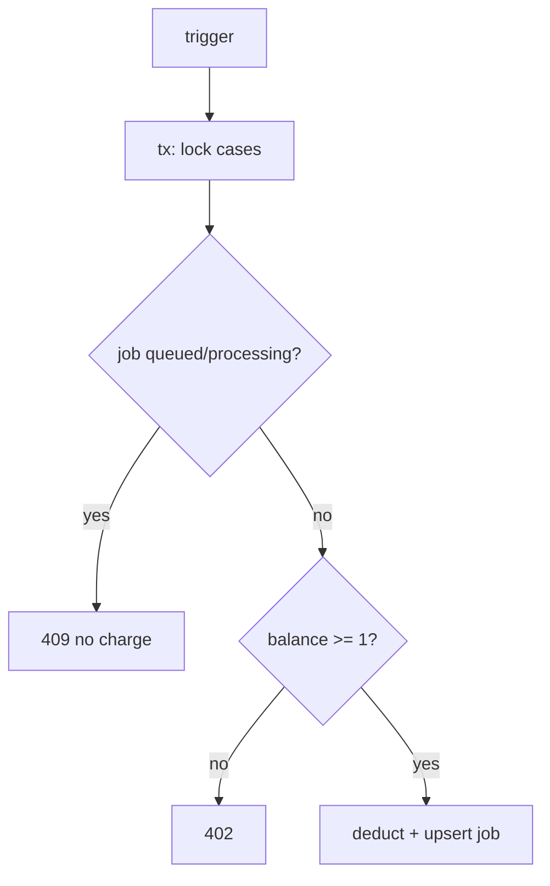

# Phase 02 — Race Credit (T1) — ✅ Done

- **Status:** ✅ Done (`545bdcb`)
- **Commit:** `545bdcb fix(ai-engine): finalize dedupe + credit race + persist unit`

## Context

Guard `AUDIT_IN_PROGRESS` nằm ngoài tx (`omp-audit-coordinator.ts:296-299`), balance check trong tx (308-346). 2 trigger đồng thời cùng pass guard → cùng trừ credit → double-charge, 1 job bị đè.

## Overview

Đưa guard vào trong tx: lock `cases FOR UPDATE` đầu tx, check `aiJob.status` trong tx, reuse idempotencyKey khi retry.

## Key Insights

- `idempotencyKey = audit-trigger-${caseId}-${startedAt}` (305) sinh mới mỗi lần → retry sau fail tạo key mới, mất idempotency.
- `createCreditEntry` đã có unique `idempotency_key` (P2002 ở refund 80) → reuse key = dedupe miễn phí.
- `refundAuditCreditIfNoReport` (50-87) giữ nguyên — đã idempotent per-trigger.

## Requirements

1. `SELECT ... FOR UPDATE` cases row đầu tx, trước balance check.
2. Guard `queued/processing` đọc trong tx → throw 409 `AUDIT_IN_PROGRESS`.
3. Retry cùng trigger gốc reuse `idempotencyKey` (key theo `startedAt` gốc); chỉ user-trigger mới sinh key mới.
4. `refundAuditCreditIfNoReport` không đổi.

## Architecture

## Related files

- `apps/api/src/modules/ai-engine/application/omp-audit-coordinator.ts:296-299` — guard ngoài tx (chuyển vào tx)
- `.../omp-audit-coordinator.ts:304-346` — tx deduct + upsert (thêm lock + guard)
- `.../omp-audit-coordinator.ts:50-87` — `refundAuditCreditIfNoReport` (giữ nguyên)
- `apps/api/src/modules/cases/infrastructure/persistence/credit-ledger.repository.ts:12-18` — `getCreditBalanceForTx` (dùng trong tx)
- `.../credit-ledger.repository.ts:38-58` — `createCreditEntry` (P2002 dedupe)
- `apps/api/src/modules/cases/http/cases-ai.controller.ts:133` — caller trigger

## Steps

1. Trong tx ở 308: đầu tiên `SELECT id FROM cases WHERE id = ${caseId} FOR UPDATE` (pattern như finalizer:189).
2. Sau lock: `tx.aiJob.findFirst({ where: { case_id: caseId } })`; nếu `queued/processing` → throw 409 `AUDIT_IN_PROGRESS` (xóa guard 296-299 ngoài tx, hoặc giữ như fast-path nhưng tx là source of truth).
3. IdempotencyKey: đọc `latestJob.input_json.startedAt` trước tx; nếu job trước `failed/cancelled` và retry trong window → reuse `audit-trigger-${caseId}-${oldStartedAt}`; else sinh key mới với `startedAt` hiện tại. `createCreditEntry` P2002 → coi như duplicate, throw 409.
4. Giữ nguyên catch 347-353 (402 không log error).

## Todo

- [x] Lock cases + guard status trong tx
- [x] Reuse idempotencyKey khi retry
- [x] Xóa/biến guard ngoài tx thành fast-path

## Success

- [x] 2 trigger đồng thời, balance=1 → 1 thành công, 1 nhận 409, balance_after = 0 (không âm)
- [x] Retry sau fail reuse key → không double-charge (P2002 → skipCharge = free retry)
- [x] User-trigger mới sinh key mới, trừ đúng 1 credit
- [x] `check-types` + `node:test` coordinator-related pass

## Risk

- Lock contention: 2 tx cùng case serialize → 1 chờ, timeout Prisma mặc định; chấp nhận vì window ngắn, đúng semantics queue.
- Fast-path ngoài tx bị loại bỏ → thêm 1 query trong tx, latency không đáng kể.

## Security

- Không thay đổi authZ; 402/409 mã lỗi giữ nguyên để FE (`useTriggerAudit.ts:44-69`) hiển thị đúng. Không log số dư chi tiết.

## Next

→ `phase-03-persist-unit.md` (T2): persist unit đã resolve để guard phase-01 có identity đúng.
