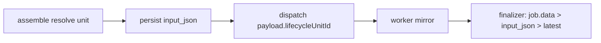

# Phase 03 — Persist Unit (T2) — ✅ Done

- **Status:** ✅ Done (`545bdcb`)
- **Commit:** `545bdcb fix(ai-engine): finalize dedupe + credit race + persist unit`

## Context

Coordinator resolve `resolvedLifecycleUnitId` ở assemble (373) nhưng chỉ truyền vào sandbox, không persist về `aiJob.input_json` (330-334 ghi `lifecycleUnitId ?? null` trước khi resolve). Finalizer đọc lại latest unit (78-99) → 2 trigger sát nhau gắn nhầm cùng unit.

## Overview

Persist unit đã resolve về `aiJob.input_json` trước dispatch; thêm `lifecycleUnitId` vào `OmpJobPayload`; finalizer ưu tiên `job.data`, fallback latest filter `unit_type=version`.

## Key Insights

- Coordinator đã có đáp án đúng trong tay lúc dispatch → truyền đi, không query lại (tránh TOCTOU).
- `input_json` là audit trail + fallback khi payload thiếu (worker restart mất job.data).
- Worker mirror `OmpJobPayload` phải đồng bộ, nếu không field bị vứt (tiền lệ submissionType phase-03 cũ).

## Requirements

1. Sau assemble (373): `update aiJob.input_json.lifecycle_unit_id = resolvedLifecycleUnitId` trước dispatch (394).
2. `OmpJobPayload` (omp-queue.ts:37-46) thêm `lifecycleUnitId?: string`.
3. `worker-omp/src/omp-runner.ts:14-23` mirror field; `executeOmpJob` persist vào job storage/output nếu có.
4. Finalizer: ưu tiên `job.data.lifecycleUnitId` → fallback `input_json.lifecycle_unit_id` → fallback latest `unit_type=version`.

## Architecture

## Related files

- `apps/api/src/modules/ai-engine/application/omp-audit-coordinator.ts:373` — assemble (lấy resolved id)
- `.../omp-audit-coordinator.ts:330-344` — `input_json` upsert (thêm update sau resolve)
- `.../omp-audit-coordinator.ts:393-402` — `dispatchOmpJob` (thêm field)
- `apps/api/src/modules/ai-engine/infrastructure/queue/omp-queue.ts:37-46` — `OmpJobPayload` (thêm `lifecycleUnitId?`)
- `apps/worker-omp/src/omp-runner.ts:14-23` — mirror interface
- `.../omp-runner.ts:25` — `executeOmpJob` (nhận field)
- `apps/api/src/modules/ai-engine/application/omp-audit-finalizer.ts:74-99` — resolve unit (đổi thứ tự ưu tiên)

## Steps

1. Sau dòng 373: nếu `resolvedLifecycleUnitId` khác `lifecycleUnitId ?? null` → `prisma.aiJob.updateMany({ where: { case_id: caseId }, data: { input_json } })` với `lifecycle_unit_id` đã resolve (giữ `startedAt`, `submission_type`).
2. `omp-queue.ts:37-46`: thêm `lifecycleUnitId?: string;` sau `submissionType`.
3. Dispatch 394-402: thêm `lifecycleUnitId: resolvedLifecycleUnitId ?? undefined`.
4. Worker `omp-runner.ts:14-23`: thêm field mirror; trong `executeOmpJob` ghi vào job storage (cạnh `updateJobInStorage` 34-37) để finalizer/status đọc được.
5. Finalizer 74-99: `const targetUnitId = jobData?.lifecycleUnitId ?? aiJobInput?.lifecycle_unit_id ?? null;` nếu null mới fallback `findFirst({ where: { case_id, unit_type: 'version' }, orderBy: version_no desc })` (thu hẹp từ query hiện tại thiếu filter unit_type).

## Todo

- [x] Persist resolved unit vào `input_json` trước dispatch
- [x] Payload + worker mirror `lifecycleUnitId`
- [x] Finalizer ưu tiên job.data, fallback có filter unit_type

## Success

- [x] Trigger resubmit với unit v01 → `input_json.lifecycle_unit_id` = v01, payload chứa v01
- [x] 2 trigger sát nhau (v01, v02) → 2 reports gắn đúng unit riêng
- [x] Worker restart mất job.data → fallback input_json vẫn đúng unit
- [x] `check-types` API + worker + `node:test` liên quan pass

## Risk

- Update `input_json` sau upsert thêm 1 write: fail giữa chừng → job ở trạng thái unit null, finalizer fallback latest (sai nhưng không crash); bọc try/catch log warn, không throw.
- Worker cũ chưa mirror field → `lifecycleUnitId` undefined, fallback input_json vẫn đúng.

## Security

- `lifecycleUnitId` validate thuộc case ở coordinator:282-287 trước persist; finalizer không trust blind, chỉ dùng id đã validate.

## Next

Xong phase-03 → guard phase-01 có identity đúng nghĩa. Chạy reviewer duyệt cả 3 phases + verify plan.md.
