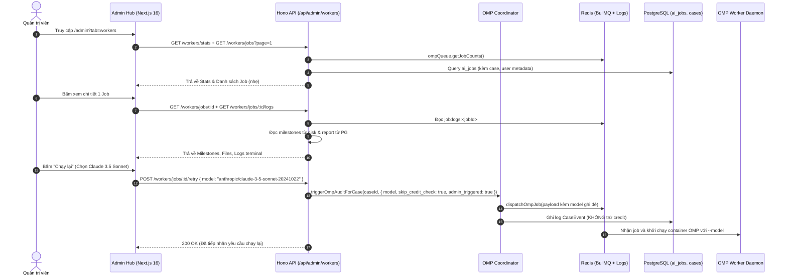

# Plan: Quản lý & Giám sát Tiến trình Thẩm định AI (OMP Worker Monitoring)

**Mã kế hoạch:** `plans/260916-1800-admin-omp-worker-monitoring/plan.md`  
**Trạng thái:** `pending`  
**Báo cáo Phân tích:** `plans/reports/260916-brainstorm-admin-omp-worker-monitoring.md`  
**Tiêu chuẩn sản xuất (Production Standards):** Không `TODO`/`FIXME`, Type-safe 100%, Xử lý triệt để lỗi Transaction Postgres, Không nuốt lỗi, UI Mantine v9 + Lucide React không phá layout.

---

## 1. Mục tiêu & Phạm vi (Objectives & Scope)

1. **Giám sát Hàng đợi & Trạng thái Thực thi Thời gian thực**:
   - Theo dõi số lượng worker concurrency, hàng đợi chờ (waiting), đang chạy (active), hoàn thành (completed) và thất bại (failed).
   - Phát hiện các tác vụ nghi kẹt (stalled / stuck > 10 phút) do worker restart hoặc LLM timeout.
2. **Quản trị Tiến trình AI Chuyên sâu**:
   - Xem chi tiết từng Job: Case ID, Tên đề án, Sinh viên, Mô hình AI thực thi, Prompt mode, Thời lượng.
   - Kiểm tra các mốc tiến trình (Milestones: Sandbox Ready -> Triad Packet -> Rubric Evaluation -> PDF Compiled).
   - Đọc trực tiếp danh sách file đầu vào (`input/`) và file kết quả (`output/`).
   - Đọc live log terminal stream từ Redis `job:logs:<jobId>` trong khung terminal chuẩn UI/UX Pro Max.
3. **Can thiệp & Khắc phục Sự cố Vận hành (Self-Healing & Admin Override)**:
   - **Chạy lại Linh hoạt (Admin Retry with Model Override)**: Cho phép Admin chọn mô hình AI (Gemini 2.5 Flash, Claude 3.5 Sonnet, OpenAI GPT-4o, Mimo v2.5, hoặc Custom model) để chạy lại. **Tuyệt đối không trừ thêm credit của sinh viên**.
   - **Giải phóng Job Kẹt (Heal Stuck Job)**: Hủy job BullMQ, đánh dấu `failed`, tự động hoàn trả 1 credit cho sinh viên (nếu chưa có báo cáo), và khôi phục `user_facing_stage` của hồ sơ về trạng thái an toàn.
   - **Hủy Tiến trình (Cancel Job)**: Gửi tín hiệu ngắt tiến trình qua Redis Pub/Sub `job-cancellation`.
4. **Tích hợp Native vào Admin Hub (`apps/web-1/app/admin`)**:
   - Bổ sung Tab `workers` vào Sidebar 2 tầng (`DoubleNavbar`) theo query `?tab=workers`.
   - Thiết kế sạch sẽ, responsive, không rườm rà hiệu ứng, tuân thủ bảng màu ngữ nghĩa kỹ thuật.

---

## 2. Phân rã Các Phase Thực hiện (Phased Roadmap)

| Phase | Trọng tâm | File chi tiết |
| :--- | :--- | :--- |
| **Phase 1** | Hợp đồng Dữ liệu & DTO Backend (`apps/api`) | `phase-01-backend-contracts-and-dtos.md` |
| **Phase 2** | Mở rộng Coordinator & Dịch vụ Quản trị Worker | `phase-02-coordinator-extension-and-admin-service.md` |
| **Phase 3** | Controller & Tuyến đường API Backend (`/api/admin/workers/*`) | `phase-03-admin-controllers-and-routes.md` |
| **Phase 4** | TanStack Query Hook & Giao diện Frontend Admin Hub | `phase-04-frontend-hook-and-components.md` |
| **Phase 5** | Kiểm thử Tích hợp, Không Hồi quy & Nghiệm thu E2E | `phase-05-integration-testing-and-verification.md` |

---

## 3. Kiến trúc Luồng Dữ liệu (Data Flow)

---

## 4. Rủi ro & Chiến lược Phòng ngừa (Risk & Mitigation)

1. **Rủi ro Tràn RAM khi List Job lớn**:
   - *Nguy cơ*: Bảng `ai_jobs` chứa `input_json` và `output_json`. Nếu `SELECT *` toàn bộ danh sách 100 job, response có thể nặng hàng chục MB gây đơ trình duyệt Admin.
   - *Khắc phục*: API danh sách `GET /workers/jobs` chỉ `SELECT` các trường metadata cần thiết (`id`, `case_id`, `status`, `created_at`, `updated_at`, `case.case_code`, `case.team_name`, `case.user`). Chỉ khi Admin mở Drawer mới gọi API chi tiết tải tài liệu.
2. **Rủi ro Bất đồng bộ Stage của Case khi Hủy/Heal**:
   - *Nguy cơ*: Admin force-terminate job nhưng `case.user_facing_stage` vẫn nằm ở `under_review`, khiến sinh viên không thể nộp bài hay xem báo cáo cũ.
   - *Khắc phục*: Trong `healStuckAdminWorkerJob`, tự động kiểm tra: Nếu case đã có báo cáo trước đó ➔ chuyển về `report_ready`; nếu chưa từng có báo cáo ➔ chuyển về `intake_ready`.
3. **Rủi ro Trừ nhầm Credit Sinh viên**:
   - *Nguy cơ*: Admin bấm Retry do lỗi hệ thống nhưng hàm trigger lại tự động trừ thêm 1 credit của nhóm sinh viên.
   - *Khắc phục*: Thêm cờ `skip_credit_check: true` vào `TriggerAuditOpts`. Bỏ qua hoàn toàn transaction trừ tiền trong `credit_ledgers`.
4. **Rủi ro Lỗi 409 AUDIT_IN_PROGRESS khi Retry Job đang Kẹt**:
   - *Nguy cơ*: Job bị kẹt vẫn lưu `status: 'processing'` trong database. Khi Admin bấm Retry, hàm `triggerOmpAuditForCase` ném lỗi `409 AUDIT_IN_PROGRESS`.
   - *Khắc phục*: `retryAdminWorkerJob` chủ động gọi `cancelOmpJob(caseId)`, đánh dấu hủy job cũ và truyền `force_supersede: true` vào `triggerOmpAuditForCase` để ghi đè an toàn.
5. **Rủi ro Lạm phát Credit khi Job Admin Retry Thất bại**:
   - *Nguy cơ*: Admin retry miễn phí (`skip_credit_check: true`), nhưng nếu sau đó job thất bại, hàm `refundAuditCreditIfNoReport` lại hoàn 1 credit khiến sinh viên được cộng credit không do nạp tiền.
   - *Khắc phục*: `refundAuditCreditIfNoReport` kiểm tra `input_json.skip_credit_check === true || input_json.admin_triggered === true` để chặn hoàn credit vô căn cứ.
