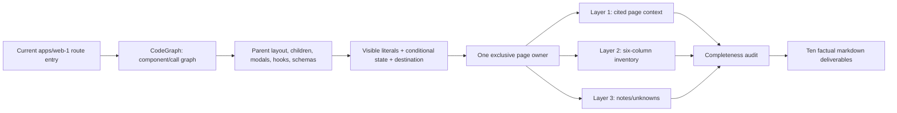
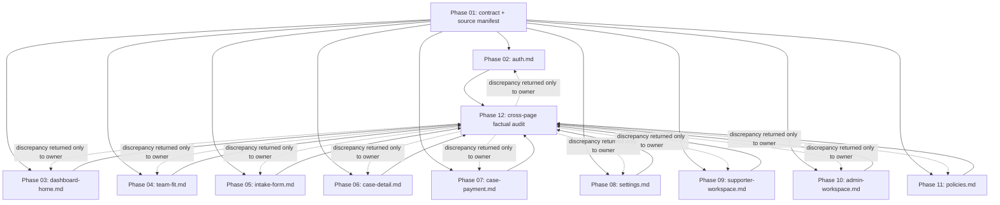

# Parallel Implementation Plan: Factual Wording Inventory

## Outcome and scope

Create factual inventories under `design-system/wording/pages/` with strict **1 Page = 1 File Markdown** mapping (all 28 `page.tsx` routes in `apps/web-1` accounted for):

1. `auth.md` — `/auth`
2. `verify-email.md` — `/auth/verify-email`
3. `dashboard-home.md` — `/dashboard`
4. `team-fit.md` — `/dashboard/team-fit`
5. `intake-form.md` — `/dashboard/intake`
6. `case-detail.md` — `/dashboard/case/[id]`
7. `case-payment.md` — `/dashboard/case/[id]/payment`
8. `payment.md` — `/dashboard/payment`
9. `payments.md` — `/dashboard/payments` (code-verified client redirect to `/dashboard/wallet`)
10. `wallet.md` — `/dashboard/wallet`
11. `profile.md` — `/dashboard/profile` (code-verified server redirect to `/dashboard/settings/profile`)
12. `settings.md` — `/dashboard/settings`
13. `settings-profile.md` — `/dashboard/settings/profile`
14. `settings-password.md` — `/dashboard/settings/password`
15. `settings-sessions.md` — `/dashboard/settings/sessions`
16. `settings-notifications.md` — `/dashboard/settings/notifications`
17. `supporter.md` — `/supporter`
18. `supporter-case-detail.md` — `/supporter/case/[id]`
19. `supporter-profile.md` — `/supporter/settings/profile`
20. `supporter-password.md` — `/supporter/settings/password`
21. `supporter-sessions.md` — `/supporter/settings/sessions`
22. `admin.md` — `/admin`
23. `terms.md` — `/terms`
24. `privacy.md` — `/privacy`
25. `refund-policy.md` — `/refund-policy`
26. `fair-use-policy.md` — `/fair-use-policy`
27. `maintenance.md` — `/maintenance`
(Plus existing template `landing-page.md` for `/`)

**Out of scope:** rewriting, ranking, diagnosing, or correcting UI wording; source-code/UI changes; a second landing inventory (already exists); generic `error.tsx` and `not-found.tsx` (not named route deliverables).

## Non-negotiable factual contract

Each target file MUST have exactly these three information layers, in this order:

1. **Page Context** — route/access; user, goals, entry/exit; primary/secondary actions; code-cited product facts/constraints. Mark an inference as `[Assumption / Cần xác minh]`; do not present it as fact.
2. **Interactive Inventory** — sectioned Markdown tables with exactly six columns: `ID | Component / Vị trí | Type | Current wording | Action / Destination | State`.
3. **Page Notes** — observed terminology variants, verified implementation behavior, unknowns/questions.

Required factual coverage: static copy, dynamic-template copy, heading/body text, labels, placeholders, helpers, options, tooltips, validation errors, loading/empty/error branches, disabled states, toast title/message, modal text, menus, badges, link/button text, image `alt`, icon `aria-label`/`title`, and accessible copy exposed by source. Quote current string verbatim; retain interpolation syntax and variable origin where applicable. Record click/submit/route/modal/toast behavior from code, never inferred intent.

Forbidden everywhere: `Suggested wording`, rewrite columns, “problem”, “severity”, copy-quality opinions, speculative explanations, and source edits. Repeated wording in a shared shell may appear in multiple page inventories when it renders on that route; it remains a factual duplicate, not a competing source of truth.

## Source-to-document data flow

**Input boundary:** current source at the manifest revision, including page/layout/component/schema/hook code; optional browser observation only supplements the code audit. **Transforms:** route map → rendered component tree → visible wording/state/destination rows → three-layer document. **Output:** Markdown records only. No user data, authentication mutation, payment action, or API write occurs.

## Dependency graph

## Execution strategy

| Stage | Scheduling | Work | Gate |
|---|---|---|---|
| 0 | Sequential | Phase 01 fixes the extraction contract and records commit/revision plus source ownership manifest. | All ten route groups mapped; no target wording file touched. |
| A | Parallel — 10 `fullstack-developer` agents | Phases 02–11. Each agent reads the common contract and owns exactly one target Markdown file. The split is output-file based, not component-file based; concurrent read-only access to shared source/layouts is allowed. | Each owner self-audits all three layers and six columns. |
| B | Sequential, read-only coordinator + owner-only remediation | Phase 12 checks all completed documents against manifest and factual contract. Findings return to the original target owner; the coordinator never edits another owner’s page file. | Zero missing scoped route/component/state rows; zero forbidden columns/opinions. |

Resource-oriented batches, if only a limited agent pool is available: **Batch A** `auth`, `dashboard-home`, `team-fit`, `policies`; **Batch B** `intake-form`, `case-payment`, `settings`; **Batch C** `case-detail`, `supporter-workspace`, `admin-workspace`. Batches are capacity controls only—there are no data dependencies among them after Phase 01.

## File ownership matrix

| Phase / assigned agent | Exclusive output file(s) | Scoped routes and primary evidence surface | Forbidden writes |
|---|---|---|---|
| 01 / `WordingManifestLead` | `plans/260921-0028-extract-all-pages-wording/research/source-manifest.md` | Baseline revision; all routes; shared extraction checklist | `design-system/wording/pages/*.md` |
| 02 / `WordingAuth` | `design-system/wording/pages/auth.md` | `/auth`, `/auth/verify-email`; `AuthShell`, email/password/Google/OTP flows, registration confirmation | Every other page file and manifest |
| 03 / `WordingDashboardHome` | `design-system/wording/pages/dashboard-home.md` | `/dashboard`; dashboard shell, user menu, notification bell, filters, cards, empty state, package modal | Every other page file and manifest |
| 04 / `WordingTeamFit` | `design-system/wording/pages/team-fit.md` | `/dashboard/team-fit`; step indicator, idea/team inputs, result, ready/navigation states | Every other page file and manifest |
| 05 / `WordingIntake` | `design-system/wording/pages/intake-form.md` | `/dashboard/intake`; progress, chat flow, every step, package-dependent branches | Every other page file and manifest |
| 06 / `WordingCaseDetail` | `design-system/wording/pages/case-detail.md` | `/dashboard/case/[id]`; tabs/sidebar/status/radar/uploads/discussion/settings | Every other page file and manifest |
| 07 / `WordingPaymentsWallet` | `design-system/wording/pages/case-payment.md` | payment, payments, wallet and case-payment routes; bank/proof/top-up/balance/history states | Every other page file and manifest |
| 08 / `WordingSettings` | `design-system/wording/pages/settings.md` | `/dashboard/settings/*`; sidebar/profile/password/sessions/notification/delete flows | Every other page file and manifest |
| 09 / `WordingSupporter` | `design-system/wording/pages/supporter-workspace.md` | supporter list/case/settings; request-info/output upload/review workflow | Every other page file and manifest |
| 10 / `WordingAdmin` | `design-system/wording/pages/admin-workspace.md` | `/admin`; users/payment/deposit/case assignment/workers/stats/ban and action modals | Every other page file and manifest |
| 11 / `WordingPolicies` | `design-system/wording/pages/policies.md` | terms/privacy/refund/fair-use/maintenance; `PolicyDocumentLayout` and TOC behavior | Every other page file and manifest |
| 12 / `WordingAuditLead` | `plans/260921-0028-extract-all-pages-wording/reports/completeness-audit.md` | Cross-document route/component/column/wording verification | All ten target page files |

This is exclusive write ownership. Source files are evidence only and are never edited. A correction after Phase 12 may be applied only by the original row owner above.

## Phase index

| Phase | Deliverable | Status | Parallel after Phase 01 |
|---|---|---:|---:|
| [01 — Contract and source manifest](./phase-01-factual-extraction-contract.md) | Frozen factual scope/checklist | Completed | No |
| [02 — Authentication](./phase-02-auth-wording.md) | `auth.md` | Completed | Yes |
| [03 — Dashboard home](./phase-03-dashboard-home-wording.md) | `dashboard-home.md` | Completed | Yes |
| [04 — Team fit](./phase-04-team-fit-wording.md) | `team-fit.md` | Completed | Yes |
| [05 — Intake form](./phase-05-intake-form-wording.md) | `intake-form.md` | Completed | Yes |
| [06 — Case detail](./phase-06-case-detail-wording.md) | `case-detail.md` | Completed | Yes |
| [07 — Payments and wallet](./phase-07-case-payment-wording.md) | `case-payment.md` | Completed | Yes |
| [08 — Settings](./phase-08-settings-wording.md) | `settings.md` | Completed | Yes |
| [09 — Supporter workspace](./phase-09-supporter-workspace-wording.md) | `supporter-workspace.md` | Completed | Yes |
| [10 — Admin workspace](./phase-10-admin-workspace-wording.md) | `admin-workspace.md` | Completed | Yes |
| [11 — Policies](./phase-11-policies-wording.md) | `policies.md` | Completed | Yes |
| [12 — Cross-page audit](./phase-12-cross-page-factual-audit.md) | Factual completeness report | Completed | No |
## Risk, compatibility, and rollback

| Risk | Likelihood × impact | Mitigation / acceptance gate | Rollback |
|---|---:|---|---|
| An owner omits words in conditional/modal/error/schema branches | High × High | Every phase maps page → layout → children → hooks/schema/toasts; audit each branch against manifest. | Revert only that page Markdown and regenerate from the same manifest revision. |
| Source changes while agents inspect it, producing an internally inconsistent inventory | High × High | Phase 01 records revision and source paths. If scoped source changes, owner re-runs its extraction atomically; P12 rejects mixed revisions. | Reset affected generated Markdown to prior factual revision; no product data/code migration exists. |
| Agents create subjective rewrite guidance | Medium × High | Contract bans rewrite/problem/severity vocabulary and P12 performs table-header/content scan. | Remove offending prose/columns, restore only source-cited factual rows. |
| Shared shell/modal wording is inconsistently reported | Medium × Medium | All owners cite the same current shared source; factual repetition is allowed. P12 compares quote and destination/state where duplicate. | Correct affected page docs only; source remains untouched. |
| Large case/admin/policy trees lead to incomplete inventory | High × High | Dedicated owner, component checklist, state coverage matrix, and code-first validation; no scope sharing. | Re-run only large page extraction with fresh source map. |
| Route aliases or obsolete `/payments` behavior are treated as live facts | Medium × Medium | Document current code behavior and route state; mark route absence/redirect/410 only when source proves it. | Amend exact row/notes after source recheck. |

**Backward compatibility:** documentation-only. Existing landing wording file and product/UI/API behavior remain unchanged. Canonical `case-payment.md` follows existing `AGENTS.md`; no consumer migration is required.

## Test and validation matrix

| Check level | Method | Covers | Pass condition |
|---|---|---|---|
| Static contract | Parse target Markdown structure manually/scripted | H1/route/access, three layers, six exact table columns | All ten documents contain all three layers; every inventory table has exactly six columns in required order. |
| Source completeness | Per-owner CodeGraph traversal plus source checklist | Entry page, layout, direct children, modals, schemas, handlers, visible conditional states | Manifest items all trace to a source section/row or an explicit code-cited non-rendered exclusion. |
| Behavioral integration | Trace each CTA/form/menu through its handler/href/mutation result; inspect UI in browser when a local scenario is available | Destinations, modal opening, disabled/loading/error/toast states | Action and State fields match code; no action is guessed from wording alone. |
| Cross-document audit | Phase 12 route-to-file and terminology comparison | Ten route groups; shared shell copy; factual-only rule | Every scoped route has one owner; no unowned output; no duplicate ownership conflict; no rewrite/opinion content. |
| Regression / rollback | `git diff -- design-system/wording/pages` plus manifest revision comparison | Documentation-only blast radius | Diff contains only the ten expected files; no application source change; all docs cite the same accepted revision or documented re-extraction revision. |

## Measurable definition of done

- Exactly the ten listed target files exist; no alternate payment filename is created.
- Every scoped route is represented in its assigned document.
- Every document has Page Context, six-column Interactive Inventory, and Page Notes; facts/constraints have source evidence or an explicit unknown label.
- All text categories and all reachable visible states listed in the factual contract are covered from code.
- No target has a rewrite/suggestion/problem/severity column, subjective quality opinion, or source-code/UI modification.
- Source manifest and Phase 12 report show zero unresolved omissions or revision mismatches.
- All ownership rules and the validation matrix pass.

## Unresolved questions

None blocking. Product ambiguities discovered during extraction become explicit `[Assumption / Cần xác minh]` entries in the owning Page Context or Page Notes; they do not trigger a wording recommendation.
