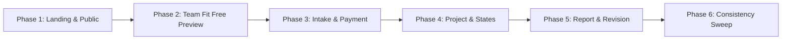

# Execution Plan: UX Wording Overhaul Nexus Platform

## 1. Nguồn gốc & Source of Truth

- **Đặc tả chính (Specification):** `design-system/wording/260921-report-fix-ux-wording.md`
- **Nguyên tắc cốt lõi:** Không mở thêm vòng nghiên cứu/phân tích chiến lược. Kế hoạch này là **Execution Plan thực dụng**, chia thành 6 phase độc lập theo user journey để giao cho coding agent thực thi tuần tự, tránh drift terminology giữa chừng.
- **Tiêu chuẩn 4 câu hỏi UX cho mọi màn hình:**
  1. *Tôi đang ở đâu?*
  2. *Hệ thống đang làm gì?*
  3. *Điều này có ý nghĩa gì với nhóm của tôi?*
  4. *Tôi cần làm gì tiếp theo?*

---

## 2. 10 Quyết định Định vị & Wording Ràng buộc (Binding User Decisions)

Từ phản hồi trực tiếp của người dùng (`Cai-thien-template-UX.md`), toàn bộ quá trình thực thi phải tuân thủ nghiêm ngặt 10 quyết định sau:

1. **Quy trình đánh giá tự động (thay vì "Phản biện bằng AI"):** Không dùng AI làm value proposition chính; Nexus là quy trình đánh giá có cấu trúc, phương pháp và tiêu chí tự động hóa.
2. **Định vị giai đoạn ý tưởng (bỏ hoàn toàn Checkpoint 1/CP1):** Loại bỏ thuật ngữ học thuật nội bộ trường (`Checkpoint 1`, `CP1`, `FPT University`, `syllabus`, `bảo vệ trước hội đồng`) khỏi toàn bộ public wording để tránh rủi ro pháp lý học thuật.
3. **Tiêu chuẩn thị trường khởi nghiệp (không bám rubric học thuật):** Đánh giá dựa trên 5 nhóm tiêu chí thực tế (vấn đề, thị trường, mô hình kinh doanh, lợi thế cạnh tranh, khả năng triển khai), kết hợp kiểm tra tính logic và chất lượng lập luận.
4. **Chủ thể người dùng:** Gọi đối tượng là **"nhóm của bạn"** và người thao tác là **"người đại diện"**.
5. **Đơn vị thanh toán:** Gọi thẳng `credit` là **"lượt đánh giá"**; gói 79.000đ ghi rõ **"Bao gồm 2 lượt đánh giá"** (không để `79.000 VND / lượt`).
6. **Team Fit là Free Funnel:** Đặt tên **"Kiểm tra nhanh ý tưởng & đội ngũ"**, là công cụ quét sơ bộ miễn phí làm phễu chuyển tiếp sang đánh giá chuyên sâu từ tài liệu.
7. **Upload tài liệu trực tiếp (bỏ Google Drive):** Hỗ trợ tệp đính kèm trực tiếp (`PDF, PPTX, DOCX...`); loại bỏ hoàn toàn việc nhắc tới Google Drive link.
8. **Thời gian xử lý thực tế (~10 phút):** Loại bỏ claim sai sự thật `< 1 phút`; dùng wording thực tế **"Kết quả thường có sau khoảng 10 phút"**.
9. **Loại bỏ kỳ vọng thông báo tự động chưa hỗ trợ:** Không hứa hẹn các tính năng notification/bot chưa hoàn thiện; user chủ động kiểm tra trạng thái trên dashboard.
10. **Xóa False Affordance (Contact Form):** Gỡ bỏ contact form giả lập không có backend; thay bằng các kênh liên hệ trực tiếp (Email, Hotline/Zalo, Fanpage chính thức).

---

## 3. Bảng quy chuẩn Terminology toàn hệ thống (Student-Facing)

> **Quy tắc tuyệt đối:** Không sửa schema DB hay internal identifiers backend (`Case`, `CreditLedger`, `AiJob`) hay admin/supporter workspaces. Chỉ thay đổi lớp hiển thị trên Student-Facing UI & Public Pages.

| Khái niệm cũ / Internal | User-Facing Mới | Quy tắc áp dụng |
|---|---|---|
| **Case / Hồ sơ** | **Dự án** | Đối tượng lớn nhất của nhóm sinh viên xuyên suốt quá trình. |
| **Ý tưởng** | **Ý tưởng** | Nội dung cốt lõi của dự án (không dùng thay thế cho danh sách dự án). |
| **Tài liệu / File / Drive** | **Tài liệu** | Slide, đề cương nộp trực tiếp. Bỏ toàn bộ nhắc đến Google Drive. |
| **Credit** | **Lượt đánh giá** | Bỏ hoàn toàn chữ `credit` khỏi UI sinh viên. |
| **Gói 79k** | **79.000đ (Bao gồm 2 lượt đánh giá)** | Sửa dứt điểm lỗi hiển thị sai `79.000đ / lượt`. |
| **Audit / Thẩm định / Kiểm định** | **Đánh giá** (tổng thể) & **Phản biện** (chi tiết) | Bỏ từ ngữ hành chính `thẩm định`, `kiểm định` khỏi student UI. |
| **Team Fit** | **Kiểm tra nhanh ý tưởng & đội ngũ** | Free Preview / Surface scan sơ bộ, không hứa phân tích sâu. |
| **Thời gian xử lý (< 1 phút)** | **Thường có sau khoảng 10 phút** | Bỏ claim sai `< 1 phút`; không hứa thông báo AI tự động. |
| **Supporter / Mentor (Landing/Paid)** | **Ẩn hoàn toàn** | Ẩn hoàn toàn khỏi Landing và Package selector trong đợt này. Không quảng bá dịch vụ chưa hỗ trợ. |
| **BLOCKER / MAJOR / MINOR** | **Cần xử lý trước / Nên cải thiện / Có thể hoàn thiện** | Diễn đạt theo thứ tự ưu tiên hành động. |
| **v00, v01, v02** | **Phiên bản 1, Phiên bản 2, Phiên bản 3** | Thân thiện hóa số hiệu phiên bản. |
| **5 Nhóm tiêu chí đánh giá** | **Vấn đề, thị trường, mô hình kinh doanh, lợi thế cạnh tranh, khả năng triển khai** | Bám sát 5 tiêu chí thật của AI engine (problemClarity, marketViability, businessModel, competitiveMoat, executionFeasibility). |
---

## 4. Lộ trình thực thi 6 Phase

| Phase | Phạm vi & Mục tiêu | File chi tiết | Status | Verification chính |
|---|---|---|---|---|
| **Phase 1** | **Landing + Pricing + FAQ + Contact** Khóa định vị public, sửa giá 79k (2 lượt), bỏ claim Supporter/<1m, xóa form Contact rác. | `phase-01-landing-pricing-faq-contact.md` | **COMPLETED** | Build & Type check pass; sạch CP1, Drive, Supporter trên Landing; Contact link trực tiếp; Card giá 79.000đ (2 lượt). |
| **Phase 2** | **Team Fit (Free Funnel)** Chuẩn hóa `Kiểm tra nhanh ý tưởng & đội ngũ`, làm rõ kết quả sơ bộ, CTA chuyển tiếp sang đánh giá dự án. | `phase-02-team-fit-preview.md` | Pending | Form & result không còn lộ API key / Supporter upsell; CTA dẫn đúng case. |
| **Phase 3** | **Intake & Payment (Conversion)** Chuẩn hóa form nộp tài liệu, bỏ `credit` trong ví/modal, làm rõ gói 79k gồm 2 lượt. | `phase-03-intake-and-payment.md` | Pending | Grep không còn `credit` trong UI sinh viên nạp/mua lượt; copy ví rõ ràng. |
| **Phase 4** | **Project & Evaluation States (Lifecycle)** `Case/Hồ sơ → Dự án`, gom 5 trạng thái dễ hiểu, bỏ worker/engine/pipeline jargons. | `phase-04-project-and-evaluation-states.md` | Pending | Dashboard & Case detail hiển thị đúng 5 trạng thái; status badge nhất quán. |
| **Phase 5** | **Report & Revision (Core Value)** Chuẩn hóa severity (Cần xử lý trước...), action plan, hiển thị phiên bản và nộp bản mới. | `phase-05-report-and-revision.md` | Pending | Tab findings và round card hiển thị đúng tên phiên bản, nút tải/đánh giá lại chuẩn. |
| **Phase 6** | **Consistency Sweep & Policy Polish** Quét toàn bộ codebase, dọn dẹp các trang Điều khoản, Bảo mật, Auth, Shell navigation. | `phase-06-consistency-sweep-and-polish.md` | Pending | Grep toàn codebase sạch các cấm từ; `bun run check-types` & `bun run build` xanh. |

---

## 5. Phase 1 Completion & Sync-back Record

- **Ngày hoàn thành Phase 1:** 2026-09-21
- **Files đã chỉnh sửa & nghiệm thu:**
  1. `apps/web-1/components/landing/LandingHero.tsx` (H1: "Đánh giá và phản biện dự án khởi nghiệp", bỏ CP1, CTA "Kiểm tra nhanh ý tưởng", 3 bullets có cấu trúc).
  2. `apps/web-1/components/landing/FeaturesGrid.tsx` (Tiêu đề "Quy trình đánh giá của Nexus", 4 cards phản biện logic, định vị, phiên bản, 5 nhóm tiêu chí).
  3. `apps/web-1/components/landing/LandingPricing.tsx` (Gói "Đánh giá Dự án Tự động" 79.000đ / Bao gồm 2 lượt đánh giá, bỏ claim <1 phút thành ~10 phút, ẩn hoàn toàn card Premium).
  4. `apps/web-1/components/landing/FAQSection.tsx` (Bỏ Drive link, bỏ CP1, giải thích gói 2 lượt, phiên bản 1/2/3, chính sách bảo mật thực tế).
  5. `apps/web-1/components/landing/ContactUs.tsx` (Gỡ form giả lập, chuyển sang card liên hệ trực tiếp Email, Hotline/Zalo, Fanpage).
- **Kết quả Verification:**
  - `bun run check-types`: 0 type errors.
  - Cấm từ grep: Đã quét sạch `CP1`, `Checkpoint 1`, `syllabus`, `Rubric`, `Supporter`, `link Drive`, `< 1 phút`, `VND / lượt`, `credit` trên thư mục `apps/web-1/components/landing/`.
---

## 6. Nguyên tắc thực thi bắt buộc cho Coding Agent

1. **Tuân thủ đúng thứ tự:** Hoàn thành và verify xong từng phase mới chuyển phase tiếp theo.
2. **Không sửa logic ngầm & Không đổi cấu trúc Intake:** Giữ nguyên router, mutations, hooks và queries. Tuyệt đối không thay đổi thứ tự hoặc cấu trúc các bước Intake (chỉ cập nhật label theo dữ liệu đang nhập).
3. **Bỏ từ “toàn diện”:** Tránh marketing adjective không chứng minh được. Thay bằng `Đánh giá dự án`, `Cần đánh giá kỹ hơn từ tài liệu của dự án?`, `5 nhóm tiêu chí đánh giá`.
4. **Định dạng Upload chuẩn:** Hỗ trợ đầy đủ `PDF, PPTX, DOCX, XLSX, MD và TXT · tối đa 5 tệp, 15MB mỗi tệp`.
5. **Quy tắc hiển thị phiên bản (Tránh lỗi Phiên bản 0):** Initial lifecycle unit dùng `version_no = 0`. UI phải map `version_no + 1` thành `Phiên bản 1`, `Phiên bản 2`... Tuyệt đối không để `Phiên bản 0`.
6. **Tránh hardcode "2 lượt" khi mua nhiều gói:** Nếu user chọn số lượng gói > 1 (`CreditQuantityModal`, toasts, transactions), hiển thị động theo số lượng: `${packageQuantity} gói · ${creditsGranted} lượt đánh giá`.
7. **Quy tắc Microcopy & CTA:**
   - Bỏ đại từ xưng hô hành chính `Vui lòng`.
   - Nút CTA luôn dùng cấu trúc: `[Động từ] + [Đối tượng]` (Ví dụ: `Bắt đầu đánh giá`, `Xem báo cáo`, `Tải tài liệu`).
   - Feedback Toast: Thông báo kết quả thực tế, không dùng generic `Thành công` / `Lỗi`.

---

## 5. Kết quả Thực thi & Nghiệm thu Toàn diện (Execution Sign-off)

- **Phase 1 (Landing, Pricing, FAQ, Contact):** Đã hoàn tất, verified qua DOM inspection trình duyệt.
- **Phase 2 (Team Fit Free Preview):** Đã hoàn tất, chuẩn hóa step labels, realistic examples, constant friendly error fallback, và loại bỏ overclaim.
- **Phase 3 (Intake & Payment):** Đã hoàn tất, chuẩn hóa semantic labels, cutover max documents = 5 trên shared schema và tests, hiển thị dynamic backend `totalCredits`.
- **Phase 4 (Case & Evaluation States):** Đã tách biệt `studentStatusThemeMap` hoàn toàn khỏi Admin status mapping, humanize radar pipeline.
- **Phase 5 (Report & Revision):** Đã chuẩn hóa hiển thị `displayVersion` từ 1-based, severity badges, và nút trigger đánh giá lại.
- **Phase 6 (Consistency Sweep & Polish):** Đã quét và loại bỏ triệt để các tàn dư `thẩm định`, `CP1`, `Checkpoint 1`, `credit`, `Google Drive` trên toàn bộ UI sinh viên.
- **Build & Type-Check:** `turbo run check-types` 100% passed (0 errors trên 7 packages).
