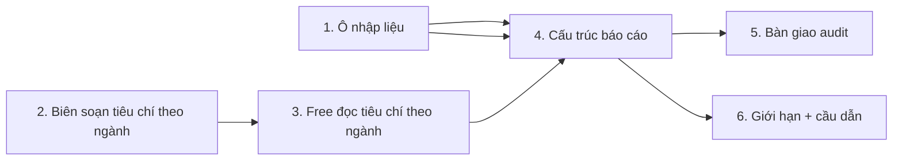

> **NGỪNG — đã thay bằng bản đơn giản.** Bản này đòi soạn tiêu chí riêng từng ngành, cần chuyên gia, không có người làm. Bản thay thế: `plans/260923-0100-team-fit-ban-don-gian/plan.md`. Các file phase trong thư mục này đã xoá.

# Plan: Thiết kế lại bản free "Kiểm tra nhanh ý tưởng & đội ngũ"

> **Trạng thái:** Pending — chờ duyệt
> **Ngày:** 2026-09-23
> **Bối cảnh:** Mentor yêu cầu bản free trả thêm giá trị để khách tin. User chốt nguyên tắc: free **phải dẫn dắt** sang gói trả phí, không được tự đủ.

---

## 1. Vấn đề

Bản free hiện tại trả về đúng hai danh sách chuỗi:

```ts
{ teamGaps: string[], commercialGaps: string[] }
```

Không có kết luận, không chia mảng, không dẫn chứng. Khách đọc xong nghĩ *"mấy cái này tôi tự nghĩ cũng ra"*.

Nhưng vấn đề gốc không phải "thiếu giá trị". Vấn đề là **bản free đang không làm đúng bản đặc tả của mentor**.

`docs/nexus-document/cp3/feedback/02-cp3-mentor-team-assessment-guidance.md` nói rõ output bản free phải gồm ba phần:

1. **Một kết luận sơ bộ** — mentor nói nguyên văn: *"theo đánh giá sơ bộ ban đầu — thì là ổn"*.
2. **Chia theo mảng, mặt ổn / mặt yếu** — *"Ổn về mặt thiết kế sản phẩm, thiết kế MVP. Nhưng về mảng mô hình kinh doanh tài chính thì còn yếu hoặc hoàn toàn thiếu."*
3. **Đánh giá theo tương quan** — background + kinh nghiệm + sở trường của từng người ↔ lĩnh vực dự án ↔ kỹ năng cần cho một dự án khởi nghiệp ở lĩnh vực đó.

Cả ba đều đang thiếu. Nên đây là làm đúng đặc tả đã có, không phải phát minh tính năng mới.

### 1.1 Bài kiểm tra của mentor cho mọi thứ định thêm vào bản free

`docs/nexus-document/cp3/feedback/06-cp3-mentor-value-prop-vs-chatgpt.md`:

> Sinh viên tự copy bảng tiêu chí rồi ném lên ChatGPT bản miễn phí là ra kết quả tương tự → không có lý do trả tiền.

Moat theo mentor: **"bộ prompt riêng cho những cái lĩnh vực riêng, các cái tiêu chí riêng và được tích lũy lại"**.

Soi lại các đề xuất thường gặp bằng bài kiểm tra này:

| Đề xuất | ChatGPT free làm được? | Kết luận |
|---|---|---|
| Kết luận chung "được / cần cân nhắc" | Có | Chỉ có giá trị khi gắn với tiêu chí **theo ngành** |
| Chia mảng ổn / yếu (chung chung) | Có | Như trên |
| Câu hỏi phản biện (chung chung) | Có | Như trên |
| Điểm số 0-100 | Có | Loại — false precision, mất uy tín khi bị phản bác |
| Máy tự đếm chỉ số từ dữ liệu khách nhập | Không (ChatGPT không giữ dữ liệu nhóm) | Giữ |
| Bộ tiêu chí + câu hỏi **riêng theo từng ngành**, tích lũy | **Không** | Đây là moat — ưu tiên số 1 |

**Kết luận:** thứ tạo giá trị thật là **chuyên biệt hóa theo ngành**. Mọi mục khác chỉ có giá trị khi được sinh ra từ bộ tiêu chí theo ngành, không phải từ một rubric chung.

### 1.2 Bản free đang bỏ phí tài sản sẵn có — nhưng tài sản đó KHÔNG dùng lại được nguyên trạng

Trong repo đã có sẵn cơ sở tri thức tích lũy ở gốc repo:

- `data/knowledge/startup_knowledge.db` (144KB) — `evaluation_criteria` (14), `evaluation_indicators` (29), `evaluation_rubric` (5), `industry_benchmarks` (3), `common_mistakes` (6), `case_audit_violations` (28)
- `data/knowledge/generate_db.ts` — script sinh DB
- `data/system-prompts/` — `triad_framework_v1_1.md`, `input_clarification_gate_lite_v1_1.md`...

Nhưng bản free **không dùng gì trong số đó**. `apps/api/src/modules/ai-engine/application/evaluate-team-fit.usecase.ts` dùng một chuỗi prompt viết cứng trong file TypeScript, chấm bằng Google model trực tiếp. Một bộ tiêu chí chung cho mọi ngành — đúng thứ mentor nói là không có moat.

**Ba sự thật phải nhìn thẳng, nếu không sẽ đánh giá thấp khối lượng công việc:**

1. **`evaluation_criteria` khoá theo `field_code` — tức khoá theo KHỐI NỘI DUNG Ý TƯỞNG** (`target_customer`, `problem_statement`, `solution_describing`, `value_proposition`, `current_alternatives`...), **không khoá theo ngành**. Đây là tiêu chí để chấm *bài*, phục vụ buổi audit trả tiền.
2. **`industry_benchmarks` có cột `industry` nhưng chỉ 3 ngành** (SaaS B2B, Marketplace/Food, D2C/E-commerce) **và chỉ chứa chỉ số tài chính** (gross margin, LTV/CAC, CAC payback). Không liên quan tới việc chấm đội ngũ.
3. **Không có bảng nào trả lời "ngành này cần những vai trò gì trong đội ngũ".**

⇒ **"Tiêu chí theo ngành" là DỮ LIỆU MỚI PHẢI BIÊN SOẠN, không phải chỉ nối dây.** Xem §6 để biết khối lượng.

---

## 2. Nguyên tắc thiết kế đã chốt

| # | Nguyên tắc | Nguồn |
|---|---|---|
| N1 | **Free chấm NGƯỜI, không chấm BÀI.** Đội ngũ thiếu ai → free nói được (chỉ cần biết trong nhóm có ai). Giải pháp/MVP/mô hình kinh doanh có tốt không → free không nói được (phải đọc tài liệu khách nộp) | Ranh giới tự nhiên, user chốt "phải dẫn dắt" |
| N2 | **Mọi thứ thêm vào free phải vượt bài kiểm tra ChatGPT** — nếu là rubric chung thì không thêm, trừ khi sinh từ bộ tiêu chí theo ngành | Mentor, `06-...md` |
| N3 | **Giữ dữ liệu, bỏ kết luận** khi bàn giao sang buổi audit trả tiền | §5 |
| N4 | **Máy đếm tách khỏi AI nhận định.** Phần nào máy đếm được thì đếm, dán nhãn "Đã kiểm tra"; phần nào AI phán thì dán nhãn "AI nhận định". AI **không được** sinh ra số liệu máy đếm | Mentor: *"không thể thí hoàn toàn cho AI"* (`05-...md`) |
| N5 | **Nội dung tiêu chí theo ngành phải sửa được mà không cần build lại** — để trong DB sinh bằng `generate_db.ts`, có `is_active`. **Giới hạn của N5: danh mục ngành vẫn là hằng số trong mã nguồn** (xem §4.2) | Mentor: *"FPT luôn update — prompt hôm nay không đảm bảo cho ngày mai"* (`05-...md`) |
| N6 | **Ngành chưa có bộ tiêu chí thì phải nói thật là chưa có**, không dùng bộ chung rồi giả vờ chuyên biệt | Hệ quả của N2 |
| N7 | **Dẫn dắt bằng giới hạn lượng + dẫn sâu, không cắt chất lượng** | Mentor: *"đừng có tham, phải biết loại bớt… không phải vô hạn"* (`05-...md`) |
| N8 | **Bản free GIỮ đường gọi đồng bộ một lần** (`generateObject` trong `evaluate-team-fit.usecase.ts`), chỉ **tiêm** bộ tiêu chí theo ngành vào prompt. **Tuyệt đối không định tuyến bản free qua OMP worker** | Xem §4.3 |

---

## 3. Cấu trúc báo cáo free mới

### Phần A — Máy tự kiểm (không dùng AI) — nhãn *"Đã kiểm tra"*

Đếm trên dữ liệu khách vừa nhập. Chi phí 0, không thể bịa, khách kiểm chứng được ngay.

| # | Chỉ số | Nguồn |
|---|---|---|
| A1 | Số ngành đào tạo khác nhau trong nhóm, so với tiêu chí mentor tối thiểu 2 | `major` |
| A2 | Bảng phủ 3 mảng nghề: Kỹ thuật / Marketing / Kinh doanh – Tài chính — mỗi mảng có mấy người, là ai | trường chọn mới `track` |
| A3 | Số thành viên có ghi kinh nghiệm thực tế | `experience` |
| A4 | Danh sách ô còn để trống | toàn bộ input |

**Toàn bộ Phần A tính bằng máy ở phía máy chủ. Không đưa vào lược đồ mà AI phải sinh ra.** Xem §4.1.

### Phần B — AI nhận định — nhãn *"AI nhận định"*

| # | Nội dung | Ghi chú |
|---|---|---|
| B1 | **Kết luận sơ bộ**: `ready` ("Được, tiếp tục") / `needs_work` ("Cần cân nhắc") + 1 câu vì sao | Mentor yêu cầu (§1). Không gửi sang audit (§5) |
| B2 | **Các mảng ổn / mảng yếu** — chia theo mảng, không phải danh sách phẳng. Mỗi mục có mức độ + lý do vì sao chỗ thiếu đó đau cho chính dự án này | Thay `teamGaps`/`commercialGaps` |
| B3 | **Mỗi nhận định phải gắn dẫn chứng** trỏ về dữ liệu khách nhập (câu khách viết, hoặc chỉ số ở Phần A) | Chống cảm giác "câu mẫu" |
| B4 | **Ngành này cần những vai trò gì** — lấy từ bộ tiêu chí theo ngành, đối chiếu với bảng phủ ở A2, chỉ ra vai trò còn thiếu | Moat chính |
| B5 | **Câu hỏi sẽ bị hội đồng hỏi** — sinh từ bộ câu hỏi của ngành | Chỉ có giá trị khi theo ngành (N2) |

### Phần C — Cầu dẫn — *"Những câu tôi chưa trả lời được"*

Cố định theo cấu trúc, **tính ở phía máy chủ, không giao cho AI** (N4):

| Câu hỏi | Cần gì để trả lời |
|---|---|
| Giải pháp của bạn có khả thi không? | Bản mô tả giải pháp / đề cương |
| Mô hình kinh doanh có hợp lý không? | Bảng chi phí, giá bán, dự phóng |
| Khách hàng thật có cần không? | Kết quả khảo sát / phỏng vấn khách hàng |
| Kỹ thuật có làm được không? | Mô tả kiến trúc, phân chia công việc |

Đây là cầu dẫn trung thực: nêu câu chưa trả lời được + điều kiện để trả lời, **không phải nút "mua ngay"**.

---

## 4. Ba quyết định kỹ thuật phải chốt trước khi viết mã

### 4.1 Tách đôi lược đồ — AI và máy chủ sinh hai phần khác nhau

`TeamFitFreeReportSchema` hiện đang được truyền thẳng vào `generateObject({ schema: TeamFitFreeReportSchema })`. Nếu gộp cả 3 phần vào một lược đồ thì **AI sẽ được yêu cầu tự sinh ra `machineChecks` (số liệu máy đếm) và `notAssessed` (phần cầu dẫn)** — trái với N4.

Phải tách thành hai:

| Lược đồ | Ai sinh | Chứa gì |
|---|---|---|
| `TeamFitAiOutputSchema` | **AI** | `verdict`, `areas`, `industryRoles`, `committeeQuestions` |
| `TeamFitFreeReportSchema` | **Máy chủ ghép** | `machineChecks` (tính bằng máy) + phần AI + `notAssessed` (cố định) + `industryCriteriaAvailable` (tra từ DB) + `reportVersion` |

`industryCriteriaAvailable` do **máy chủ** quyết định (có bộ tiêu chí cho ngành này hay không), không phải AI tự phán.

Lược đồ lưu và hiển thị là `TeamFitFreeReportSchema` đã ghép. Lược đồ truyền cho AI chỉ là `TeamFitAiOutputSchema`.

### 4.2 `fieldCategory` là hằng số, không phải giá trị tra lúc chạy

`fieldCategory` dùng `z.enum(INDUSTRY_CODES)` — hằng số trong `packages/validation`, được biên dịch vào cả API lẫn web.

**Hệ quả phải nói rõ:** thêm một ngành mới vào bảng `industries` **sẽ bị chặn ở bước kiểm tra dữ liệu cho tới khi build lại API và web.** N5 chỉ áp dụng cho **nội dung tiêu chí bên trong một ngành**, không áp dụng cho danh mục ngành.

Đánh đổi có chủ ý:

| Việc | Có cần build lại? | Tần suất thực tế |
|---|---|---|
| Sửa `why`, `importance`, thêm/bớt vai trò, thêm/bớt câu hỏi trong một ngành | **Không** — chạy lại `generate_db.ts` | Thường xuyên — đây là chỗ FPT hay đổi |
| Thêm một ngành hoàn toàn mới | **Có** — sửa hằng số rồi build lại | Hiếm, và dù sao cũng phải biên soạn bộ tiêu chí mới |

Chọn cách này thay vì để `fieldCategory` là chuỗi tự do, vì cách đó đòi thêm một điểm truy vấn danh mục ngành cho web — thêm đường dữ liệu để tiết kiệm một lần build hiếm khi xảy ra. Không đáng.

### 4.3 Bản free không đi qua OMP worker

Bản free **giữ nguyên** đường gọi hiện tại: một lần gọi `generateObject` bất đồng bộ ngay trong yêu cầu HTTP, trả kết quả trực tiếp cho khách.

**Không định tuyến bản free qua OMP worker.** Worker là đường dùng cho bản trả tiền: đẩy vào hàng đợi, chạy trong sandbox, sao chép cả cơ sở tri thức vào thư mục từng job (`omp-audit.service.ts`, khối copy DB + prompt). Nếu bản free đi vào đó thì:

- Mất tính trả kết quả tức thì trước mắt người dùng — khách phải chờ job
- Mỗi lượt free biến thành một job nặng (sandbox + copy 144KB DB + prompt)

Bản free chỉ **đọc** bộ tiêu chí theo ngành (vài hàng trong DB) rồi **tiêm vào prompt**. Đọc vài hàng, không dựng sandbox.

Ghi rõ ở đây để người sau không "tái dùng worker cho tiện".

---

## 5. Bàn giao sang buổi audit trả tiền — giữ dữ liệu, bỏ kết luận

### 5.1 Hiện trạng (đã xác minh trong code)

`apps/api/src/modules/ai-engine/application/omp-audit-coordinator.ts`, hàm `assembleScopedInputFiles`:

- Chỉ khi `submissionType === "initial"` (dòng 246) mới nhét báo cáo team-fit vào input của buổi audit trả tiền.
- File sinh ra tên riêng `team_fit_report.md` (dòng 280), **không trộn** vào `intake_submission.md` (dòng 250) → không vi phạm ràng buộc *"Báo cáo khớp nhóm không lẫn vào hồ sơ intake"* trong `docs/flows/team-fit-flow.md`.
- Nội dung file có đúng 3 phần (dòng 260-279):
  1. `## 1. Thông tin ý tưởng` — dữ liệu khách nhập
  2. `## 2. Kết quả đánh giá sơ bộ` — **nguyên `result_snapshot` dưới dạng JSON**, tức kết quả AI của bản free (dòng 270-273)
  3. `## 3. Khảo sát Đội ngũ` — dữ liệu khách nhập

### 5.2 Rủi ro và quyết định

Khi bản free có thêm kết luận `needs_work`, mục 2 sẽ chứa chữ đó dưới dạng JSON. Người chấm buổi audit trả tiền **đọc thấy kết luận trước khi đọc bài thật của khách** → bị neo theo hướng đã có. Bản 79.000đ bị nhiễm định kiến sinh ra từ 6 ô mô tả gõ trong 5 phút.

**Quyết định: bỏ mục 2 khỏi file bàn giao.** Giữ mục 1 và mục 3.

Nguyên tắc: **bản free nói cho khách biết, không nói cho người chấm biết.** Người chấm đọc bài với đầu óc trắng.

---

## 6. Khối lượng công việc thật của Phase 02 — biên soạn dữ liệu

Đây là phần **nặng nhất** của kế hoạch, và không phải việc viết mã.

Cần biên soạn 3 bảng dữ liệu mới. **Nội dung viết trong file JSON riêng `data/knowledge/industry_criteria.json`** — không viết vào file code, để người hiểu nghề sửa trực tiếp được. Script sinh dữ liệu đọc file này rồi nạp vào DB. Chi tiết khuôn JSON và 3 điều phải biết trước khi làm: **phase-02 §4.6**.

Ước lượng thô: 3 bảng × tập ngành nhỏ. Phần mã để sinh DB và đọc DB là việc nhẹ; phần ngồi viết nội dung cho đúng mới là việc chính.

Lệnh chạy `knowledge:generate` **chưa tồn tại** trong `apps/api/package.json` — kế hoạch cũ định thêm mà chưa làm. Phải thêm `"knowledge:generate": "bun ../../data/knowledge/generate_db.ts"` (chạy bằng `bun` vì file dùng `bun:sqlite`; đường dẫn tính từ `apps/api/`, file nằm ở gốc repo). Chi tiết: **phase-02 §4.6**.
## 7. Giới hạn lượt dùng — cơ chế thực thi được

`docs/flows/team-fit-flow.md` đang để mở: *"Chưa khóa chính sách gói miễn phí được dùng tối đa bao nhiêu lần."*

### 7.1 Vì sao "1 lượt cho mỗi ý tưởng" KHÔNG thực thi được

| Vấn đề | Chi tiết |
|---|---|
| Lượt chấm xảy ra **trước** khi lưu | Khách bấm chấm → xem kết quả → *tuỳ chọn* lưu. Chưa lưu thì chưa có gì để đếm |
| Khoá chống trùng hiện tại khớp **chính xác** JSON idea + team | Sửa 1 ký tự là thành lượt mới. Đếm theo nội dung là vô hiệu |
| `/api/ai-engine/team-fit` chỉ có `requireAuth` | Không có giới hạn theo người dùng. Đổi một chữ rồi chấm lại là chấm vô hạn |

⇒ Đếm theo nội dung ý tưởng là không khả thi. Phải đếm theo **tài khoản**.

### 7.2 Chính sách chốt

**N lượt chấm cho mỗi tài khoản trong một cửa sổ thời gian.** N để trong cấu hình, có giá trị mặc định; không viết cứng trong mã.

Cơ chế: giới hạn theo người dùng ở **bộ nhớ trong tiến trình**, **tái dùng đúng mẫu đã có trong repo** — không dựng cơ chế mới:

- `apps/api/src/modules/profile/application/password-rate-limit.ts` — Map trong bộ nhớ, cửa sổ thời gian, `MAX_REQUESTS` + `WINDOW_MS`
- `apps/api/src/modules/cases/application/message-send-rate-limit.ts` — `claimMessageSendSlot` + `resetMessageSendRateLimitForTests`

Làm theo đúng khuôn đó: một file giới hạn riêng trong `apps/api/src/modules/ai-engine/application/`, khoá theo `user.id`, kiểm tra **trước khi gọi AI**, có hàm reset cho test.

Chấp nhận đánh đổi: giới hạn trong bộ nhớ mất khi khởi động lại và không dùng chung giữa nhiều tiến trình. Phù hợp vì API chạy một tiến trình. **Không thêm bảng, không cần migration.**

### 7.3 Cộng thêm: chặn gọi AI trùng nội dung

Ngoài giới hạn theo tài khoản, giữ thêm một lớp tối ưu chi phí: nếu chủ sở hữu đã có báo cáo cho **cùng nội dung ý tưởng** thì trả lại kết quả đã lưu, **không gọi AI**.

Đây là **tối ưu chi phí, không phải cơ chế giới hạn** — vì nó dễ bị lách bằng cách sửa một chữ. Cơ chế giới hạn thật là §7.2.

Khoá so khớp lấy theo nội dung ý tưởng (gồm cả `fieldCategory`), không lấy theo `projectName` — sinh viên hay đổi tên dự án mà nội dung không đổi.

### 7.4 Dẫn dắt nằm ở đâu

Vì bản free **được** chấm lại (trong hạn mức), dẫn dắt không nằm ở số lần chấm. Dẫn dắt nằm ở ba thứ bản free **không bao giờ** có, đúng theo lời mentor về lý do trả tiền:

| Bản free không có | Nguồn |
|---|---|
| Cách sửa cụ thể | `06-...md`: *"gợi ý cả điểm cải thiện cụ thể"* |
| **So sánh hai phiên bản cạnh nhau** (xem mình đã tiến bộ bao nhiêu) | `06-...md`: *"khả năng so sánh phiên bản này phiên bản trước"*. Free chấm lại được nhưng chỉ xem từng kết quả một, không có màn so sánh |
| Chấm điểm tài liệu khách nộp | Toàn bộ gói trả tiền |

---

## 8. Thay đổi dữ liệu đầu vào

Bắt buộc làm trước, vì Phần A chỉ đếm được nếu đầu vào là dữ liệu chọn, không phải chữ tự do.

### 8.1 Hiện trạng — không đếm được

| Ô | Kiểu hiện tại | Vấn đề |
|---|---|---|
| `major` | `TextInput` gõ tự do, placeholder *"Ví dụ: Fullstack Developer, Product Manager..."* | Nhãn ghi "Chuyên ngành" nhưng ví dụ lại là **chức danh công việc**. Dữ liệu lẫn giữa ngành đào tạo và chức danh |
| `strengths`, `experience` | `TagsInput` gõ tự do | Muốn phân loại kỹ thuật/marketing/kinh tế phải đoán nghĩa chuỗi tiếng Việt. *"Chạy fanpage"* là marketing nhưng không có từ khoá nào bắt được → đoán sai → mất niềm tin |
| `field` (lĩnh vực) | Gõ tự do, placeholder *"Ví dụ: EdTech, Thương mại điện tử..."* | Giá trị thực tế lộn xộn: *"EdTech - Hỗ trợ khởi nghiệp"*, *"AgriTech & E-commerce - Phân phối nông sản"* → không chọn được bộ tiêu chí theo ngành |

### 8.2 Thiết kế mới

**Mỗi thành viên — sửa nhãn + thêm 1 ô chọn bắt buộc:**

| Trường | Kiểu mới | Bắt buộc |
|---|---|---|
| `major` | Ô gõ tự do, **sửa nhãn thành "Chuyên ngành đào tạo"**, sửa ví dụ thành ngành thật (*"Kỹ thuật phần mềm, Quản trị kinh doanh, Thiết kế đồ hoạ"*) | Có |
| `track` **(mới)** | Ô chọn: `Kỹ thuật` / `Marketing` / `Kinh doanh – Tài chính` | Có |
| `strengths`, `experience` | Giữ nguyên gõ tự do — dùng làm ngữ cảnh cho AI, không dùng để đếm | `strengths` có, `experience` không |

**Ý tưởng — tách lĩnh vực thành 2 phần:**

| Trường | Kiểu | Bắt buộc |
|---|---|---|
| `fieldCategory` **(mới)** | Ô chọn từ danh mục ngành cố định (`z.enum(INDUSTRY_CODES)` — xem §4.2). Đây là khoá để tra bộ tiêu chí theo ngành | Có |
| `field` | Giữ ô gõ tự do, đổi nhãn thành "Mô tả thêm về lĩnh vực" | Không |

**Tương thích dữ liệu cũ:** case đã tạo trước đây không có `track` và `fieldCategory`. Trường mới là bắt buộc **với lượt nộp mới**, nhưng phải đọc được dữ liệu cũ thiếu trường — hiển thị "chưa xác định", **không suy đoán**. Đã có tiền lệ ở `caseOverviewModel.ts` và `admin-workers.service.ts` đọc trực tiếp các snapshot này.

---

## 9. Một ghi chú để tránh nối nhầm lược đồ

Trong `packages/validation/src/index.ts` **đã có sẵn** `TeamFitReportSchema` (dòng 53-75) nằm ngay cạnh `TeamFitFreeReportSchema` đang sửa. Nó chứa `overview`, `fitLevel` (strong/moderate/weak/poor), `strengths`, `weaknesses`, `recommendations`.

**Đã kiểm tra: lược đồ này không có nơi nào sử dụng.** Chỉ có 1 tham chiếu trong toàn repo, chính là dòng định nghĩa của nó. Đây là thiết kế trước cho gói trả tiền, chưa kích hoạt.

Cấu trúc free mới ở §3 **trùng khái niệm** với nó (`verdict.level` ≈ `fitLevel`; `areas[]` ≈ `strengths`/`weaknesses[]`). Ghi rõ ba điều để người sau không nhầm:

1. **Không nối bản free vào `TeamFitReportSchema`.** Nó chứa `recommendations` và `weaknesses[].recommendation` — đúng thứ bản free phải thiếu.
2. **Không tưởng gói trả tiền đã có sẵn báo cáo dùng được.** Gói trả tiền hiện chạy qua OMP worker và ra báo cáo markdown + PDF, không dùng lược đồ này.
3. Lược đồ này **không bị xoá trong kế hoạch này.** Nó là mã không phải do kế hoạch này tạo ra; xoá hay giữ là việc của người viết ra nó. Kế hoạch chỉ ghi nhận trạng thái và thêm ghi chú phân biệt.

---

## 10. Rủi ro

| # | Rủi ro | Xử lý |
|---|---|---|
| R1 | Dữ liệu cũ không có `track`/`fieldCategory`; `result_snapshot` cũ chỉ có 2 mảng chuỗi | Thay đổi phải **cộng thêm**, không đổi tên cứng. Đọc được cả hai dạng. **8 nơi** đang đọc `result_snapshot` hoặc hai mảng gap: `TeamFitResultStep.tsx`, `caseOverviewModel.ts` (**tính `hasFreeAnalysis` từ hai mảng gap**), `CaseOverviewTab.tsx`, `OverviewGapsSection.tsx`, `CaseOverviewPanel.tsx` (có interface viết tay `ResultSnapshotData` trùng nguồn sự thật), `admin-workers.service.ts`, `omp-audit-coordinator.ts`, `team-fit-save.test.ts`. **Hỏng âm thầm:** đổi dạng mà không sửa `caseOverviewModel.ts` thì hai danh sách gap render rỗng và khối "Điểm cần chú ý" có thể mất, không có lỗi nào hiện ra. Danh sách đầy đủ + việc cần làm: phase-04 §5.5 |
| R2 | Nhiễm định kiến bản trả tiền | §5 — bỏ mục 2 khỏi file bàn giao. Có phase riêng để verify |
| R3 | Máy đếm vẫn đoán sai vì chưa có ô chọn | Phase 01 là điều kiện tiên quyết của Phase 04 |
| R4 | Ngành chưa có bộ tiêu chí → dùng bộ chung rồi giả vờ chuyên biệt | N6 — bắt buộc nói thật |
| R5 | Chi phí gọi AI không có trần | §7.2 giới hạn theo tài khoản + §7.3 chặn gọi trùng |
| R6 | Bộ tiêu chí viết cứng rồi FPT đổi rubric | §4.2 — nội dung tiêu chí trong DB; danh mục ngành là hằng số, đã ghi rõ đánh đổi |
| R7 | Đổi phần nhập liệu làm học sinh đang dở phải nhập lại | Nháp đã lưu ở localStorage (`team-fit:blanks`, `team-fit:members`); dữ liệu nháp cũ thiếu trường mới thì hiện ô chọn ở trạng thái trống, không mất phần đã gõ |
| R8 | **Biên soạn dữ liệu tiêu chí theo ngành bị đánh giá thấp** — đây là việc nặng nhất, cần người hiểu nghiệp vụ, không phải việc viết mã | §6 — tách thành việc riêng, có người duyệt, phạm vi v1 là tập ngành nhỏ |
| R9 | Bản free chạy trên đúng model Google trực tiếp, không qua worker | §4.3 — giữ nguyên đường đồng bộ, chỉ tiêm tiêu chí vào prompt. Ghi rõ để không ai định tuyến qua worker |
| R10 | AI tự sinh số liệu máy đếm hoặc phần cầu dẫn | §4.1 — tách đôi lược đồ, AI chỉ sinh 4 trường của nó |

---

## 11. Phases

| Phase | File | Mô tả |
|---|---|---|
| 1 | [phase-01-input-fields.md](./phase-01-input-fields.md) | Sửa phần khách nhập: ô chọn mảng nghề, danh mục ngành, sửa nhãn ô chuyên ngành |
| 2 | [phase-02-industry-knowledge.md](./phase-02-industry-knowledge.md) | **Biên soạn dữ liệu** tiêu chí theo ngành + đưa vào `startup_knowledge.db` |
| 3 | [phase-03-industry-criteria-for-free.md](./phase-03-industry-criteria-for-free.md) | Bản free đọc bộ tiêu chí theo ngành, giữ đường gọi đồng bộ, bỏ prompt chung viết cứng |
| 4 | [phase-04-report-structure.md](./phase-04-report-structure.md) | Tách đôi lược đồ + cấu trúc báo cáo 3 phần + máy tự kiểm + màn kết quả |
| 5 | [phase-05-audit-handoff.md](./phase-05-audit-handoff.md) | Bỏ kết luận AI khỏi file bàn giao sang audit trả tiền |
| 6 | [phase-06-limit-and-funnel.md](./phase-06-limit-and-funnel.md) | Giới hạn lượt theo tài khoản + phần cầu dẫn |

### Thứ tự phụ thuộc



Phase 1 và Phase 2 làm song song được. Phase 2 là đường găng (biên soạn dữ liệu, cần người duyệt) — không phải đường mã. Phase 4 là điểm hội tụ.

---

## 12. Tiêu chí hoàn thành

- [ ] Khách nhập nhóm → mỗi thành viên phải chọn mảng nghề; lĩnh vực phải chọn từ danh mục ngành
- [ ] Báo cáo free có đủ 3 phần A/B/C, phân biệt rõ nhãn "Đã kiểm tra" và "AI nhận định"
- [ ] AI **không** sinh ra `machineChecks` và `notAssessed` — hai phần đó do máy chủ ghép
- [ ] Có kết luận sơ bộ và chia mảng ổn/yếu — đúng đặc tả mentor
- [ ] Mọi nhận định có dẫn chứng trỏ về dữ liệu khách nhập
- [ ] Có phần "ngành này cần vai trò gì, nhóm còn thiếu vai trò nào"
- [ ] Nội dung tiêu chí theo ngành nằm trong DB, sửa được không cần build lại; danh mục ngành là hằng số, đã ghi rõ trong tài liệu
- [ ] Ngành chưa có bộ tiêu chí → hệ thống nói thật, không dùng bộ chung
- [ ] Bản free vẫn gọi AI một lần đồng bộ, **không** đi qua OMP worker
- [ ] Có giới hạn số lượt theo tài khoản, cấu hình được, tái dùng mẫu giới hạn có sẵn trong repo
- [ ] File `team_fit_report.md` gửi buổi audit **không còn** mục "Kết quả đánh giá sơ bộ"
- [ ] Case cũ (dữ liệu thiếu trường) vẫn xem được, không lỗi
- [ ] Cập nhật `docs/flows/team-fit-flow.md` mục "Thiếu / chưa rõ"
