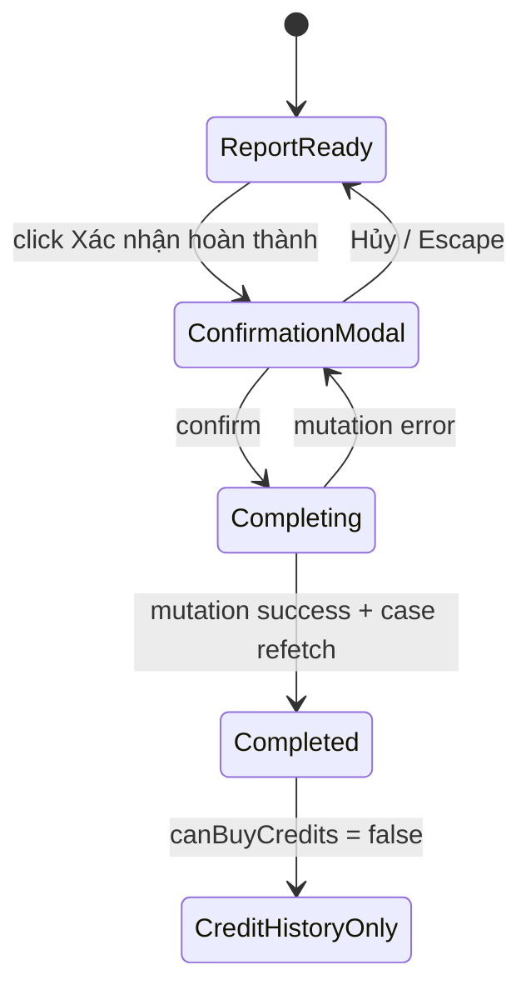

# Phase 1 — Completion confirmation UX

## Context

- Parent: [plan.md](./plan.md)
- Current trigger: `StatusGuidanceCard.tsx:414-425` calls `onConfirmComplete` immediately.
- Mantine `Modal` already provides dialog semantics, Escape, focus trap, and return-focus behavior; do not reimplement dialog behavior or apply Tailwind positioning overrides.

## Overview

Turn `Xác nhận hoàn thành` into a two-step final action. Prevent case `completed` from exposing a buy-credit entrypoint while preserving balance and transaction history.

## Requirements

- Warning must say completing ends this workflow and additional evaluation credits cannot be purchased for this project.
- Cancel/close must not call mutation.
- Confirm button awaits existing `mutateAsync`; it closes modal only after success and stays open after error. `isConfirmingComplete` prevents duplicate request.
- No direct `apiClient` call in UI components; existing hook mutation remains owner.
- Do not hide `credits` tab, ledger, balance, or past orders.

## Related Code Files

- Modify `apps/web-1/app/dashboard/case/[id]/_components/StatusGuidanceCard.tsx`
- Modify `apps/web-1/app/dashboard/case/[id]/page.tsx`
- Modify `apps/web-1/app/dashboard/case/[id]/_components/CreditPanel.tsx`
- Modify `apps/web-1/app/dashboard/case/[id]/_components/CreditBalanceCard.tsx`
- Create none. Delete none.

## Implementation Steps

1. In `StatusGuidanceCard`, add local boolean state for completion-confirmation modal. Change report-ready button handler to open it, not invoke `onConfirmComplete`.
2. Render Mantine `Modal` adjacent to report-ready branch with Vietnamese title/description, `Quay lại`, and warning-styled `Xác nhận hoàn tất`. Await promise-returning `onConfirmComplete`; call `setCompletionConfirmOpen(false)` only after resolve. Let hook notification/error path keep modal open on rejection.
3. In case page, derive `canBuyCredits = caseData.user_facing_stage !== "completed"`. Gate checkout-query auto-open, `PackageSelectionModal.opened`, its package-selection callback, `CreditPanel` purchase callback, and `CreditQuantityModal.opened` with it. This closes stale client-side purchase entrypoints.
4. Make `onBuyCredits` optional in `CreditPanel` and `CreditBalanceCard`; conditionally render each buy CTA only when handler supplied. Keep card metrics, ledger, order history intact.
5. Do not edit dead `CreditActions.tsx`: CodeGraph reports no external caller; it is not current visible surface.

## UI State Flow

## Success Criteria

- Keyboard can open button, Escape modal, and return focus to trigger through Mantine behavior.
- Cancel produces zero complete endpoint calls.
- Successful completion closes modal once, refetches completed case, and removes every rendered buy CTA in active workspace.

## Risks

- Stale case data can briefly render old CTA until TanStack Query invalidation/refetch finishes. UI gating is affordance-only; API behavior is intentionally unchanged.
- Modal copy must warn that completion ends current workspace flow; do not claim backend purchase enforcement.

## Todo

- [x] Add local modal state and warning copy.
- [x] Gate completed-case purchase entrypoints.
- [x] Preserve ledger/history rendering.