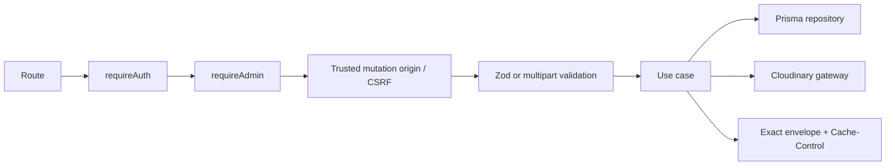

# Phase 02 — News API and Security

## Context Links

- [Overview](./plan.md)
- [Phase 01 contracts](./phase-01-contracts-database-foundation.md)
- [Architecture research](./research/architecture-research.md)

## Overview

- **Priority:** P1
- **Status:** Pending
- **Depends on:** Phase 01 contracts and approved database foundation
- **Output:** Public/admin News endpoints, authorization, persistence/use cases, Cloudinary lifecycle, focused API tests.

## Key Insights

- Follow existing `domain/`, `application/`, `infrastructure/persistence/`, `http/` module boundaries and router mounting in `apps/api/src/index.ts`.
- Add reusable `requireAdmin` beside existing `requireAuth`; frontend desktop blocking is not authorization.
- Cookie-authenticated mutations also need trusted-origin/CSRF enforcement before body parsing or upload. CORS alone is insufficient.
- Stable pagination requires `published_at DESC, id DESC`; public list/detail must never leak drafts, actor IDs, or Cloudinary public IDs. Cloudinary replacement order is upload new, conditionally persist, then delete old.

## Requirements

### API contract

| Method | Path | Contract |
|---|---|---|
| GET | `/api/news?page=1&limit=12` | Published cards; `{ items, total, page, limit, total_pages }`; stable chronology; public no-store |
| GET | `/api/news/:slug` | Published article DTO only; draft/video/missing = standard 404; public no-store |
| GET | `/api/admin/news` | Validated pagination/status/type/sort; private no-store |
| GET | `/api/admin/news/:id` | Full editor DTO; private no-store |
| POST | `/api/admin/news` | Create draft; session actor only |
| PUT | `/api/admin/news/:id` | Full type-specific live edit + `expected_updated_at`; type fixed; published slug fixed; published result must remain complete |
| POST | `/api/admin/news/:id/cover` | Article multipart atomic replacement on draft or published item + `expected_updated_at`; JPEG/PNG/WebP ≤5 MiB |
| POST | `/api/admin/news/:id/publish` | Validate complete item + `expected_updated_at`; preserve first publication time |
| POST | `/api/admin/news/:id/unpublish` | Set draft + `expected_updated_at`; preserve first publication time |
| DELETE | `/api/admin/news/:id` | Draft only + `expected_updated_at`; published returns 409 |

All success/error bodies parse Phase 1 schemas. Mutations return the updated editor DTO and fresh `updated_at`. Errors use `{ code, message, details? }`: 400 validation, 401 unauthenticated, 403 non-admin/untrusted mutation origin, 404 missing/inaccessible, 409 slug/state/stale-write conflict.

Card union: common `id`, `type`, `title`, `excerpt`, `published_at`; article adds `slug`, cover URL/alt, reading minutes; video adds canonical YouTube URL and derived thumbnail. Detail adds validated content, `updated_at`, and `author_name: \"Nexus Team\"`. Public never receives actor/public IDs.

Sort values map to allowlisted Prisma orders. YouTube outputs derive from stored ID. Every content/state/media write conditions on `id + expected_updated_at`; zero affected rows returns 409 and latest safe editor state.

## Architecture

Keep controllers thin. Domain/use cases own transitions; repository owns query/order/mapping; gateways own external effects. Split source files before 200 lines.

## Related Code Files

| Action | Absolute path | Responsibility |
|---|---|---|
| Modify | `D:/AShiroru/ProgramCode/Project/Team/Nexus/nexus-platform/apps/api/src/shared/infrastructure/middlewares/auth.ts` | Add typed admin and mutation-origin guards beside existing auth |
| Create | `D:/AShiroru/ProgramCode/Project/Team/Nexus/nexus-platform/apps/api/src/modules/news/domain/news-rules.ts` | State, publish/live-edit, reading-time, slug rules |
| Create | `D:/AShiroru/ProgramCode/Project/Team/Nexus/nexus-platform/apps/api/src/modules/news/application/news-query.usecases.ts` | Public/admin list/detail |
| Create | `D:/AShiroru/ProgramCode/Project/Team/Nexus/nexus-platform/apps/api/src/modules/news/application/news-command.usecases.ts` | Create, live update, cover, publish, unpublish, delete |
| Create | `D:/AShiroru/ProgramCode/Project/Team/Nexus/nexus-platform/apps/api/src/modules/news/infrastructure/persistence/prisma-news.repository.ts` | Prisma projections, pagination, conditional writes |
| Create | `D:/AShiroru/ProgramCode/Project/Team/Nexus/nexus-platform/apps/api/src/modules/news/infrastructure/cloudinary/news-cover.gateway.ts` | Validated upload/delete |
| Create | `D:/AShiroru/ProgramCode/Project/Team/Nexus/nexus-platform/apps/api/src/modules/news/http/news-public.controller.ts` | Public DTOs/envelopes/cache headers |
| Create | `D:/AShiroru/ProgramCode/Project/Team/Nexus/nexus-platform/apps/api/src/modules/news/http/news-admin.controller.ts` | Admin DTO/multipart/envelopes/cache headers |
| Create | `D:/AShiroru/ProgramCode/Project/Team/Nexus/nexus-platform/apps/api/src/modules/news/http/news-public.routes.ts` | Public registration |
| Create | `D:/AShiroru/ProgramCode/Project/Team/Nexus/nexus-platform/apps/api/src/modules/news/http/news-admin.routes.ts` | Guarded admin registration |
| Modify | `D:/AShiroru/ProgramCode/Project/Team/Nexus/nexus-platform/apps/api/src/modules/admin/http/admin.routes.ts` | Mount News under `/news` |
| Modify | `D:/AShiroru/ProgramCode/Project/Team/Nexus/nexus-platform/apps/api/src/index.ts` | Mount public `/api/news` only |
| Create | `D:/AShiroru/ProgramCode/Project/Team/Nexus/nexus-platform/apps/api/src/shared/infrastructure/tests/news/news-public.test.ts` | Public behavior/cache tests |
| Create | `D:/AShiroru/ProgramCode/Project/Team/Nexus/nexus-platform/apps/api/src/shared/infrastructure/tests/news/news-admin.test.ts` | Auth, origin, CRUD/state/conflict tests |
| Create | `D:/AShiroru/ProgramCode/Project/Team/Nexus/nexus-platform/apps/api/src/shared/infrastructure/tests/news/news-content-security.test.ts` | TipTap, URL, YouTube, upload hostile fixtures |

## Implementation Steps

1. Extend existing auth middleware with `requireAdmin` and one trusted mutation-origin/CSRF guard. Resolve session server-side; reject missing/untrusted browser mutation origins before parsing. Verify Better Auth trusted-origin/cookie behavior; do not invent a parallel token if existing protection is sufficient.
2. Implement explicit row/domain/DTO mappers and exact response parsing. Apply public `Cache-Control: no-store` and admin `Cache-Control: private, no-store` to successes and errors.
3. Implement bounded stable list/detail queries. Public predicates require published status and article type for detail. Use generic 404 for inaccessible variants.
4. Implement create and full-record live update. Type locks after create; published article slug locks. Revalidate the complete resulting published item. Use `expected_updated_at`; stale writes return 409 with latest safe editor DTO.
5. Implement publish/unpublish as conditional transactions. First publish sets date once; republish preserves it. Delete stays draft-only.
6. Parse exact YouTube hosts through shared normalizer; store ID only; derive canonical link and deterministic `hqdefault` thumbnail.
7. Implement cover replacement for draft or published article: verify auth/origin/item/type/version before reading upload; sniff signature; upload new; conditionally persist; delete new on DB/conflict failure; delete old only after success.
8. Implement draft deletion DB-first, then best-effort Cloudinary cleanup with secret-free orphan log.
9. Mount public router in `index.ts`; mount guarded admin router through existing admin router.
10. Add API tests for exact envelopes/statuses, auth and cross-origin mutations including multipart, cache headers, draft leakage, live published edits, stale conflicts, slug collision, pagination ties, hostile content/URLs, file spoofing/size, and Cloudinary compensation.
11. Keep new source/test files ≤200 lines; existing wiring files receive minimal additions.

## Todo List

- [ ] Admin and mutation-origin guards cover every admin mutation
- [ ] Exact public/admin/error envelopes and cache headers implemented
- [ ] Public list/detail cannot leak drafts or identity
- [ ] Optimistic CRUD/state/live-edit commands implemented
- [ ] Stable pagination and allowlisted sorting implemented
- [ ] YouTube and cover lifecycle implemented
- [ ] Focused API/security/conflict tests added
- [ ] New owned source files ≤200 lines

## Success Criteria

- Anonymous gets 401; non-admin gets 403; untrusted mutation origins fail before parse/upload.
- Public cannot fetch draft/video detail or receive actor/public IDs.
- Live published edits stay published, preserve slug/first date, and reject stale versions.
- Publish/unpublish/delete follow state rules; published delete remains blocked.
- Public/admin/errors emit specified no-store headers.
- Upload failures/conflicts preserve last valid DB/media state; hostile contract tests pass.

## Verification

Focused tests prove exact envelopes, public-only predicates, bounded pagination, malformed params, auth/origin matrix, direct published edits, stale update/cover/state conflicts, slug lock/collision, retained publication time, delete guard, cache headers, closed TipTap/link/YouTube grammar, multipart signature/size, and Cloudinary failure compensation. Phase 5 runs final commands once.

## Risk Assessment

| Risk | Impact | Mitigation / rollback |
|---|---|---|
| Role/CSRF bypass | Unauthorized mutation | required auth/admin/origin chain; cross-site tests |
| Draft/identity/cache leak | Private content exposure | restrictive projection + explicit public/admin no-store |
| Concurrent write | Silent lost edit/media | conditional `expected_updated_at`; 409 latest state |
| Partial image replacement | Leak/broken cover | ordered compensation and orphan logs |
| Module growth | Maintenance failure | split new files before 200 lines |

Rollback: unmount News routers first to stop traffic, then revert only Phase 2 files. Do not roll back or mutate the database automatically; Phase 1/human controls schema rollback.

## Security

Use the Phase 1 closed TipTap grammar and shared URL normalizer; never accept/render raw HTML. Enforce server auth, trusted mutation origin, restrictive projections, exact URL hosts/schemes, upload limits/signatures, sort/page allowlists, no-store headers, generic public 404s, and secret-free logs.

## Next Steps

Once endpoints and contracts are stable, Phase 3 and Phase 4 proceed in parallel with disjoint ownership. Contract changes return to Phase 1/2 rather than being patched independently in UI code.
