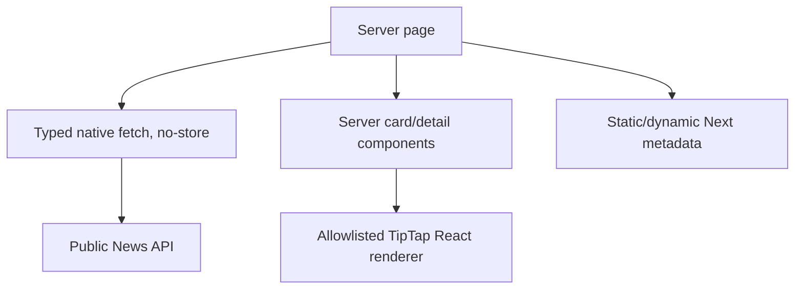

# Phase 03 — Public News Experience

## Context Links

- [Overview](./plan.md)
- [Phase 02 API](./phase-02-news-api-and-security.md)
- [UX research](./research/spiderum-ux-research.md)
- [Architecture research](./research/architecture-research.md)

## Overview

- **Priority:** P1
- **Status:** Complete
- **Depends on:** Phase 02 stable public API
- **Parallel with:** Phase 04
- **Output:** Responsive `/news` and article detail, News navigation, safe renderer, basic metadata.

## Key Insights

- Use Server Components and native `fetch`; parse exact shared schemas and require API `Cache-Control: no-store`, not only Next `fetch` no-store.
- Put `AppShell` in `app/news/layout.tsx` so list, detail, loading, error, and not-found retain public navigation.
- Add exact label `Tin tức` to desktop header/mobile drawer only; preserve global font, palette, spacing, landing composition, and desktop behavior.
- Borrow Spiderum reading hierarchy, not branding/social mechanics: restrained cards, strong H1/deck, metadata, wide cover, 720px body, generous whitespace.
- Video has no internal route: one safe whole-card external anchor with visible new-tab affordance.
## Requirements

### Confirmed

- Active nav uses weight plus underline/border, not color alone.
- `/news`: compact heading/deck, lead item, then one-column base/two-column `sm+` grid, 24px gap, pagination.
- Cards: 16:9 reserved media, `Bài viết`/`Video` badge, title, excerpt, publication date; articles add derived reading time.
- Article card is one internal link. Video card is one new-tab canonical YouTube anchor with visible `Mở trên YouTube`, ExternalLink, accessible new-tab phrase, and safe `rel`.
- `/news/[slug]`: badge, H1, deck, `Nexus Team · date · x phút đọc`, wide cover, 720px article body. Draft/video/missing = localized 404.
- Body: 17/30 base, 18/32 `md+`; H2 28/36, H3 22/30; 60–75 characters/line; brand-border blockquote.
- Existing semantic tokens and Google Sans Flex only. No global CSS/font/color changes, gradients, heavy shadows, fixed social rail, share/progress/related modules.
- Gutters 16/24/32px; one H1; semantic list/article; sequential headings; visible focus; keyboard operation; ≥44px targets; reduced motion; dark-mode contrast.
- Reserve media dimensions; lead eager, lower cards lazy. Card thumbnail may be decorative; detail cover uses authored alt.
- Canonical origin `https://nexusforstartup.site`; article metadata includes title, excerpt, canonical, OG/Twitter, type, first publication and modified times.
- Public fetch rejects malformed DTOs or unexpected cache policy. API and Next layers both no-store so unpublish/live edit reaches a fresh client immediately.
- Empty/error/loading preserve shell. No sitemap/JSON-LD in held scope.

## Architecture

Client JavaScript is limited to retry/pagination behavior only if necessary. Never hydrate a public client-state store and never use `dangerouslySetInnerHTML`.

## Related Code Files

| Action | Absolute path | Responsibility |
|---|---|---|
| Create | `D:/AShiroru/ProgramCode/Project/Team/Nexus/nexus-platform/apps/web-1/app/news/layout.tsx` | AppShell for every News route state |
| Create | `D:/AShiroru/ProgramCode/Project/Team/Nexus/nexus-platform/apps/web-1/app/news/page.tsx` | Server feed and metadata |
| Create | `D:/AShiroru/ProgramCode/Project/Team/Nexus/nexus-platform/apps/web-1/app/news/[slug]/page.tsx` | Article detail, `generateMetadata`, `notFound()` |
| Create | `D:/AShiroru/ProgramCode/Project/Team/Nexus/nexus-platform/apps/web-1/app/news/loading.tsx` | Geometry-preserving skeleton |
| Create | `D:/AShiroru/ProgramCode/Project/Team/Nexus/nexus-platform/apps/web-1/app/news/error.tsx` | Client retry boundary inside layout |
| Create | `D:/AShiroru/ProgramCode/Project/Team/Nexus/nexus-platform/apps/web-1/app/news/not-found.tsx` | Localized article 404 |
| Create | `D:/AShiroru/ProgramCode/Project/Team/Nexus/nexus-platform/apps/web-1/app/news/_components/NewsFeed.tsx` | Lead/grid/pagination |
| Create | `D:/AShiroru/ProgramCode/Project/Team/Nexus/nexus-platform/apps/web-1/app/news/_components/NewsCard.tsx` | One-link article/video card |
| Create | `D:/AShiroru/ProgramCode/Project/Team/Nexus/nexus-platform/apps/web-1/app/news/_components/ArticleBody.tsx` | Controlled TipTap-to-React renderer |
| Create | `D:/AShiroru/ProgramCode/Project/Team/Nexus/nexus-platform/apps/web-1/app/news/news.module.css` | Scoped editorial styling if Mantine props are insufficient |
| Create | `D:/AShiroru/ProgramCode/Project/Team/Nexus/nexus-platform/apps/web-1/lib/news-server.ts` | Absolute server fetch and exact DTO/cache parsing |
| Modify | `D:/AShiroru/ProgramCode/Project/Team/Nexus/nexus-platform/apps/web-1/components/layout/AppShell.tsx` | Add `Tin tức` desktop/mobile links only |
| Modify | `D:/AShiroru/ProgramCode/Project/Team/Nexus/nexus-platform/apps/web-1/proxy.ts` | Cover `/news/:path*` in maintenance matcher |
| Modify | `D:/AShiroru/ProgramCode/Project/Team/Nexus/nexus-platform/apps/web-1/next.config.ts` | Exact Cloudinary/YouTube image hosts |
| Modify | `D:/AShiroru/ProgramCode/Project/Team/Nexus/nexus-platform/apps/web-1/app/layout.tsx` | Set production `metadataBase` only if not centralized |

Phase 3 never edits Phase 4 or contract/API files. New files stay ≤200 lines; legacy edits stay minimal.

## Implementation Steps

1. Add News route layout around existing `AppShell`; add `Tin tức` desktop/mobile links without changing unrelated shell/landing visuals.
2. Add `news-server.ts` using configured absolute API base, `cache: \"no-store\"`, exact schema parsing, API cache-header assertion, encoded slug, and normalized 404/error mapping. Never import browser Axios or forward cookies.
3. Configure exact existing Cloudinary and YouTube thumbnail image hosts; no arbitrary HTTPS.
4. Build semantic cards/feed/pagination with reserved media, one interactive element, safe external behavior, deterministic YouTube thumbnail fallback, loading/empty/error states.
5. Build article Server Component with fixed byline, cover alt, dates, reading time, and `notFound()` for inaccessible content.
6. Map only Phase 1 TipTap grammar to explicit React elements. Re-run shared URL normalizer; never spread unknown attributes or use `dangerouslySetInnerHTML`.
7. Run hostile `renderToStaticMarkup` smoke: text escapes; unknown nodes/attrs and unsafe links fail closed; external links get safe rel. Remove only throwaway harness after recording proof.
8. Apply scoped Nexus Editorial typography/spacing using existing tokens/font; no global font or palette changes.
9. Add async article metadata with canonical apex, OG/Twitter cover, first publication and modified times; never fetch draft metadata.
10. Add loading/error/not-found states, maintenance matcher, and strict remote patterns.
11. Browser-smoke list/detail/video/error at 390/768/1024/1440, light/dark, keyboard, reduced motion; inspect HTML, API/page cache headers, canonical metadata, image dimensions, and external link attributes.
12. Keep each route/component/style responsibility ≤200 source lines. Reuse existing shell/tokens; no global font/color change.

## Todo List

- [ ] News layout and `Tin tức` desktop/mobile nav added
- [ ] Server fetch parses exact DTO and no-store policy
- [ ] Responsive feed/cards/pagination/states implemented
- [ ] Article detail and controlled renderer implemented
- [ ] Hostile SSR renderer smoke passes
- [ ] Canonical/OG/Twitter metadata implemented
- [ ] Maintenance matcher and exact image hosts updated
- [ ] Accessibility/responsive/dark/browser checks completed

## Success Criteria

- `/news` renders only published cards with stable responsive geometry.
- Article detail securely renders with `Nexus Team`; draft/video slugs resolve 404.
- YouTube card uses derived thumbnail and safe new-tab canonical link, never internal detail.
- Live edits/unpublish reach a fresh client immediately through API and Next no-store.
- Existing desktop/landing visuals remain unchanged except `Tin tức`; metadata/accessibility/error states pass smoke.

## Verification

Run focused type/build diagnostics for owned files and hostile `renderToStaticMarkup` smoke. Run actual browser at 390/768/1024/1440: feed, pagination, article, video link, missing slug, API error, maintenance, light/dark, keyboard, reduced motion. Inspect API/page cache headers, one H1, heading order, safe links, canonical/OG tags, reserved images, no identity/raw HTML/overflow. Phase 5 runs workspace checks once.

## Risk Assessment

| Risk | Impact | Mitigation / rollback |
|---|---|---|
| Unsafe rich rendering | XSS/crash | shared closed grammar, explicit React mapper, hostile SSR fixtures |
| Stale/private content | Unpublished leak | API + Next no-store; fresh-client smoke |
| Header regression | Existing landing changes | nav-only AppShell edit; width smoke |
| YouTube ambiguity | User expects internal detail | badge, ExternalLink, explicit label/new-tab announcement |
| CLS/host bypass | Poor UX/security | reserved images and exact remote patterns |

Rollback: remove News layout/routes/components/helper/nav, restore matcher/image/metadata edits. API and DB remain independent; no automated DB rollback.

## Security

Treat API content as untrusted even after backend validation. Validate renderer nodes, marks, href schemes, and external-link rel. Do not expose session, actor IDs, private Cloudinary identifiers, drafts, or API stack data. Use encoded route params and exact remote image hosts.

## Next Steps

Proceed in parallel with Phase 04. After both complete, Phase 05 performs integrated smoke and documentation. Public defects return to Phase 3 ownership.
