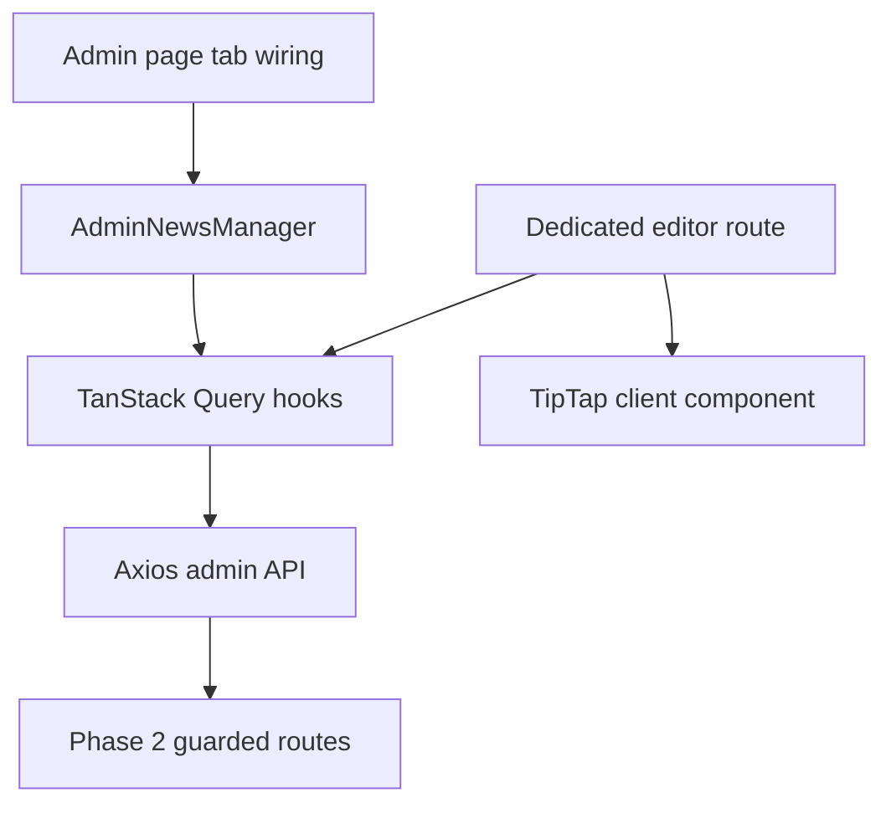

# Phase 04 — Admin News Management

## Context Links

- [Overview](./plan.md)
- [Phase 02 API](./phase-02-news-api-and-security.md)
- [UX research](./research/spiderum-ux-research.md)

## Overview

- **Priority:** P1
- **Status:** Complete
- **Depends on:** Phase 02 stable admin API
- **Parallel with:** Phase 03
- **Output:** Isolated desktop News list, create/edit routes, TipTap editor, cover and publication workflow.

## Key Insights

- Existing admin remains desktop-only below 1024px and uses `/admin?tab=`. Preserve that behavior.
- `app/admin/page.tsx` already exceeds the 200-line rule; only wire the tab there. Do not add News state/business logic.
- Dedicated editor pages avoid oversized modal/drawer state and support dirty-navigation guards.
- TipTap must be a client component with `immediatelyRender: false`; server/API remains authoritative for content safety.

## Requirements

### List

- Add exact label `Tin tức` to inline DoubleNavbar/`VALID_TABS`; render isolated `AdminNewsManager` for `?tab=news`.
- CTA `Tạo nội dung`; filters type (`Tất cả/Bài viết/Video`), status (`Tất cả/Bản nháp/Đã xuất bản`), sort (`Mới cập nhật/Mới xuất bản/Cũ nhất`). No search.
- Table: 96×54 thumbnail, title/excerpt, type/status badges, updated/published dates, action menu.
- Actions edit, publish/unpublish, delete. Published content can be edited live but must be unpublished before delete.
- Explicit initial-empty and filtered-empty copy, reset/create actions, loading and actionable error states.

### Editor

- Routes `/admin/news/new` and `/admin/news/[id]`; first choice article/video; type locks after successful initial save.
- Common fields title, excerpt, status summary. Draft save and publication are separate; published `Lưu thay đổi` updates public content directly.
- Article: server-generated slug editable before first publication, then read-only; cover upload/16:9 preview, alt, TipTap body. Cover replacement works on draft or published item.
- Video: YouTube URL with immediate canonical validation and derived thumbnail; no slug/body/custom cover. New-tab behavior is public-only.
- Every update/cover/publish/unpublish/delete sends current `expected_updated_at`; 409 never overwrites local input and offers compare/refetch.
- Sticky desktop action bar: `Lưu nháp`/`Lưu thay đổi`, `Xuất bản` for draft, `Hủy xuất bản` for published.
- Dirty route/back/reload guard; no autosave or standalone public preview.
- Draft delete confirmation names item and explains irreversibility; published delete directs admin to unpublish first.

### Editor allowlist

Toolbar: undo/redo, bold, italic, underline, strike, H2/H3, bullet/ordered list, blockquote, link, horizontal rule. Vietnamese labels; sticky toolbar; min height 480px; content max 760px. No H1, inline image, embed, table, HTML, color/font/alignment.

## Architecture

Keep server-derived authorization authoritative. UI gating improves clarity but never substitutes API enforcement.

## Related Code Files

| Action | Absolute path | Responsibility |
|---|---|---|
| Modify | `D:/AShiroru/ProgramCode/Project/Team/Nexus/nexus-platform/apps/web-1/app/admin/page.tsx` | Minimal inline tab/nav/import/render wiring only |
| Create | `D:/AShiroru/ProgramCode/Project/Team/Nexus/nexus-platform/apps/web-1/app/admin/hooks/useAdminNews.ts` | Typed list/detail/mutation hooks, invalidation, conflict state |
| Create | `D:/AShiroru/ProgramCode/Project/Team/Nexus/nexus-platform/apps/web-1/app/admin/_components/news/AdminNewsManager.tsx` | List/filter/page orchestration |
| Create | `D:/AShiroru/ProgramCode/Project/Team/Nexus/nexus-platform/apps/web-1/app/admin/_components/news/NewsTable.tsx` | Table, loading/empty/error states |
| Create | `D:/AShiroru/ProgramCode/Project/Team/Nexus/nexus-platform/apps/web-1/app/admin/_components/news/NewsFilters.tsx` | Validated URL/query filters |
| Create | `D:/AShiroru/ProgramCode/Project/Team/Nexus/nexus-platform/apps/web-1/app/admin/_components/news/NewsActions.tsx` | Menus and confirmations |
| Create | `D:/AShiroru/ProgramCode/Project/Team/Nexus/nexus-platform/apps/web-1/app/admin/_components/news/NewsEditorForm.tsx` | Shared form, save/publication/conflict flow |
| Create | `D:/AShiroru/ProgramCode/Project/Team/Nexus/nexus-platform/apps/web-1/app/admin/_components/news/ArticleFields.tsx` | Slug/cover/alt/body fields |
| Create | `D:/AShiroru/ProgramCode/Project/Team/Nexus/nexus-platform/apps/web-1/app/admin/_components/news/VideoFields.tsx` | YouTube validation/thumbnail |
| Create | `D:/AShiroru/ProgramCode/Project/Team/Nexus/nexus-platform/apps/web-1/app/admin/_components/news/NewsRichTextEditor.tsx` | TipTap client editor |
| Create | `D:/AShiroru/ProgramCode/Project/Team/Nexus/nexus-platform/apps/web-1/app/admin/hooks/useDirtyFormGuard.ts` | route/back/reload protection |
| Create | `D:/AShiroru/ProgramCode/Project/Team/Nexus/nexus-platform/apps/web-1/app/admin/news/new/page.tsx` | Create route |
| Create | `D:/AShiroru/ProgramCode/Project/Team/Nexus/nexus-platform/apps/web-1/app/admin/news/[id]/page.tsx` | Edit route/load handling |

Phase 4 never creates duplicate navbar/tab modules and never edits Phase 1–3 files. New files stay ≤200 lines; oversized admin page receives minimal wiring only.

## Implementation Steps

1. Add only `news` discriminator, `Tin tức` nav item, import and manager branch inside existing admin page/inline DoubleNavbar. Preserve all tabs and desktop blockade.
2. Build typed TanStack Query/Axios hooks for exact list/detail/create/full-update/cover/publish/unpublish/delete contracts. Include `expected_updated_at`, encode filters, invalidate/refetch relevant keys, preserve local input on 409, and surface standard errors.
3. Implement table filters/page in URL state; filter changes reset page. Provide reserved loading geometry and distinct initial/filtered empty/error states.
4. Create route starts with required type, posts draft, redirects to `/admin/news/<id>`, locks type, and establishes clean baseline.
5. Edit route handles loading/404/authorization/error states. Reset baseline only after successful save/refetch.
6. Build form from shared Zod. Disable duplicate submit; retain failed values; show field/summary errors; focus first invalid field. Published save performs one full-record live update and remains published.
7. Article fields: slug editable only before first publish; cover accepts JPG/PNG/WebP ≤5 MiB, recommends 1600×900 without client-only hard dimension rejection, previews 16:9, and requires alt before publish. Replacement is available on published content.
8. Build TipTap client with `immediatelyRender: false`, only approved extensions/heading levels, Vietnamese labels, keyboard toolbar, sticky controls, 480px editor and 760px content width. Emit JSON only.
9. Video fields use shared parser for exact hosts, show canonical URL and derived YouTube thumbnail, and never offer custom cover.
10. Sticky actions: save draft or live published changes; publish/unpublish only from clean saved state. On stale 409, retain local draft and offer refetch/compare instead of silent overwrite.
11. Delete draft through titled Mantine confirmation. Published item shows `Hủy xuất bản để xóa`; deletion remains disabled until latest state is draft.
12. Add dirty internal/back/reload guard; clear after successful save/delete. No autosave, preview, social or taxonomy controls.
13. Split new concerns before 200 lines; do not refactor unrelated oversized admin code.

## Todo List

- [ ] `Tin tức` tab added with minimal existing-page wiring
- [ ] List/filter/pagination/empty/error/loading states implemented
- [ ] Exact hooks include `expected_updated_at` and 409 recovery
- [ ] Dedicated create/edit flows implemented
- [ ] Article live edit/cover/alt/slug/TipTap UX implemented
- [ ] Video YouTube-thumbnail-only UX implemented
- [ ] Save/publish/unpublish/draft-delete actions implemented
- [ ] Dirty guard implemented without autosave
- [ ] New source files ≤200 lines

## Success Criteria

- Admin below 1024px stays blocked; public UI unaffected.
- Admin can create both types, edit drafts or published items, replace published article cover, publish/unpublish, and delete drafts.
- Published full update stays live, preserves slug/first date, and stale writes produce visible 409 recovery without input loss.
- Article cannot publish without valid body/cover/alt; video never shows article/custom-cover controls.
- Dirty navigation warns; successful save clears it.
- `admin/page.tsx` receives only tab/nav/import/render wiring, no News business state.

## Verification

Desktop smoke ≥1024px: tab/deep link; filters/pagination/reset; empty/error; create article/video; slug lock; image type/size and draft/published replacement; toolbar/keyboard; failed-save retention; direct live published edit; stale update/cover 409 recovery; publish/unpublish; blocked published delete then draft delete; confirmation cancel/confirm; dirty internal/back/reload; query invalidation. At 390/768 verify existing admin blockade. Confirm no autosave or public draft preview request.

## Risk Assessment

| Risk | Impact | Mitigation / rollback |
|---|---|---|
| Admin page grows further | High | wiring only; isolated manager/hooks/routes |
| Unsaved content loss | High | baseline-driven dirty guard |
| UI/API state race | High | `expected_updated_at`, duplicate-submit lock, 409 preserve/refetch flow |
| TipTap hydration | Medium | client boundary + `immediatelyRender: false` |
| Invalid cover | Medium | client feedback plus authoritative API signature/limit checks |

Rollback: remove News tab/editor routes/components/hooks and revert minimal nav/page wiring. API/data remain intact. Never delete News rows or roll back schema as a UI rollback.

## Security

API remains authoritative for auth, origin, invariants and conflicts. Never send role/actor/public ID/arbitrary status. Escape API errors/content. Use shared URL and upload checks for early feedback; retain server enforcement. No admin external preview or reverse-tabnabbing path.

## Next Steps

When Phase 3 and Phase 4 both complete, Phase 5 runs integrated verification and updates docs. Admin defects return to Phase 4; contract defects return to Phase 1/2.
