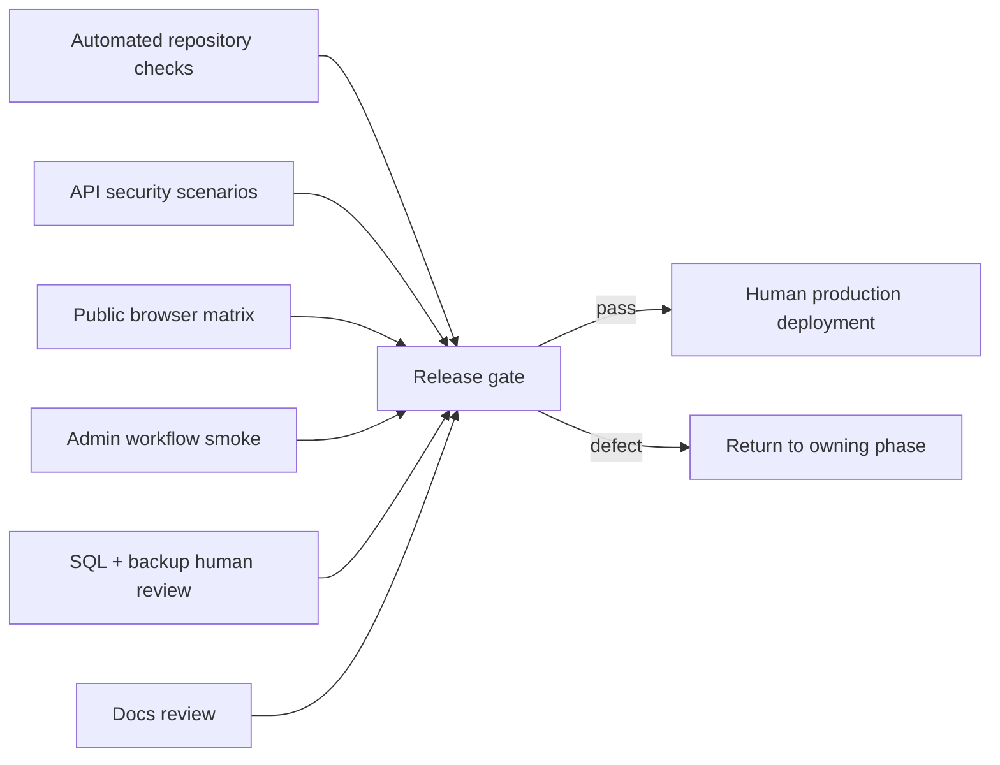

# Phase 05 — Integration, Verification, and Docs

## Context Links

- [Overview](./plan.md)
- [Phase 01 foundation](./phase-01-contracts-database-foundation.md)
- [Phase 02 API](./phase-02-news-api-and-security.md)
- [Phase 03 public UI](./phase-03-public-news-experience.md)
- [Phase 04 admin UI](./phase-04-admin-news-management.md)
- [Architecture research](./research/architecture-research.md)
- [UX research](./research/spiderum-ux-research.md)

## Overview

- **Priority:** P1
- **Status:** Complete
- **Depends on:** Phases 03 and 04 complete
- **Output:** One integrated verification pass, human-run DB/deployment handoff, two canonical doc updates, and one News requirements document.
- **Ownership rule:** Docs only. No source/schema/config/migration edits; discovered defects return to the owning phase.

## Key Insights

- API uses `node:test`; no web test runner exists. Do not add one solely for this scope; use focused hostile SSR smoke plus actual browser verification.
- Final confidence combines repository commands, focused API tests, SSR smoke, and public/admin browser journeys.
- Exact reviewed migration may already be human-applied to isolated local/test for implementation. Production remains unapplied until authorized backup/target/SQL confirmation.
- Immediate consistency requires API response headers plus Next no-store and fresh-client observation, not inference from code.

## Requirements

### Verification gates

- Exclusive ownership complete; every new source file ≤200 lines; pre-existing oversized convention files have minimal wiring only.
- Existing build/typecheck/lint/API test commands pass, plus focused News tests and hostile SSR smoke.
- Public smoke at 390/768/1024/1440; admin desktop ≥1024 and existing blockade below 1024.
- Security matrix covers auth/admin/origin guard, draft leakage, exact cache headers, hostile body/link/YouTube/upload/renderer fixtures, public DTO identity leakage, and stale-write conflicts.
- Accessibility covers keyboard, focus, semantics, 44px controls, dark mode, reduced motion, external-link wording, and no overflow.
- SEO covers canonical, description, OG/Twitter, publication/modified metadata, and inaccessible draft/video detail. Sitemap/JSON-LD remain excluded.

### Documentation and release

- Update existing development/API/operator documentation with endpoints, workflow, required environment settings already used by Cloudinary/API origin, content restrictions, and human migration procedure.
- Clearly mark fixed public byline `Nexus Team`; admin identities are private audit data.
- Production migration/deployment is human-run only after backup and SQL review. No automatic apply, reset, push, destructive statement, or applied-migration edit.

## Architecture

## Related Code Files

| Action | Absolute path | Responsibility |
|---|---|---|
| Modify | `D:/AShiroru/ProgramCode/Project/Team/Nexus/nexus-platform/docs/system-architecture.md` | Add final News data flow/module boundaries |
| Modify | `D:/AShiroru/ProgramCode/Project/Team/Nexus/nexus-platform/docs/codebase-summary.md` | Add final routes/module/file ownership summary |
| Create | `D:/AShiroru/ProgramCode/Project/Team/Nexus/nexus-platform/docs/requirements/news-content-management.md` | Canonical behavior, API table, content rules, admin workflow, release notes |

Phase 5 owns only these docs. Discovered source/config/schema/migration defects return to owning phases.

## Implementation Steps

1. Review phase evidence and ownership. Return defects to P1 contracts/schema, P2 API, P3 public, or P4 admin; Phase 5 edits docs only.
2. Confirm DB evidence without mutation: target/backup, separate approvals, reviewed checksum, human-applied isolated local/test artifact, and production still pending authorized release. Missing evidence blocks release.
3. Run documented install/typecheck/build/lint/API test commands once after implementation. Run focused News tests and hostile SSR render smoke. Capture exact commands/results.
4. Execute API/security matrix: exact envelopes; auth/admin/trusted-origin including cross-site multipart; cache headers on success/error; boundaries/pagination; malformed/unknown fields; hostile TipTap/renderer/link/YouTube; upload signature/size; slug collision; publish invariants; stale update/cover/state actions; published delete 409; public DTO omissions.
5. Article journey: create draft, cover/body/save/publish, observe feed/detail, edit published title/body/cover directly and observe fresh client, exercise stale 409 recovery, unpublish to immediate 404, republish with same slug/first date, unpublish then delete.
6. Video journey: create from supported URL, confirm derived thumbnail/canonical new-tab card, publish/unpublish, and confirm no internal detail/custom cover.
7. Execute browser matrix at 390/768/1024/1440 for all states, navigation, metadata, layout, keyboard/focus, light/dark, reduced motion, overflow, maintenance, admin desktop and below-1024 blockade.
8. Exercise safe local/test failures: API unavailable, malformed response, stale writes, Cloudinary upload/DB/cleanup failures. Verify input retention, no invalid DB/media reference, and structured orphan logs.
9. Review new files ≤200 lines and minimal legacy edits; route defects back. Update only owned canonical docs from observed behavior.
10. Production sequence, human only: verify fresh backup/target/checksum; apply exact reviewed additive migration through established procedure; verify migration; deploy API; smoke public/admin API; deploy web; run browser smoke; monitor errors/orphan logs.
11. Failure response: roll back web, then API, leaving additive schema/data intact. Database rollback is never automatic; only a separately reviewed forward migration may change schema.

## Todo List

- [ ] Phase evidence and exclusive ownership reviewed
- [ ] Local/test DB evidence complete; production backup/target/checksum gate ready
- [ ] Repository, focused API, and hostile SSR checks pass
- [ ] Auth/origin/cache/content/upload/conflict matrix passes
- [ ] Published live-edit article and YouTube video journeys pass
- [ ] Responsive/accessibility/dark/maintenance/SEO smoke passes
- [ ] Failure and compensation paths observed
- [ ] New-file limits and minimal legacy edits verified
- [ ] Three canonical docs updated from observed behavior
- [ ] Human production sequence and app rollback approved

## Success Criteria

- Confirmed behaviors work end to end; no unresolved core decision remains.
- Publish/unpublish/live published edit is immediately consistent to a fresh client; drafts/admin identity never leak.
- Article/video, media lifecycle, stale conflicts, pagination, cache headers, metadata, accessibility, and responsive criteria pass.
- Excluded features stay absent; landing/desktop visuals have no unrelated regression.
- Production cannot proceed without human backup/target/checksum confirmation.
- Docs describe observed final contracts and commands, not speculation.

## Verification

Record observed outcomes:

1. Published article orders by `(published_at DESC, id DESC)`; detail and metadata resolve.
2. Direct published content and cover edit remains public, preserves slug/date, and reaches fresh client; stale edit returns recoverable 409.
3. Video shows badge/derived thumbnail and opens canonical YouTube safely; internal video detail is 404.
4. Draft is absent publicly; public DTO has no actor/public IDs; API/page no-store headers are present.
5. Unpublish removes access immediately; republish retains slug/first date; published delete is 409, draft delete succeeds.
6. Untrusted-origin mutation, malicious content/link, lookalike YouTube, SVG/spoofed/oversized upload, unauthorized admin, and hostile persisted renderer fixture fail safely.
7. Empty/loading/error/out-of-range/404/conflict states remain usable.
8. Keyboard/screen-reader/focus/dimensions/dark/reduced-motion/four-width checks pass.

## Risk Assessment

| Risk | Impact | Mitigation / rollback |
|---|---|---|
| Wrong DB/release order | Critical | isolated local/test evidence; human production migration → API → web |
| Late contract mismatch | High | return to owning phase; rerun final pass |
| Happy-path-only proof | High | explicit origin/cache/security/failure/responsive matrix |
| Destructive rollback | Critical | web/API rollback first; retain additive schema/data |
| Docs drift | Medium | update fixed canonical files from observed behavior |

## Security

Use sanitized fixtures and non-production credentials. Never record tokens, DB URLs, Cloudinary secrets, actor IDs, or private IDs. Verify 401/403/origin boundaries, cache headers, generic public 404, safe errors/logs, closed content/URL grammar, upload inspection, hostile renderer output, and external-link rel. Human reviews production access/migration.

## Next Steps

After every gate passes, hand the production-unapplied reviewed migration and exact migration → API → web sequence to the authorized operator. Post-release defects return to file-owning phase; deferred features require a separate plan.
