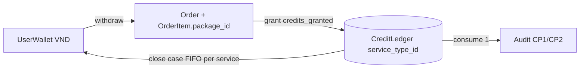

# Phase 2 — Credit ledger by service type

## Context
- Research: `../reports/research-2026-10-10-unified-service-payment.md`
- Schema: `prisma/schema.prisma` `ServiceType` (code unique), `ServicePackage` (:129, `service_type_id` có sẵn), `CreditLedger` (:653), `OrderItem` (:288, `service_type` String)
- Seeds: `prisma/seeds/seed-active-packages.ts:38-98` — `pkg_tf_free` 0, `pkg_tf_audit` inactive, `pkg_ai_audit` 79000 `features.credits_granted: 2`, `pkg_supporter_audit` 149000. Không có seed ServiceType.
- Số dư lặp ~9 chỗ:
  - `cases/infrastructure/persistence/credit-ledger.repository.ts:3-58` (canonical)
  - `orders/application/credit-audit-order.helpers.ts:79-88`
  - `services/case-transition.service.ts:36-43, 104-130, 224-225`
  - `services/credit-refund.ts:109-257`
  - `ai-engine/application/omp-audit-coordinator.ts:89, 535-549`
  - `cases/application/get-case-detail.usecase.ts:154`
  - `cases/application/send-message.usecase.ts:36`
  - `payments/infrastructure/persistence/payment.repository.ts:194-233` (chỉ khi `USE_ORDER_DOMAIN!==true`)
  - `wallet/application/purchase-credits.usecase.ts` (@deprecated, vẫn route `POST /api/wallet/purchase-credits`, web không gọi)
- Magic: `create-order.usecase.ts:127-145` (`79000`, `pkg_ai_audit`, `pkg_tf_audit`).

## Overview
Priority P1. Nền cho phase 3, 6, 7. Đổi đường tiền: rủi ro cao nhất plan.

## Requirements
- `ServiceType` rows: `cp1_audit` (gói CP1 hiện có), `cp2_audit`. Gán `service_type_id` cho các `ServicePackage` hiện có.
- `ServicePackage.credits_granted Int?` (typed). Backfill từ `features.credits_granted`; `pkg_ai_audit` = 2.
- `CreditLedger.service_type_id String?` FK -> ServiceType, `@@index([case_id, service_type_id])`. Backfill toàn bộ dòng cũ -> `cp1_audit`.
- `OrderItem.package_id String?` FK -> ServicePackage. Order mới gửi `package_id`; `service_type` = `ServiceType.code` của gói (giữ cột cho báo cáo/export).
- Một module số dư duy nhất: `getCreditBalance(db, caseId, serviceTypeId)` + `getCreditBalances(db, caseId)` (map theo code cho UI). Mọi caller dùng; xóa bản sao.
- Grant: `credits_granted × quantity` của gói. Xóa nhánh magic.
- Consume: caller truyền ServiceType. CP1 flow hiện tại = `cp1_audit`.
- Refund FIFO (`credit-refund.ts`): tính riêng theo từng `service_type_id`; resolver giá chấp nhận 0 (đọc `price_per_credit` khi là number, kể cả 0) để lượt giá 0 hoàn 0đ.
- Case detail API: thêm `credit_balances: { [serviceTypeCode]: number }`; giữ `credit_balance` = số dư `cp1_audit` cho web cũ tới phase 7 thay.
- Cutover: xóa route + usecase `purchase-credits` deprecated.

## Architecture

## Steps
1. Đọc kỹ: `case-transition.service.ts:104-130` và `omp-audit-coordinator.ts:535-549` — scout báo credit có thể bị trừ ở cả 2 nơi. Xác định nhánh nào chạy cho flow nào trước khi refactor; ghi kết luận vào phase này. Nếu là lỗi trừ đôi: báo user, không tự sửa ngoài phạm vi.
2. Schema + `migrate dev --create-only`. SQL: thêm cột nullable, insert ServiceType (`ON CONFLICT (code) DO NOTHING`), backfill ledger + package + credits_granted. Review SQL tay.
3. Cập nhật `seed-active-packages.ts` cho ServiceType + `credits_granted` + gói `pkg_cp2_audit` (79000, 4, `service_type` cp2_audit).
4. Viết module số dư trong `credit-ledger.repository.ts`; thay toàn bộ caller ở danh sách trên.
5. `create-order.usecase.ts`: nhận `package_id` (validate active, đúng owner case); giá từ `ServicePricing` hiện hành (`resolveCreditAuditPrice` tổng quát hóa theo package); bỏ `ALL_CREDIT_AUDIT_SERVICES` cho logic grant. Giữ `credit_audit_manual` semantics: đọc nơi dùng, map sang trường tương ứng trước khi xóa.
6. Refund per service type + resolver giá 0.
7. Xóa `purchase-credits` route/usecase.
8. Tests (`apps/api/src/shared/infrastructure/tests/`, node:test): grant đúng ServiceType; consume CP2 không chạm số dư CP1; refund hai ServiceType độc lập; lượt giá 0 hoàn 0đ; order với package inactive -> 400. Sửa test cũ gãy (`credit-audit-order-upgrade.test.ts`, `phase-09-intake-stuck-fix.test.ts`).

## Todo
- [x] Xác minh trừ lượt 2 nơi
- [x] Migration create-only + review
- [x] Seed
- [x] Module số dư + thay caller
- [x] Order theo package
- [x] Refund
- [x] Xóa purchase-credits
- [x] Tests

## Success criteria
- `grep` không còn `creditLedger.aggregate` ngoài module số dư.
- Không còn `79000`/`pkg_ai_audit` trong logic grant.
- Toàn bộ test API pass; smoke local: mua CP1, chạy audit, đóng case -> số tiền hoàn bằng trước refactor.

## Risks
- Sai backfill -> lệch số dư khách thật. Mitigation: query đối chiếu tổng số dư theo case trước/sau trên DB local copy; migration chỉ thêm, không sửa amount.
- Deploy lệch API/web: giữ `credit_balance` cũ.

## Security
Giá chỉ tính server; client không gửi giá. Owner check giữ nguyên.

## Findings
Step 1 (đã xác minh bằng đọc code, không phải lỗi trừ đôi):
- Chỉ `omp-audit-coordinator.ts` (`triggerOmpAuditForCase`, trong tx có `SELECT ... FOR UPDATE` trên case) ghi dòng `consumption` -1 thật sự, idempotency key `audit-trigger-<caseId>-<startedAt>`; hoàn lại +1 qua `refundAuditCreditIfNoReport` khi job lỗi.
- `case-transition.service.ts` `case 'subtractCredit'` là nhánh chết: không transition nào trong `case-machine.ts` gắn action `subtractCredit` (chỉ có khai báo ở bảng `actions` và `ActionName`). T11/T3 chỉ kiểm tra số dư (`creditGated`), không trừ. Comment ở `submit-revision.usecase.ts:265` ("machine lo subtractCredit") đã lỗi thời.
- Xử lý: xóa nhánh chết `subtractCredit` thay vì migrate sang ServiceType (không đổi hành vi). Số dư dùng cho gate T11/T3/T5 lấy theo `cp1_audit`.
