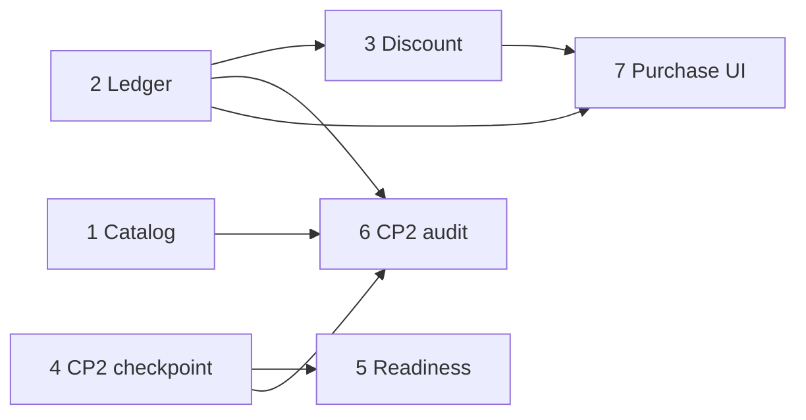

# CP2 service expansion

## Overview
Mở rộng dịch vụ sang Checkpoint 2 theo feedback giảng viên (pre-OC1): gói nâng cao CP2, phỏng vấn thật > survey, TAM bottom-up, không làm thay nhóm.
Ví VND giữ nguyên là cách trả duy nhất. Lượt chấm gắn `ServiceType`, mỗi dịch vụ sau này = 1 ServiceType + 1 gói.

Nguồn quyết định:
- [Brainstorm CP2](../reports/brainstorm-2026-10-10-cp2-service-expansion.md)
- [Research thanh toán](../reports/research-2026-10-10-unified-service-payment.md)
- [Research đánh giá CP2](../reports/research-2026-10-10-cp2-evaluation-design.md)
- System prompt viết sẵn: [prompts/](./prompts/) — copy nguyên khi implement phase 6
- Feedback: `docs/nexus-document/oc1/feedback/pre-oc1-feedback-transcript.md`

## Decisions (chốt)
- CP1-4 cùng 1 case. CP2 không bắt buộc qua CP1.
- Gói CP2 79.000đ = 4 lượt (`credits_granted`, đổi được). Lượt dùng chung: chấm bảng hỏi phỏng vấn + chấm toàn bộ CP2.
- `CreditLedger.service_type_id` FK; `ServicePackage.credits_granted Int`; không dùng JSON `features` cho dữ liệu tính tiền.
- Lượt tặng = mã giảm giá 100% đi qua order (giá 0), không phải ledger `promo`.
- SOM dạy theo bài news (kênh × tiếp cận × tỷ lệ tải × tỷ lệ trả phí).
- Link đọc thêm: `further_reading: { url, title }[]` trong catalog, chỉ `https://`.
- Ngoài phạm vi: CP1 nhiều ý tưởng (kèm đổi gói CP1 từ 2 lên 4 lượt theo gợi ý giảng viên — làm cùng việc đó, không làm ở đây), CP3/CP4 audit, debate simulator, hạn dùng lượt, combo.
- Chấm CP2: AI quyết định từng tiêu chí kèm trích dẫn; code tính điểm, kết luận, kiểm trích dẫn. Thêm câu `cp2_question_bank` làm đầu vào chấm bảng hỏi.

## Phases

| Phase | Name | Status |
|-------|------|--------|
| 1 | [Catalog content and further reading](./phase-01-catalog-content-and-further-reading.md) | Pending |
| 2 | [Credit ledger by service type](./phase-02-credit-ledger-by-service-type.md) | Pending |
| 3 | [Discount codes](./phase-03-discount-codes.md) | Pending |
| 4 | [CP2 checkpoint lifecycle](./phase-04-cp2-checkpoint-lifecycle.md) | Pending |
| 5 | [CP2 readiness check](./phase-05-cp2-readiness-check.md) | Pending |
| 6 | [CP2 audit](./phase-06-cp2-audit.md) | Pending |
| 7 | [CP2 package purchase UI](./phase-07-cp2-package-purchase-ui.md) | Pending |

Song song được: 1 | 2 | 4. Sau đó 3, 5. Cuối: 6, 7.

## Dependencies / safety
- DB: mọi migration chỉ `prisma migrate dev --create-only`, review SQL, deploy bằng `migrate deploy` theo `docs/db-migration-guide.md`. Không `db push`/`reset`. Không DROP trong plan này.
- Phase 2 đổi đường tiền: bắt buộc test refund/consume trước khi deploy; deploy kiểu migration additive -> code -> (sau ổn định) siết NOT NULL.
- Rollback: mọi cột mới nullable/default; code cũ bỏ qua cột mới.

## Không làm (song song, không code)
Bài news: phỏng vấn thật, persona/pain, Figma outline, MVP bằng Lovable/Google Sites. Clip hướng dẫn. Liên hệ CLB Khởi nghiệp.
