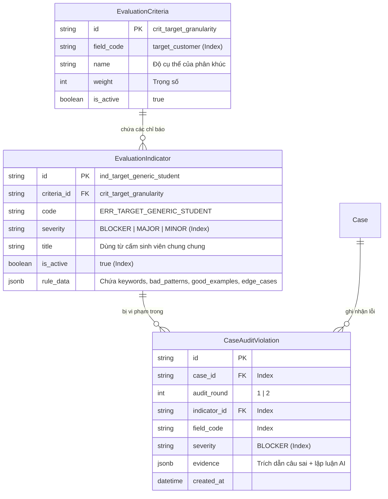

# BÁO CÁO BRAINSTORM TOÀN DIỆN: TÁI CẤU TRÚC GÓI DỊCH VỤ (79K/149K), LÕI ĐÁNH GIÁ (CORE ENGINE) & KIẾN TRÚC VÒNG ĐỜI TÀI LIỆU (DOCUMENT LIFECYCLE)

> **Tài liệu nguồn:** `temp/omp-session-2026-09-06-dialogue-clean.txt` (Phiên làm việc `01a07584-6ce3-702a-bbd2-1762647c03e3`)  
> **Thời điểm niêm phong:** 06/09/2026  
> **Người chủ trì brainstorm:** User (Product Owner / Tech Lead) & Solution Brainstormer Agent  
> **Trạng thái:** Đang đánh giá tính sẵn sàng lập kế hoạch (Plan Readiness Assessment) — Phát hiện 7 tử huyệt kiến trúc cần giải quyết trước khi lên Plan

---

## MỤC LỤC
1. [Bối cảnh lịch sử & Nguồn gốc thực tế của Nexus](#1-bối-cảnh-lịch-sử--nguồn-gốc-thực-tế-của-nexus)
2. [Hiện trạng kỹ thuật & Xử lý Pull Request #34](#2-hiện-trạng-kỹ-thuật--xử-lý-pull-request-34)
3. [Xung đột tư duy & Sự hợp nhất 3 thế hệ kiến trúc](#3-xung-đột-tư-duy--sự-hợp-nhất-3-thế-hệ-kiến-trúc)
4. [Tái cấu trúc trải nghiệm thanh toán (Payment UX) & Mô hình Credit](#4-tái-cấu-trúc-trải-nghiệm-thanh-toán-payment-ux--mô-hình-credit)
5. [Mổ xẻ "Cái lõi" đánh giá (The Core Engine) & Hệ tiêu chí](#5-mổ-xẻ-cái-lõi-đánh-giá-the-core-engine--hệ-tiêu-chí)
6. [Cơ chế chuyển đổi điểm số toán học (Deterministic Scoring) & Cứu hộ định dạng](#6-cơ-chế-chuyển-đổi-điểm-số-toán-học-deterministic-scoring--cứu-hộ-định-dạng)
7. [Kiến trúc Cơ sở dữ liệu động cho Agent: "Strong Spine, Flexible Ribs"](#7-kiến-trúc-cơ-sở-dữ-liệu-động-cho-agent-strong-spine-flexible-ribs)
8. [Tổng hợp Quyết định kiến trúc (ADR Summary) & Kế hoạch 4 giai đoạn](#8-tổng-hợp-quyết-định-kiến-trúc-adr-summary--kế-hoạch-4-giai-đoạn)
9. [Đánh giá tính sẵn sàng lập kế hoạch & 7 tử huyệt kiến trúc (Plan Readiness & Core Blockers)](#9-đánh-giá-tính-sẵn-sàng-lập-kế-hoạch--7-tử-huyệt-kiến-trúc-plan-readiness--core-blockers)
10. [Bảng đối chiếu Đã đủ vs. Còn thiếu & 3 Quyết định cốt lõi cho phiên tiếp theo](#10-bảng-đối-chiếu-đã-đủ-vs-còn-thiếu--3-quyết-định-cốt-lõi-cho-phiên-tiếp-theo)

---

## 1. BỐI CẢNH LỊCH SỬ & NGUỒN GỐC THỰC TẾ CỦA NEXUS

### 1.1. Thực tế từ 12 nhóm sinh viên tại `HƯỚNG DẪN CÁC NHÓM`
Trước khi có phần mềm web tự động, Nexus đã vận hành thực tế hỗ trợ **12 nhóm sinh viên FPT môn EXE101** (từ nhóm `0001_26` đến `0012_187` được lưu trữ tại `E:\FPT\Semester_7\EXE101\HƯỚNG DẪN CÁC NHÓM`).
- Toàn bộ dữ liệu thực chứng gồm:
  - Các bản nộp gốc của sinh viên: `_INPUT_SUBMISSION_ORIGINAL.md`
  - Các bản báo cáo thẩm định xuất bản: `_OUTPUT_FINAL_REPORT_DELIVERED.md`
  - Tài liệu đặc tả vòng đời tài liệu: `LIFECYCLE_IMPLEMENTATION_SPEC.md`
- Trong giai đoạn này, Product Owner đóng vai trò là "Human Operator":
  1. Nhận bài nộp sơ khởi qua tin nhắn riêng.
  2. Đưa bài nộp qua System Prompt được căn chỉnh thủ công trên ChatGPT.
  3. Xuất file báo cáo Markdown gửi lại cho sinh viên.
  4. Sinh viên đọc các lỗi vi phạm, chỉnh sửa bài làm và gửi lại bản cập nhật.
  5. Tiếp tục thẩm định lần 2, lần 3 cho đến khi bài đạt chuẩn Checkpoint 1.

### 1.2. Bản chất bất biến của Checkpoint 1: Vòng lặp sửa bài (Iteration Loop)
Từ dữ liệu thực tế của 12 nhóm, phát hiện một chân lý miền (Domain Insight) cốt tử:
* **Không có bất kỳ nhóm nào nộp bài 1 lần duy nhất mà đạt chuẩn ngay.**
* Bài nộp vòng 1 (`v01`) luôn mắc các lỗi ngây thơ kinh điển: Vấn đề quá rộng ("giải quyết nỗi buồn của giới trẻ"), Khách hàng mục tiêu mơ hồ ("tất cả sinh viên Việt Nam"), Giải pháp "búa tìm đinh" (đòi làm Siêu ứng dụng tích hợp AI/Blockchain mà chưa phỏng vấn được 1 khách hàng nào).
* Sau khi nhận Báo cáo thẩm định vòng 1, sinh viên **bắt buộc phải sửa bài và nộp lại vòng 2 (`v02`)** để đào sâu phân khúc hẹp và bổ sung số liệu chứng minh.
* Thực tế cho thấy: Số vòng lặp tối đa của một nhóm tại Checkpoint 1 là **3 lần (v01, v02, v03)**. Đến vòng 3, ý tưởng đã đủ độ sắc bén để tự tin pitching trước hội đồng giảng viên.

### 1.3. Hậu quả lên thiết kế mã nguồn ban đầu
- Vì nhận thấy sinh viên cần nộp bài nhiều lần cho 1 Checkpoint, kiến trúc ban đầu của Nexus đã thiết kế mô hình **Ví Credit theo Case** (sinh viên nạp credit để có lượt nộp bài lại).
- Tuy nhiên, khi đưa mô hình này lên giao diện thương mại sau buổi Demo Pitching, sự nhập nhằng giữa "mua credit trừ dần" và "mua gói dịch vụ 79k / 149k" đã tạo ra xung đột nghiêm trọng về trải nghiệm người dùng và logic State Machine.

---

## 2. HIỆN TRẠNG KỸ THUẬT & XỬ LÝ PULL REQUEST #34

### 2.1. Xác minh Cơ sở dữ liệu thực tế (Production Database)
- Đã thực hiện truy vấn trực tiếp vào bảng `service_packages` thông qua chuỗi kết nối an toàn `READONLY_DATABASE_URL`:
  - `pkg_ai_audit` (**79.000 VNĐ**): Đã tồn tại trong DB, `is_active = true`, `features` chứa mô tả gói tự động.
  - `pkg_supporter_audit` (**149.000 VNĐ**): Đã tồn tại trong DB, `is_active = true`, `features` chứa mô tả gói có Mentor thẩm định.
  - `pkg_tf_audit` (**39.000 VNĐ**): Gói cũ, đã bị vô hiệu hóa (`is_active = false`).
- **Kết luận:** Cơ sở dữ liệu thực tế **đã có sẵn 2 gói 79k và 149k**. Nhận định ban đầu của AI cho rằng "bảng ServicePackage chưa có 2 gói này" là sai sót do đọc tài liệu phân tích cũ chưa cập nhật.

### 2.2. Kiểm tra và Hợp nhất PR #34
- **PR #34 (`feat/payment-flow-shortcut-fix`)**:
  - Giải quyết bài toán: Sinh viên thanh toán mà ví thiếu tiền sẽ được chuyển hướng thẳng sang `/dashboard/payment?amount=...`, tự động tạo giao dịch VietQR với đúng số tiền còn thiếu.
  - Sau khi chuyển khoản qua SePay, Webhook cập nhật số dư ví tức thì và tự động hoàn tất đơn hàng.
- **Quyết định:** Đã hợp nhất (Merge) PR #34 vào nhánh `dev`, sau đó pull code mới nhất về nhánh làm việc `feat/pricing-package-tiers-ui`. Toàn bộ luồng thanh toán mới của 2 gói 79k/149k sẽ kế thừa 100% nền tảng vững chắc này.

---

## 3. XUNG ĐỘT TƯ DUY & SỰ HỢP NHẤT 3 THẾ HỆ KIẾN TRÚC

### 3.1. Ba thế hệ tư duy trong Nexus
1. **Thế hệ 1 (Mô hình Dịch vụ Tĩnh):** Gói bán theo số lượt đánh giá tĩnh (Gói 1 lượt, Gói 2 lượt, Gói vô hạn lượt). Phù hợp bán lẻ nhưng thiếu khả năng quản lý vòng đời tài liệu.
2. **Thế hệ 2 (Mô hình Ví Credit theo Case - Code hiện tại):** Nạp tiền vào ví  $\rightarrow$  Đổi thành Credit  $\rightarrow$  Mỗi lần nộp bài/yêu cầu báo cáo trừ 1 Credit. Linh hoạt về kỹ thuật nhưng giao diện cực kỳ khó hiểu đối với sinh viên.
3. **Thế hệ 3 (Mô hình Phân tầng Thương mại 79k/149k):** Sinh viên mua Cấp độ giải pháp (Gói 79k: Máy chấm AI tức thì; Gói 149k: Mentor người thật thẩm định chuyên sâu + 24h tư vấn).

### 3.2. Bản chất của sự xung đột
* **Xung đột 1 (Kỳ vọng người dùng vs Chi phí vận hành):** 
  - Gói 79k là **100% máy chấm**, chi phí 1 lần chạy API chỉ tốn 1.000đ – 2.000đ. Máy không biết mệt, do đó việc cho phép sinh viên nộp bài sửa lại lần 2 miễn phí trong 24 giờ là hoàn toàn khả thi và tạo ra giá trị khổng lồ cho sinh viên.
  - Gói 149k là **có Human Mentor FPT đọc và ký duyệt**. Không thể bắt Mentor đọc lại miễn phí lần 2 mà không tăng chi phí nhân sự. Giá trị vượt trội của gói 149k không nằm ở việc "chấm lại nhiều lần" mà nằm ở **Độ tin cậy được Mentor bảo chứng + Kênh chat 24h hỏi đáp trực tiếp (tối đa 3 câu hỏi đào sâu)**.
* **Xung đột 2 (Mô hình Credit ngầm vs Modal bán Credit trên UI):**
  - Người dùng không quan tâm "Credit" là gì. Sinh viên vào Nexus vì họ đang hoang mang sắp đến hạn nộp Checkpoint 1, họ chỉ muốn biết: "Tôi trả 79k thì tôi được gì? Bài tôi có qua môn không?".
  - Nếu hiện modal hỏi: *"Bạn muốn mua mấy credit?"*, sinh viên sẽ đứng hình: *"Tôi làm sao biết bài tôi cần mấy credit? 300k là mấy credit?"*.

### 3.3. Quyết định kiến trúc hợp nhất: "Bên ngoài bán Gói — Bên trong cấp Hạn mức Vòng đời"
Hệ thống hợp nhất hoàn hảo 3 thế hệ kiến trúc bằng nguyên lý phân tầng:

```
┌────────────────────────────────────────────────────────────────────────┐
│              GIAO DIỆN THƯƠNG MẠI (COMMERCIAL UX - FRONTEND)           │
│  Bán Cấp độ giải pháp rõ ràng:                                         │
│  • Gói 79k: Báo cáo AI Tức thì + 1 lần Quét lại miễn phí sau khi sửa   │
│  • Gói 149k: Mentor FPT Thẩm định & Ký tên + 24h Chat tư vấn trực tiếp │
└──────────────────────────────────┬─────────────────────────────────────┘
                                   │ Kích hoạt giao dịch
                                   ▼
┌────────────────────────────────────────────────────────────────────────┐
│            HẠN MỨC VÒNG ĐỜI NGẦM (DOCUMENT LIFECYCLE QUOTA - BACKEND)   │
│  Quản trị kỹ thuật bằng State Machine & Credit Ledger:                 │
│  • Mua Gói 79k  ──► Cấp Hạn ngạch: 2 vòng chấm AI (v01 + v02 trong 24h) │
│  • Mua Gói 149k ──► Cấp Hạn ngạch: 1 vòng Mentor ký tên + 1 Chat Session│
└────────────────────────────────────────────────────────────────────────┘
```

---

## 4. TÁI CẤU TRÚC TRẢI NGHIỆM THANH TOÁN (PAYMENT UX) & MÔ HÌNH CREDIT

### 4.1. Hành trình Người dùng Chi tiết (Persona: Hoàng Long - K19 SE ĐH FPT)
* **Bối cảnh:** Hoàng Long là nhóm trưởng nhóm 13 môn EXE101. Hiện tại là 21h30, hạn nộp bài Checkpoint 1 trên Flm/Coursera là 23h59. Nhóm Long đang cãi nhau gay gắt vì chưa thống nhất được chân dung khách hàng và giải pháp. Long vào Nexus để tìm chiếc phao cứu sinh.
* **Bước 1: Chọn gói giải pháp:**
  - Long tải file bài nộp lên màn hình Intake.
  - Màn hình hiển thị 2 thẻ gói rõ ràng:
    - Thẻ 79.000đ: "Báo cáo AI Tức thì (1 phút) — Tặng 1 lần quét lại miễn phí trong 24h để hoàn thiện bài".
    - Thẻ 149.000đ: "Mentor FPT Thẩm định (Có chữ ký bảo chứng) — Tặng 24h chat trực tiếp với Mentor".
  - Long chọn gói 79k vì cần kết quả ngay trong đêm để kịp giờ nộp bài.
* **Bước 2: Xác nhận thanh toán 1-click & Tự động tính tiền thiếu:**
  - Bấm `[Chọn gói 79.000đ]`, Modal **"Xác nhận thanh toán gói dịch vụ"** hiện lên (xóa sổ hoàn toàn ô nhập số lượng credit):
    - Tên dịch vụ: **Gói Thẩm định AI Cấp tốc**
    - Đơn giá: **79.000 VNĐ**
    - Số dư ví hiện tại: **50.000 VNĐ**
    - Số tiền cần nạp thêm: **29.000 VNĐ**
  - Long bấm nút `[Nạp thêm 29.000đ & Thanh toán]`: Hệ thống lập tức mở popup VietQR với số tiền chính xác **29.000 VNĐ**.
  - Long quét mã ngân hàng. Sau 3 giây, SePay bắn Webhook về API  $\rightarrow$  Ví nhảy lên 79.000đ  $\rightarrow$  Hệ thống tự trừ tiền và chuyển Long sang màn hình thẩm định mà Long không cần phải bấm lại nút nào!

### 4.2. Màn hình Chờ Tích cực (Active Radar Progress Screen)
Thay vì để màn hình đứng im ở trạng thái `triage_pending` vô cảm khiến sinh viên sốt ruột:
- **Gói 79k:** Hiển thị radar xoay kèm các dòng trạng thái giải thích rõ AI đang làm gì theo từng mốc giây:
  - *Giây 0 – 15:* "🔍 Đang bóc tách 13 trường dữ liệu ý tưởng và chân dung khách hàng..."
  - *Giây 15 – 35:* "⚖️ Đang đối chiếu Bộ tiêu chí Checkpoint 1 FPT EXE101 & Quét bẫy lỗi phổ biến..."
  - *Giây 35 – 50:* "📊 Đang tổng hợp khuyến nghị chỉnh sửa và đóng gói báo cáo thẩm định..."
- **Gói 149k:** Hiển thị Stepper 3 giai đoạn: `AI tạo bản nháp (Hoàn tất)`  $\rightarrow$  `Đang phân phối tới Mentor chuyên môn (Đang xử lý)`  $\rightarrow$  `Mentor duyệt & Kích hoạt kênh tư vấn 24h`.

### 4.3. Banner Nhắc nhở & Guardrail Chống Phí Lượt Quét Lần 2 (Copywriting Chuẩn)
Khi Báo cáo thẩm định lần 1 của gói 79k hiện ra:
* **Giao diện Banner nổi bật ở đầu trang báo cáo:**
  ```
  ⚡ BẠN CÒN 1 LƯỢT QUÉT LẠI MIỄN PHÍ (HẾT HẠN SAU: 23 GIỜ 58 PHÚT)
  💡 Lời khuyên quan trọng từ Nexus: Đừng vội bấm "Quét lại" ngay bây giờ!
  Hãy cùng nhóm đọc kỹ từng Lỗi nghiêm trọng (Blocker/Major) được chỉ ra ở báo cáo bên dưới. 
  Chỉnh sửa lại file bài nộp cho thật chuẩn chỉnh, sau đó mới dùng lượt quét này để kiểm tra 
  xem điểm số Checkpoint 1 của nhóm đã được nâng lên hay chưa nhé.
  ```
* **Guardrail logic khi bấm `[Quét lại bài nộp]`:*
  - Hệ thống so sánh nội dung bài nộp mới với bài nộp cũ thông qua mã băm (Hash comparison) hoặc cờ `is_intake_modified`.
  - **Nếu nội dung CHƯA HỀ ĐƯỢC CHỈNH SỬA:** Lập tức bật Modal cảnh báo màu cam:
    ```
    ⚠️ CẢNH BÁO: BÀI NỘP CHƯA CÓ THAY ĐỔI!
    Hệ thống phát hiện bạn chưa chỉnh sửa nội dung bài làm so với lần quét trước.
    Nếu quét lại ngay bây giờ, điểm số và kết quả sẽ không thay đổi, và nhóm bạn sẽ 
    LÃNG PHÍ MẤT LƯỢT QUÉT MIỄN PHÍ DUY NHẤT.

    [ Quay lại chỉnh sửa bài làm ] (Nút chính - Màu xanh nổi bật)
    [ Tôi vẫn muốn quét lại ]       (Nút phụ - Chữ xám mờ)
    ```

---

## 5. MỔ XẺ "CÁI LÕI" ĐÁNH GIÁ (THE CORE ENGINE) & HỆ TIÊU CHÍ

### 5.1. Nguồn gốc Tiêu chí & Quy trình Thẩm định Chuẩn trên Notion
* **Tài liệu tham chiếu gốc:** Bộ quy trình vận hành thủ công của Supporter trên ChatGPT do Product Owner biên soạn (`https://app.notion.com/p/H-NG-D-N-WORKFLOW-TH-C-NG-AUDIT-T-NG-B-NG-CHATGPT-38657ff9f63e8053a46fecc08e1963b5`).
* Quy trình chuẩn gồm một dây chuyền kiểm định chất lượng (Assembly Line) 4 công đoạn:
  1. **Công đoạn 1 (Context Opening - Triad Framework NMF-IPOD-CV):** Đóng khung vai trò AI là "Mentor phản biện khắt khe môn EXE101 ĐH FPT", triệt tiêu hoàn toàn tính cách "khen dạo thảo mai" hay "nói nước đôi" của LLM thông thường.
  2. **Công đoạn 2 (Input Clarification Gate):** Cơ chế chống ảo giác (Anti-Hallucination) và chống khen xảo quyệt (Anti-Flattery). Nếu sinh viên nộp bài hời hợt, AI gắn cờ vi phạm ngay ở cửa ngõ, tuyệt đối không tự suy diễn thêm thông tin để bao biện cho sinh viên.
  3. **Công đoạn 3 (Rubric Evaluation):** Bóc tách và đối chiếu 13 trường dữ liệu bài nộp với bộ tiêu chí chuẩn.
  4. **Công đoạn 4 (Report Formatting):** Đóng gói báo cáo chuẩn hóa gồm bảng tổng kết, điểm trừ và hướng dẫn hành động.

* **13 Trường dữ liệu Checkpoint 1 FPT EXE101 (Được AI bóc tách từ tài liệu bài nộp):**
  > 💡 **Lưu ý Codebase-First:** Trên giao diện web thực tế (`apps/web-1/app/dashboard/intake/` tuân thủ `Cp1IntakeSchema` trong `packages/validation`), sinh viên nộp bài bằng cách tải lên file tài liệu (PDF, DOCX, Slide) hoặc đính kèm link Google Drive. Sinh viên KHÔNG nhập 13 ô text riêng lẻ trên web. 13 trường dữ liệu dưới đây là **cấu trúc thông tin cốt lõi bên trong tài liệu bài làm** mà AI Engine có nhiệm vụ trích xuất (extract & parse) trước khi đưa vào bộ Rubrics:
  1. *Idea name* (Tên ý tưởng)
  2. *Target customer* (Khách hàng mục tiêu)
  3. *Customer story* (Bối cảnh/Câu chuyện thực tế)
  4. *Pain point* (Nỗi đau thực tế)
  5. *Current alternative* (Giải pháp thay thế hiện tại)
  6. *Solution* (Giải pháp đề xuất)
  7. *Core value proposition* (Tuyên ngôn giá trị cốt lõi)
  8. *User / Customer / Payer / Partner* (Phân định vai trò)
  9. *Evidence / Assumptions* (Bằng chứng và giả định)
  10. *Market* (Quy mô thị trường sơ bộ)
  11. *Business model* (Mô hình kiếm tiền sơ khởi)
  12. *MVP / Validation path* (Lộ trình kiểm chứng nhỏ nhất)
  13. *Team feasibility* (Khả năng thực thi của nhóm)
### 5.2. So sánh 4 Hướng Triển khai Tiêu chí
Trong buổi brainstorm, 4 hướng triển khai tiêu chí kỹ thuật đã được phân tích và đánh giá:

| Hướng Triển Khai | Cho ra điểm số? | Mức độ khách quan | Ưu điểm | Nhược điểm / Đánh giá |
| :--- | :---: | :---: | :--- | :--- |
| **1. Checklist Nhị phân (Yes/No)** | Không trực tiếp | Rất cao | Đơn giản, lập trình dễ, AI không bị lú | Quá nông cạn, không đo được độ chín muồi của ý tưởng. |
| **2. Thang đo Rubric Định tính** | Không trực tiếp | Trung bình | Sâu sắc về mặt sư phạm, giải thích cặn kẽ | Khó tự động hóa thành điểm số nhất quán. |
| **3. Điểm số Trực tiếp (0-100)** | Có | Rất thấp (Dễ ảo giác) | Trực quan cho sinh viên | **Bị loại bỏ hoàn toàn**: AI sinh số ngẫu nhiên, lần 1 chấm 52, lần 2 sửa 1 chữ chấm 80. |
| **4. Luật Trừ điểm (Rule Penalty)** | Có (Toán học) | Cực kỳ cao | Minh bạch lý do trừ điểm, có thể kiểm thử hồi quy | Cần xây dựng cây lỗi phong phú. |

**👉 Quyết định:** Nexus lựa chọn giải pháp **Lai (Hybrid)**: Kết hợp **Thang đo Rubric Định tính (Tầng 4) + Luật Trừ điểm Cơ học (Backend Deterministic Scoring)**.

### 5.3. Định nghĩa Khoa học: Cây Phân tầng 4 Cấp độ (Evaluation Hierarchy)
Khắc phục sai lầm coi 1 hạng mục là 1 check-item đơn lẻ, hệ thống chuẩn hóa cây phân tầng 4 cấp độ:

```
[TẦNG 1: HẠNG MỤC]      Field: "Khách hàng mục tiêu" (Target Customer)
        │
        ▼
[TẦNG 2: HỆ TIÊU CHÍ]   Criteria: Các thuộc tính chất lượng cốt lõi
        │               1. Độ hẹp và cụ thể của phân khúc (Granularity)
        │               2. Tính khả thi tiếp cận 5-10 người trong 1 tuần (Accessibility)
        │               3. Phân định vai trò User vs Payer (Role Separation)
        ▼
[TẦNG 3: CHỈ BÁO ĐO]    Indicators: Dấu hiệu thực chứng để nhận diện
        │               • Indicator IND-01: Chứa từ cấm chung chung ("sinh viên", "người trẻ")
        │               • Indicator IND-02: Không nêu rõ địa điểm/kênh tiếp cận thực tế
        │               • Indicator IND-03: Nhầm lẫn giữa người dùng cuối và người trả tiền
        ▼
[TẦNG 4: RUBRIC & LỖI]  Rubric Status & Severity Level
                        • Status: Good enough | Too vague | Missing | Mixed frame
                        • Severity: BLOCKER (-25đ, chặn trần 49) | MAJOR (-12đ, chặn trần 75) | MINOR (-5đ)
```

### 5.4. Phân nhánh Pipeline cho 2 Gói
* **Gói 79k (Single-pass Fast Pipeline):** Gộp toàn bộ kiểm định vào **1 file Prompt duy nhất** (`input_clarification_gate_lite_v1.md`). Thời gian chạy ~10-15 giây, chi phí LLM < 150 VNĐ/lần, tự động hoàn tất 100% không cần can thiệp con người.
* **Gói 149k (Two-pass Human-in-the-loop Pipeline):** Chạy 2 bước hoàn chỉnh (`triad_framework_v1_1`  $\rightarrow$  `input_clarification_gate_v4_1`) xuất bản nháp (Draft Report) lên Dashboard  $\rightarrow$  Supporter/Mentor FPT vào đọc, chỉnh sửa nhận xét, ký tên bảo chứng  $\rightarrow$  Xuất bản báo cáo chính thức và mở kênh Chat 24h.

---

## 6. CƠ CHẾ CHUYỂN ĐỔI ĐIỂM SỐ TOÁN HỌC (DETERMINISTIC SCORING) & CỨU HỘ ĐỊNH DẠNG

### 6.1. Bản chất của System Prompt gốc
**Khẳng định nguyên tắc bất biến: System Prompt tuyệt đối KHÔNG ĐƯỢC PHÉP xuất điểm số 0-100 trực tiếp.**
LLM chỉ chịu trách nhiệm nhận diện sự thật khách quan:
1. Xác định 3 mức độ Sẵn sàng: `READY FOR CP1`, `PARTIALLY READY FOR CP1`, hoặc `NOT READY FOR CP1 YET`.
2. Trạng thái của từng trường: `Good enough`, `Too vague`, `Missing`, `Mixed frame`.
3. Danh sách các vi phạm cụ thể tương ứng với các `indicator_id` và mức độ nghiêm trọng `severity`.

### 6.2. Công thức Tính điểm Cơ học tại Backend TypeScript
Con số điểm số hiển thị trên giao diện (ví dụ: `68/100`) được Backend tính toán bằng thuật toán toán học cơ học, đảm bảo cùng một danh sách lỗi thì 100 lần tính đều ra đúng 1 kết quả duy nhất:

$$	ext{Điểm ban đầu} = \left( rac{	ext{Số trường đạt chuẩn Good enough}}{13} 
ight) 	imes 100$$

$$	ext{Tổng điểm phạt} = \sum (	ext{Lỗi BLOCKER} 	imes 20) + \sum (	ext{Lỗi MAJOR} 	imes 8) + \sum (	ext{Lỗi MINOR} 	imes 3)$$

$$	ext{Điểm thô} = 	ext{Điểm ban đầu} - 	ext{Tổng điểm phạt}$$

### 6.3. Quy tắc Khóa Trần Điểm số (Clamping Rules)
Để ngăn chặn trường hợp bài nộp viết rất dài được nhiều điểm nhưng lại mắc phải 1 lỗi chết người (ví dụ: Ý tưởng phạm pháp, hoặc tệp khách hàng hoàn toàn không tiếp cận được) mà vẫn được điểm cao:
1. **Khóa trần lỗi BLOCKER:** Nếu bài nộp dính $\ge 1$ lỗi `BLOCKER`, điểm tổng kết **tuyệt đối không được vượt quá 49/100** (bắt buộc rớt xuống ngưỡng `NOT READY FOR CP1 YET`):
   $$	ext{Điểm kết luận} = \min(	ext{Điểm thô}, 49)$$
2. **Khóa trần lỗi MAJOR:** Nếu bài nộp không có `BLOCKER` nhưng dính $\ge 1$ lỗi `MAJOR`, điểm tổng kết **tuyệt đối không được vượt quá 75/100** (bắt buộc rớt xuống ngưỡng `PARTIALLY READY FOR CP1`):
   $$	ext{Điểm kết luận} = \min(	ext{Điểm thô}, 75)$$
3. **Giới hạn biên:** Điểm số được giới hạn trong đoạn $[10, 100]$ (không bao giờ để điểm 0 gây sốc tâm lý cực đoan, điểm sàn là 10).

### 6.4. Bộ Tự Động Cứu Hộ Định Dạng (Validator & Retry Loop)
Thay thế hoàn toàn vai trò của Human Operator khi LLM trả về định dạng vỡ cú pháp:
```
  [LLM Output Markdown] ──► [Backend Syntax & JSON Validator]
                                          │
                        ┌─────────────────┴─────────────────┐
                        ▼                                   ▼
                   [Hợp lệ 100%]                    [Lỗi vỡ cấu trúc]
             Chạy hàm tính điểm số               Gửi prompt sửa lỗi tức thì:
             Lưu kết quả & Hiển thị UI           "System notice: Output format invalid. 
                                                  Regenerate strictly adhering to schema..."
                                                 (Vòng lặp thử lại tối đa 2 lần)
```

---

## 7. KIẾN TRÚC CƠ SỞ DỮ LIỆU ĐỘNG CHO AGENT: "STRONG SPINE, FLEXIBLE RIBS"

### 7.1. Bài toán Mâu thuẫn Kỹ thuật
* **Yêu cầu 1 (Khả năng tích lũy tri thức):** Sau khi vận hành 100+ dự án, Product Owner sẽ thu thập được vô số bẫy lỗi mới, từ cấm mới, và các trường hợp biên (edge cases). Cơ sở dữ liệu phải cho phép thêm bớt thuộc tính mà không cần chạy Prisma Migration (tránh nguy cơ mất an toàn DB).
* **Yêu cầu 2 (Tốc độ truy vấn & Thống kê):** Agent cần query cực nhanh trong < 1ms danh sách Top 3 lỗi phổ biến nhất trên toàn hệ thống để làm dữ liệu đối chiếu nhanh (Fast-Path Screening).
* **Bế tắc nếu dùng giải pháp cực đoan:**
  - Ném hết vào 1 bản ghi JSON khổng lồ: Chậm, nghẽn băng thông, không thể dùng lệnh `GROUP BY` để đếm tần suất lỗi.
  - Tách thành 7-8 bảng quan hệ chuẩn tắc (Pure Relational): Cực kỳ cồng kềnh, mỗi lần sửa thuộc tính bẫy lỗi là phải đổi schema.

### 7.2. Giải pháp: Mô hình "Strong Spine, Flexible Ribs" (PostgreSQL JSONB)
Áp dụng mẫu hình thiết kế tiêu chuẩn công nghiệp (Stripe & Shopify Architecture):



* **Cột sống cứng (Strong Spine - B-Tree Index):**
  - Các trường định danh và phân loại: `id`, `field_code`, `severity`, `is_active`, `case_id`, `audit_round`.
  - Được đánh chỉ mục B-Tree chuẩn của PostgreSQL, phục vụ cho các câu lệnh đếm, lọc và thống kê cực nhanh.
* **Xương sườn mềm (Flexible Ribs - JSONB Column):**
  - Cột `rule_data` trong `EvaluationIndicator`: Thoải mái lưu mảng từ cấm, câu hỏi bẫy lỗi, kinh nghiệm mentor:
    ```json
    {
      "trigger_keywords": ["sinh viên", "mọi người", "người trẻ", "toàn quốc"],
      "bad_pattern_examples": ["Khách hàng là sinh viên các trường đại học tại Hà Nội"],
      "good_pattern_examples": ["Sinh viên năm 1-2 khối ngành kinh tế tại khu vực Cầu Giấy chi tiêu dưới 3tr/tháng"],
      "edge_case_notes": "Nếu đề tài là ứng dụng tuyển dụng B2B thì sinh viên là user chứ không phải payer."
    }
    ```

### 7.3. Cơ chế Fast-Path Screening của Agent
Nhờ kiến trúc "Strong Spine", Agent thực hiện cơ chế rà soát 2 giai đoạn siêu tốc:
1. **Truy vấn thống kê siêu tốc (< 1ms):**
   ```sql
   SELECT indicator_id, COUNT(*) as hit_frequency
   FROM case_audit_violations
   WHERE severity IN ('BLOCKER', 'MAJOR')
   GROUP BY indicator_id
   ORDER BY hit_frequency DESC
   LIMIT 3;
   ```
2. **Soi nhanh bài nộp (Fast-Path Pre-screening):**
   Agent nạp payload của đúng 3 lỗi hay gặp nhất này vào bộ nhớ làm việc. Trong 2 giây đầu tiên đọc bài nộp, Agent đối chiếu ngay xem bài có dính 3 lỗi ngớ ngẩn kinh điển này không. Nếu có, cờ vi phạm được dựng ngay lập tức trước khi bước vào phân tích sâu 13 trường.

---

## 8. TỔNG HỢP QUYẾT ĐỊNH KIẾN TRÚC (ADR SUMMARY) & KẾ HOẠCH 4 GIAI ĐOẠN

### 8.1. Bảng Tổng Hợp Quyết Định Kiến Trúc (ADR 01 – 08)

| Mã Quyết Định | Tên Quyết Định | Bản Chất Quyết Định & Đánh Đổi (Trade-offs) | Trạng Thái |
| :--- | :--- | :--- | :---: |
| **ADR-01** | Tận dụng Luồng Nạp tiền PR #34 | Chuyển hướng thanh toán thiếu tiền sang VietQR tự động. Không tự chế luồng nạp mới. | **ĐÃ CHỐT** |
| **ADR-02** | Hợp nhất Gói & Hạn mức Vòng đời | Bên ngoài bán Gói giải pháp (79k/149k) — Bên trong cấp Hạn mức vòng đời tài liệu (v01 + v02). | **ĐÃ CHỐT** |
| **ADR-03** | Bỏ Modal Credit Quantity | Xóa bỏ hoàn toàn ô chọn số lượng credit trên UI. Modal đổi thành "Xác nhận thanh toán gói dịch vụ" 1-click. | **ĐÃ CHỐT** |
| **ADR-04** | Lựa chọn Rubric + Rule Penalty | Loại bỏ chấm điểm trực tiếp 0-100 từ Prompt; kết hợp Thang đo Rubric định tính với Luật trừ điểm cơ học. | **ĐÃ CHỐT** |
| **ADR-05** | Chuẩn hóa Cây 4 Cấp độ | Cấu trúc phân tầng chuẩn: Hạng mục (Field)  $\rightarrow$  Tiêu chí (Criteria)  $\rightarrow$  Chỉ báo (Indicator)  $\rightarrow$  Rubric/Severity. | **ĐÃ CHỐT** |
| **ADR-06** | Công thức Tính điểm & Khóa trần | Backend tính điểm bằng công thức cơ học; dính `BLOCKER` khóa trần $\le 49$, dính `MAJOR` khóa trần $\le 75$. | **ĐÃ CHỐT** |
| **ADR-07** | Kiến trúc DB Hybrid PostgreSQL JSONB | "Strong Spine, Flexible Ribs": Cột cứng có B-Tree index để query nhanh; Cột `rule_data` JSONB để mở rộng tri thức không cần migration. | **ĐÃ CHỐT** |
| **ADR-08** | Cơ chế Fast-Path Screening | Agent query Top 3 chỉ báo vi phạm nhiều nhất để soi lướt bài nộp trong 2 giây đầu tiên. | **ĐÃ CHỐT** |

### 8.2. Kế hoạch 4 Giai đoạn Triển khai Mã nguồn (Implementation Roadmap)

```
┌─────────────────────────────────────────────────────────────────────────────┐
│ GIAI ĐOẠN 1: CƠ SỞ DỮ LIỆU & SEED TRI THỨC (DATABASE & KNOWLEDGE SEED)     │
│ • Kiểm tra bảng EvaluationCriteria & EvaluationIndicator (thêm JSONB)      │
│ • Seed bộ 13 trường Checkpoint 1 & danh sách Indicators lỗi phổ biến       │
│ • Tuân thủ tuyệt đối quy tắc An toàn Prisma Migration của dự án            │
└──────────────────────────────────────┬──────────────────────────────────────┘
                                       │
                                       ▼
┌─────────────────────────────────────────────────────────────────────────────┐
│ GIAI ĐOẠN 2: LÕI THẨM ĐỊNH & PROMPT PIPELINE (CORE ENGINE & PROMPTS)       │
│ • Hoàn thiện `input_clarification_gate_lite_v1.md` cho gói 79k             │
│ • Viết hàm tính điểm cơ học Deterministic Scoring & Clamping Rules tại API │
│ • Xây dựng bộ Validator kiểm tra định dạng và Retry Loop                    │
└──────────────────────────────────────┬──────────────────────────────────────┘
                                       │
                                       ▼
┌─────────────────────────────────────────────────────────────────────────────┐
│ GIAI ĐOẠN 3: BACKEND USE CASES & STATE MACHINE (BUSINESS LOGIC)             │
│ • Cập nhật Use Case nộp bài lần 2 (Resubmission Use Case) cho gói 79k       │
│ • Thiết lập thời hạn hết hạn 24 giờ cho lượt quét miễn phí                 │
│ • Dây nối webhook thanh toán VietQR với việc kích hoạt lượt thẩm định       │
└──────────────────────────────────────┬──────────────────────────────────────┘
                                       │
                                       ▼
┌─────────────────────────────────────────────────────────────────────────────┐
│ GIAI ĐOẠN 4: GIAO DIỆN NGƯỜI DÙNG & TRẢI NGHIỆM (FRONTEND & UX)            │
│ • Xóa bỏ ô nhập số lượng Credit, hoàn thiện Modal Xác nhận thanh toán gói   │
│ • Xây dựng Màn hình Chờ tích cực (Active Radar Progress Screen)             │
│ • Thêm Banner nhắc nhở 24h & Modal cảnh báo chống lãng phí lượt quét lại   │
└─────────────────────────────────────────────────────────────────────────────┘
```

---

## 9. ĐÁNH GIÁ TÍNH SẴN SÀNG LẬP KẾ HOẠCH & 7 TỬ HUYỆT KIẾN TRÚC (PLAN READINESS & CORE BLOCKERS)

### 9.0. Bối cảnh đánh giá: Từ ý tưởng thương mại đến hiện thực mã nguồn
Sau khi đối chiếu toàn diện giữa **Báo cáo ý tưởng tái cấu trúc sản phẩm (Phần 1 – 8)** với **hiện trạng mã nguồn thực tế của hệ thống** thông qua đợt khảo sát độc lập của 6 subagent `scout` (bao quát từ Frontend, Backend Hono, State Machine, Prisma Schema, Payment/Order cho đến AI Engine), Tech Lead và Hệ thống chính thức xác nhận:

> ⚠️ **KẾT LUẬN ĐANH THÉP: BẢN BRAINSTORM NÀY CHƯA ĐỦ ĐIỀU KIỆN ĐỂ LẬP IMPLEMENTATION PLAN.**

**Nguyên nhân gốc rễ (The Root Cause):**
* Toàn bộ mã nguồn hiện tại của Nexus Platform (được khởi tạo từ tháng 07/2026 và phát triển qua các PR từ #22 đến #34) được đúc khuôn cho **Mô hình Dịch vụ Tư vấn Thủ công (Manual Consulting Agency)**: Mọi case đều đi qua Admin duyệt, phân công Supporter người thật nhận việc, Supporter đọc tài liệu và nộp file báo cáo.
* Khi đưa ra ý tưởng thương mại mới về **Gói 79k (100% Máy chấm AI tức thì sau 1 phút)** và **Gói 149k (Hybrid: AI tạo nháp + Supporter duyệt bảo chứng + 24h Chat)**, chúng ta mới chỉ phác thảo "lớp vỏ ngoài" (Commercial Framing & Pricing UX).
* Khi soi chiếu xuống "lớp ruột" (State Machine, Event Bus, AI Service, Database Schema), hệ thống bộc lộ **7 tử huyệt kiến trúc đứt gãy dây chuyền**. Nếu vội vã lập plan và phân công kỹ sư/subagent viết code ngay lúc này, hệ thống sẽ rơi vào bẫy "vá lỗ thủng cục bộ", gây xung đột logic nghiêm trọng, làm sập quy trình thanh toán hoặc khiến sinh viên trả tiền xong nhưng hồ sơ bị kẹt vĩnh viễn.

Dưới đây là phân tích lập luận sâu sắc, chi tiết từng góc cạnh kỹ thuật, bối cảnh lịch sử, nguyên nhân, rủi ro vận hành và bằng chứng mã nguồn chính xác của 7 tử huyệt:

---

### 9.1. Tử huyệt 1: State Machine kẹt cứng — Gói 79k chạy trên trạng thái nào? Ai trigger transition?

#### A. Bối cảnh & Nguyên nhân cốt lõi:
Hệ thống quản lý trạng thái hồ sơ của Nexus dựa trên thư viện **XState v5** (`apps/api/src/modules/cases/domain/case-machine.ts`). Cỗ máy này được thiết kế với tư duy kiểm soát rủi ro cực đoan cho dịch vụ thủ công: không cho phép bất kỳ hành động nào diễn ra nếu thiếu sự phê duyệt của con người (Admin hoặc Supporter).

#### B. Xung đột kiến trúc với cam kết thương mại của Gói 79k:
1. **Cam kết thương mại:** Gói 79k là "Báo cáo AI Tức thì (giao bài trong 30 giây – 1 phút), tự động hóa 100%, không cần con người can thiệp".
2. **Thực tế mã nguồn FSM:**
   * Khi sinh viên nộp bài, Case được tạo với `internal_status = 'triage_pending'`.
   * Tại `triage_pending`, lối thoát duy nhất để hồ sơ tiến về phía trước là transition `T5_ACCEPT`. Transition này được bảo vệ bởi guard:
     ```typescript
     T5_ACCEPT: {
       target: 'accepted_unassigned',
       guard: and(['isAdmin', 'hasCredit', 'hasPaymentComplete']),
     }
     ```
   * **Hệ quả chết người:** Dù sinh viên đã trả đủ 79.000đ qua VietQR, hồ sơ vẫn **vĩnh viễn dừng lại ở `triage_pending`** cho đến khi có một tài khoản Admin đăng nhập vào hệ thống và bấm nút duyệt bằng tay. Cam kết "nhận bài tức thì trong đêm để kịp deadline 23h59" bị phá sản 100%!
3. **Thiếu vắng hoàn toàn danh tính AI trong FSM:**
   * Khi AI Engine phân tích xong tài liệu, tiến trình này cần chuyển trạng thái hồ sơ sang có báo cáo. Nhưng transition bàn giao báo cáo duy nhất hiện có là `T11_SUBMIT_OUTPUT`:
     ```typescript
     T11_SUBMIT_OUTPUT: {
       target: 'report_ready_to_publish',
       guard: and(['isAssignedSupporter', 'hasCredit']),
       actions: ['subtractCredit', 'lockPrice'],
     }
     ```
   * Transition này bắt buộc `isAssignedSupporter` (`event.data?.actorId === caseAssignedSupporterId`). AI Service là một tiến trình backend, không phải user supporter, không có `actorId` hợp lệ, do đó **không thể gọi được transition này để nộp báo cáo**!

#### C. Xung đột với Lượt Quét Lại Lần 2 (Resubmission V2 trong 24h):
* Khi sinh viên đã nhận Báo cáo V1, Case đang ở trạng thái `done` (hoặc `report_ready_to_publish`).
* Nếu sinh viên chỉnh sửa bài làm và bấm "Quét lại bài đã sửa", transition duy nhất từ `done` là `T19_REOPEN`:
  ```typescript
  done: {
    on: {
      T19_REOPEN: {
        target: 'supporter_working',
        guard: 'isOwner',
        actions: 'setSlaDeadline', // Tự động set deadline SLA 48h cho Supporter!
      },
    },
  }
  ```
* **Nghịch lý vận hành:** Sinh viên mua gói máy chấm 79k bấm quét lại lần 2 thì hệ thống lại biến hồ sơ thành ca làm việc của Supporter con người (`supporter_working`) và đếm ngược SLA 48h! Nexus sẽ phải trả thù lao cho Supporter một cách oan uổng.

#### D. Bằng chứng thực tế từ Scout Agent (`ScoutStateMachine`):
* `apps/api/src/modules/cases/domain/case-machine.ts` (dòng 240–243) & `case.types.ts` (dòng 17–26):
  ```typescript
  export const VALID_STATES: readonly InternalStatus[] = [
    'triage_pending', 'accepted_unassigned', 'assigned', 'supporter_working',
    'waiting_user', 'report_ready_to_publish', 'done', 'cancelled',
  ]
  ```
  Chỉ có đúng 8 trạng thái thủ công. Hoàn toàn vắng bóng các trạng thái `ai_evaluating`, `ai_completed`.
* `apps/api/src/modules/cases/application/submit-revision.usecase.ts` (dòng 180–186): `T9_SUBMIT_REVISION` chỉ đưa trạng thái về `supporter_working`, hoàn toàn không có đường cho AI re-audit.

---

### 9.2. Tử huyệt 2: Rủi ro Schema "Strong Spine, Flexible Ribs", Cold-Start & Nguy cơ Crash Foreign Key (P2003)

#### A. Bối cảnh & Nguyên nhân cốt lõi:
Báo cáo brainstorm đề xuất một mô hình cơ sở dữ liệu rất hấp dẫn về mặt lý thuyết: "Cột sống cứng, xương sườn mềm" (PostgreSQL JSONB) gồm 3 bảng `EvaluationCriteria`, `EvaluationIndicator`, và `CaseAuditViolation`. Tuy nhiên, khi đối chiếu với quy chuẩn kỹ thuật và môi trường thực tế, thiết kế này đang chứa đựng 3 rủi ro chí mạng:

#### B. 3 Rủi ro kỹ thuật chưa có lời giải:
1. **Vi phạm Quy tắc An toàn Database Production (`.agents/rules/prisma-migration-safety.md` & `Makefile`):**
   * Cơ sở dữ liệu Production của Nexus hiện tại là **Self-hosted PostgreSQL 18.4 chạy trong Docker container `nexus-db` trên VPS** (theo `docker-compose.prod.yml` và `docs/db-query-guide.md`, đã chuyển toàn bộ từ Supabase sang VPS).
   * Hệ thống vận hành với dữ liệu người dùng thật, backup định kỳ qua lệnh `pg_dump` vào `prisma/backup/` (`Makefile:80`) và deploy migration bằng lệnh `npx prisma migrate deploy` (`Makefile:64`).
   * Quy tắc an toàn bắt buộc: Tuyệt đối cấm chạy `prisma migrate dev` tự do trên production, cấm mọi lệnh destructive (DROP TABLE/COLUMN), mọi thay đổi schema phải được kiểm soát qua `--create-only` và kiểm thử migration script kỹ lưỡng trước khi deploy.
   * Việc tạo mới cùng lúc 3 bảng có quan hệ ràng buộc khóa ngoại phức tạp đòi hỏi phải có migration script an toàn, không thể làm ẩu trên VPS Production.
2. **Nguy cơ sập Foreign Key (P2003 Constraint Failure) do LLM Hallucination:**
   * Trong mô hình đề xuất, bảng `case_audit_violations` có foreign key trỏ trực tiếp đến `evaluation_indicators.id`.
   * LLM là mô hình xác suất. Dù có ép prompt hay dùng JSON Schema, vẫn luôn có tỷ lệ LLM tự bịa ra một mã `indicator_id` không tồn tại trong DB (ví dụ: `ERR_TARGET_STUDENT_V2` thay vì `ERR_TARGET_GENERIC_STUDENT`).
   * Khi Backend nhận JSON từ LLM và thực hiện câu lệnh `prisma.caseAuditViolation.createMany()`, PostgreSQL sẽ lập tức ném lỗi **Foreign Key Constraint Violation (Prisma P2003)**! Toàn bộ transaction lưu báo cáo bị rollback, sinh viên bị màn hình trắng hoặc lỗi 500 dù LLM đã chạy xong.
3. **Lỗ hổng Khởi động nguội (Cold-Start Problem):**
   * Mục 7.3 của báo cáo kỳ vọng Agent sẽ chạy câu query thần thánh:
     ```sql
     SELECT indicator_id, COUNT(*) as hit_frequency
     FROM case_audit_violations
     WHERE severity IN ('BLOCKER', 'MAJOR')
     GROUP BY indicator_id
     ORDER BY hit_frequency DESC
     LIMIT 3;
     ```
   * **Thực tế trần trụi:** Khi hệ thống vừa deploy lên production, bảng `case_audit_violations` có **0 bản ghi**. Câu query trên sẽ trả về **mảng rỗng `[]`**.
   * Báo cáo hoàn toàn không thiết kế cơ chế Fallback tĩnh (Static Hardcoded Seed Fallback). Khi query trả về rỗng, tính năng Fast-Path Screening sẽ bị treo hoặc không có dữ liệu để bơm vào prompt!
4. **Thiếu hụt dữ liệu Seed thực tế:**
   * Để chấm 13 trường của Checkpoint 1, cần bao nhiêu Criteria và bao nhiêu Indicators? Báo cáo chỉ đưa ra duy nhất 1 ví dụ minh họa (`IND-01`). Chưa hề có bảng danh mục 30–50 indicators thực tế từ 12 nhóm sinh viên FPT để nạp vào DB.

#### C. Bằng chứng thực tế từ Scout Agent (`ScoutPrismaSchema`):
* `prisma/schema.prisma`: Hoàn toàn **KHÔNG TỒN TẠI** các bảng `evaluation_criteria`, `evaluation_indicators`, `case_audit_violations`.
* `prisma/migrations/`: Không có migration nào chứa các bảng này. Bảng `audit_rounds` từng được tạo trong migration cũ `20260722000000_add_audit_rounds` nhưng đã bị **DROP sạch sẽ** ở migration `20260723182330_add_credit_ledger`.

---

### 9.3. Tử huyệt 3: Ngộ nhận giữa "Agent tự query DB siêu tốc" và thực tế Stateless Backend Service

#### A. Bối cảnh & Nguyên nhân cốt lõi:
Trong buổi brainstorm, văn phong nhân hóa AI ("Agent tự soi bài trong 2 giây", "Agent tự query DB <1ms", "Agent nạp payload vào bộ nhớ làm việc") đã tạo ra một ảo tưởng nguy hiểm về mặt kiến trúc: ngỡ rằng Nexus đang có một Autonomous Agent chạy thường trực.

#### B. Thực tế kiến trúc mã nguồn (`apps/api`):
1. **Nexus không có Autonomous Agent Runtime:**
   * Hệ thống backend là Hono framework chạy trên Node.js.
   * Module `apps/api/src/modules/ai-engine/` hiện tại chỉ sử dụng **Vercel AI SDK (`ai: ^5.0.44`, `@ai-sdk/google: ^2.0.83`)**.
   * Cơ chế hoạt động thực tế là **Stateless HTTP Request-Response**: Client gọi API $\rightarrow$ Backend chuẩn bị prompt $\rightarrow$ Gọi hàm `generateObject()` hoặc `generateText()` sang Google Gemini API $\rightarrow$ Đợi phản hồi $\rightarrow$ Lưu DB $\rightarrow$ Trả kết quả.
   * Không có agent loop (ReAct / Plan-and-Solve), không có tool-calling tự query PostgreSQL, không có bộ nhớ session (memory), và đặc biệt **không có hàng đợi tác vụ nền (Background Queue như BullMQ / Redis)**.
2. **Rủi ro Timeout HTTP (Gateway Timeout 504):**
   * Một tài liệu nộp CP1 gồm 13 trường text rất dài cộng thêm nội dung các file đính kèm.
   * Nếu chạy qua pipeline 2 bước (Triad Framework $\rightarrow$ Input Clarification Gate) trên cùng một HTTP request đồng bộ, thời gian gọi Gemini/OpenAI có thể mất từ **30 đến 60 giây**.
   * Nếu chạy trực tiếp trên HTTP handler mà không có worker nền:
     * Trình duyệt hoặc Reverse Proxy (Nginx/Cloudflare) sẽ ngắt kết nối do **HTTP 504 Gateway Timeout**.
     * Nếu kết nối mạng chập chờn, toàn bộ tiến trình phân tích bị hủy giữa chừng, gây lãng phí token và làm hỏng trạng thái hồ sơ.
3. **Khoảng trống hoàn toàn về CP1 Audit Code:**
   * Toàn bộ `apps/api/src/modules/ai-engine/` hiện tại chỉ có 2 file code phục vụ việc đánh giá Team-Idea Fit (`evaluate-team-fit.usecase.ts` và `save-team-fit.usecase.ts`).
   * Chưa có bất kỳ file prompt, service, hay validator nào được viết cho việc chấm bài Checkpoint 1.

#### C. Bằng chứng thực tế từ Scout Agent (`ScoutAiEngine`):
* `apps/api/src/modules/ai-engine/application/evaluate-team-fit.usecase.ts` (dòng 75–96): Gọi trực tiếp `generateObject()` tới model `gemini-2.0-flash` (định nghĩa tại `apps/api/src/services/google-provider.ts:23`).
* Toàn bộ codebase không có bất kỳ file nào chứa nội dung prompt của Checkpoint 1 hay Triad Framework.

---

### 9.4. Tử huyệt 4: Dây nối thanh toán (PR #34 Cutover) vẫn bị khóa cứng vào gói 39k cũ

#### A. Bối cảnh & Nguyên nhân cốt lõi:
PR #34 (`feat/payment-flow-shortcut-fix`) đã giải quyết rất xuất sắc bài toán tạo mã VietQR động khi ví thiếu tiền. Tuy nhiên, PR #34 được phát triển dựa trên codebase cũ khi hệ thống chỉ có một gói duy nhất là gói kiểm tra chuyên sâu 39.000đ (`pkg_tf_audit`).

#### B. Điểm nghẽn kỹ thuật trong mã nguồn:
1. **Hardcode gói 39k trong Helper tạo đơn hàng:**
   * Trong file `apps/api/src/modules/orders/application/credit-audit-order.helpers.ts` (dòng 7):
     ```typescript
     export const FREE_PACKAGE_KEY = "pkg_tf_free";
     export const AUDIT_PACKAGE_KEY = "pkg_tf_audit"; // Gói 39k cũ đã bị vô hiệu hóa (is_active = false)
     ```
   * Hàm `resolveCreditAuditPrice(caseId)` (dòng 58–76) được viết cứng để chỉ tìm gói `AUDIT_PACKAGE_KEY` (`pkg_tf_audit`).
   * Khi đơn hàng được thanh toán, hàm `applyPaidCreditCaseUpdate` (dòng 107–112, 121–126) tự động cập nhật Case với `package_id = AUDIT_PACKAGE_KEY`. Nghĩa là dù sinh viên có muốn mua gói 79k hay 149k, hệ thống vẫn ép hồ sơ về gói 39k cũ!
2. **Hardcode chặn nâng cấp gói:**
   * Trong `apps/api/src/modules/cases/application/upgrade-package.usecase.ts` (dòng 10, 17–19):
     ```typescript
     const ALLOWED_UPGRADE_TARGET = "pkg_tf_audit";
     if (targetPackageId !== ALLOWED_UPGRADE_TARGET) {
       throw new AppError(400, "INVALID_PACKAGE", "Gói dịch vụ không hợp lệ để nâng cấp");
     }
     ```
   * API nâng cấp gói thẳng thừng từ chối bất kỳ gói nào khác ngoài `pkg_tf_audit`. Không thể nâng cấp lên `pkg_ai_audit` (79k) hay `pkg_supporter_audit` (149k)!
3. **API `POST /orders` không nhận định danh gói dịch vụ:**
   * Tại `apps/api/src/modules/orders/application/create-order.usecase.ts` (dòng 31–40), endpoint tạo order chỉ kiểm tra `service_type === "credit_audit"`. Payload hoàn toàn không có trường nào để nhận `target_package_id`.
4. **Đứt gãy liên kết sau thanh toán:**
   * Sau khi SePay bắn Webhook xác nhận tiền vào ví $\rightarrow$ Hệ thống tự trừ tiền trong ví $\rightarrow$ Bắn event `DOMAIN_EVENTS.ORDER_PAID` (`create-order.usecase.ts:90-167`).
   * Listener duy nhất của event này là `recipients.ts:27` (chỉ gửi notification thông báo trừ tiền thành công).
   * **Hoàn toàn không có listener hay job handler nào kích hoạt tiến trình audit cho gói 79k.** Khách bị trừ 79k xong thì tiền mất nhưng bài không được chấm!

#### C. Bằng chứng thực tế từ Scout Agent (`ScoutPaymentOrder`):
* `apps/api/src/modules/orders/application/credit-audit-order.helpers.ts`: Các dòng 7, 58–76, 107–112 đều gắn chặt vào `pkg_tf_audit`.
* `apps/api/src/modules/cases/application/upgrade-package.usecase.ts`: Dòng 10 khóa cứng `ALLOWED_UPGRADE_TARGET = "pkg_tf_audit"`.

---

### 9.5. Tử huyệt 5: Hạn mức Vòng đời (Resubmission Quota 24h) chưa có nơi lưu trữ vật lý trong Schema

#### A. Bối cảnh & Nguyên nhân cốt lõi:
Nguyên lý cốt lõi của buổi brainstorm là: *"Bên ngoài bán Gói — Bên trong cấp Hạn mức Vòng đời"* (Gói 79k được cấp hạn mức: 1 lần quét đầu + 1 lần quét lại bản sửa trong vòng 24 giờ). Tuy nhiên, đây mới chỉ là khái niệm trừu tượng trong văn bản.

#### B. Sự thật từ Codebase & Điểm nghẽn kỹ thuật thực tế:
1. **Cơ chế Report Versioning ĐÃ CÓ trong Codebase (Đính chính nhận định cũ):**
   * Kiểm tra mã nguồn `get-case-detail.usecase.ts` (dòng 115–125):
     ```typescript
     const round_history = lifecycleUnits
       .map((unit: any) => {
         const report = reports.find((r: any) => r.lifecycle_unit_id === unit.id);
         return {
           round_no: unit.version_no,
           submitted_at: unit.created_at,
           submission: unit,
           report: report || null,
         };
       })
       .sort((a: any, b: any) => b.round_no - a.round_no);
     ```
   * Hệ thống **ĐÃ CÓ SẴN** cơ chế định danh vòng nộp và liên kết báo cáo thông qua bảng `lifecycle_units` (`version_no`, `unit_code` như `v00`, `v01`, `v02`) và trường khóa ngoại `reports.lifecycle_unit_id`.
   * Backend đã tự động ghép từng lần nộp (`LifecycleUnit`) với `Report` tương ứng và trả về `round_history` cho Frontend hiển thị.
2. **Tử huyệt thực sự: Thiếu Use Case AI Re-audit & Thiếu cột kiểm soát Hạn ngạch 24h:**
   * **Luồng nộp bài sửa hiện tại bị trói vào Supporter:** Khi sinh viên nộp bài sửa, tiến trình đi qua `submitRevisionUploadUseCase` (`apps/api/src/modules/cases/application/submit-revision.usecase.ts:180-186`). Usecase này kích hoạt transition `T9_SUBMIT_REVISION`, vốn chỉ đẩy hồ sơ về trạng thái `supporter_working` cho Supporter người thật đọc bài. **Hoàn toàn chưa có usecase hay nhánh rẽ nào để kích hoạt AI Re-audit tự động cho gói 79k.**
   * **Bảng `cases` thiếu cột kiểm soát hạn ngạch:**
     * Không có cột `resubmissions_left` (để kiểm tra xem sinh viên đã dùng hết 1 lượt quét lại miễn phí chưa).
     * Không có cột `resubmission_deadline_at` (mốc thời gian hết hạn đúng 24h tính từ lúc xuất bản Báo cáo V1).
   * **Chưa có cơ chế kiểm tra tài liệu thay đổi (Diff Guardrail):** Sinh viên nộp bài CP1 là nộp file tài liệu (File PDF/Docx/Link Drive) qua `Cp1IntakeSchema` (`packages/validation/src/index.ts:288-370`). Hệ thống chưa có logic so sánh hash hoặc URL của tài liệu mới trong `document_records` để ngăn chặn việc bấm quét lại khi file bài làm chưa hề được chỉnh sửa.

#### C. Bằng chứng thực tế từ Codebase:
* `apps/api/src/modules/cases/application/get-case-detail.usecase.ts` (dòng 115–125): Đã map `round_history` qua `lifecycle_unit_id`.
* `prisma/schema.prisma` (dòng 315–358): Bảng `cases` hoàn toàn không có cột `resubmissions_left` hay `resubmission_deadline_at`.
* `apps/api/src/modules/cases/application/submit-revision.usecase.ts` (dòng 180–186): `T9_SUBMIT_REVISION` chỉ phục vụ bàn giao bài cho Supporter người thật.
---

### 9.6. Tử huyệt 6: Lỗ hổng vận hành Gói 149k (Thiếu Auto-assign Supporter & Giới hạn Chat 24h)

#### A. Bối cảnh & Nguyên nhân cốt lõi:
Gói 149k bán giá trị "Có con người thẩm định và đồng hành". Để gói này vận hành trơn tru mà không làm kiệt sức đội ngũ sáng lập, cần có quy trình tự động hóa khâu điều phối và giới hạn chặt chẽ phạm vi hỗ trợ.

#### B. 3 Điểm gãy vận hành thực tế:
1. **Nghẽn cổ chai phân bổ Supporter (Manual Assignment):**
   * Trong `apps/api/src/modules/admin/application/assign-supporter.usecase.ts` (dòng 12–55), việc gán Supporter phụ thuộc 100% vào việc Admin đăng nhập web, chọn một supporter cụ thể từ danh sách và bấm nút gán (`T6_ASSIGN_SUPPORTER`).
   * Nếu sinh viên nộp bài lúc 22h đêm mà Admin đi ngủ hoặc không online, hồ sơ sẽ bị treo ở trạng thái chờ phân bổ. Cam kết SLA 24h–48h bắt đầu tính từ thời điểm nào? Nếu tính từ lúc sinh viên nộp bài thì nguy cơ vỡ SLA rất cao. Chưa hề có cơ chế Hàng chờ nhận việc (Supporter Claim Queue) hay Phân bổ xoay vòng tự động (Round-robin Auto-assign).
2. **Hở luật Khung Chat 24h (Không giới hạn 3 câu hỏi):**
   * Quy tắc đã chốt: Sinh viên được gửi **tối đa 3 câu hỏi, mỗi câu không quá 500 chữ trong 24 giờ sau khi nhận báo cáo**.
   * Kiểm tra mã nguồn `apps/api/src/modules/cases/application/send-message.usecase.ts` (dòng 10–89): Hệ thống chỉ kiểm tra độ dài tin nhắn $\le 5000$ ký tự và rate-limit 1 giây/tin. **Hoàn toàn không có biến đếm số lượng câu hỏi của sinh viên!** Sinh viên có thể gửi hàng chục tin nhắn hỏi dồn dập khiến Supporter quá tải.
   * Thời hạn đóng chat trong `chat-access.ts` (dòng 29–44) hiện đang tính từ lúc Case chuyển sang stage `completed` (`T14_COMPLETE`) hoặc khi hết credit, **không phải tính từ thời điểm xuất bản báo cáo chính thức**.
3. **Frontend Supporter bị "mù" đối với AI Draft Report:**
   * Mặc dù backend có các route API tại `apps/api/src/modules/supporter/http/supporter.routes.ts` (`GET /cases/:caseId/reports/draft`, `PUT /reports/:reportId`, `POST /reports/:reportId/publish`), nhưng kiểm tra màn hình Supporter trên web (`apps/web-1/app/supporter/case/[id]/page.tsx:89-94`):
   * Giao diện Supporter **chỉ có duy nhất một nút mở modal upload file tài liệu tĩnh (`SupporterOutputUploadModal.tsx`)**.
   * Giao diện hoàn toàn không có component hay hook nào gọi tới các API draft report! Supporter không có chỗ để đọc bản nháp của AI trên web, không có khung soạn thảo nhận xét, và không có nút duyệt Publish trực tiếp.

#### C. Bằng chứng thực tế từ Scout Agent (`ScoutSupporterChat`):
* `send-message.usecase.ts`: Không có logic đếm 3 câu hỏi.
* `apps/web-1/app/supporter/case/[id]/page.tsx`: Giao diện supporter hoàn toàn thiếu màn hình biên tập draft report.

---

### 9.7. Tử huyệt 7: Công thức tính điểm cơ học (Deterministic Scoring) cào bằng trọng số 13 trường

#### A. Bối cảnh & Nguyên nhân cốt lõi:
Để triệt tiêu hiện tượng ảo giác điểm số của LLM (lúc chấm 50, lúc chấm 80), báo cáo brainstorm đã đề xuất phương pháp toán học cơ học tại Backend. Tuy nhiên, công thức sơ khởi tại Mục 6.2 đang mắc phải một lỗi nghiêm trọng về mặt sư phạm và nghiệp vụ chấm thi.

#### B. Lỗ hổng toán học cào bằng trọng số:
* Công thức trong brainstorm:
  $$\text{Điểm ban đầu} = \left(\frac{\text{Số trường đạt chuẩn Good enough}}{13}\right) \times 100$$
* **Nghịch lý thực tế môn FPT EXE101:**
  * Công thức này coi cả 13 trường đều có giá trị ngang nhau (mỗi trường chiếm đúng $1/13 \approx 7.69\%$ tổng số điểm).
  * Trong thực tế đánh giá ý tưởng khởi nghiệp Checkpoint 1:
    * Các trường "Tên ý tưởng" (Idea name) hay "Câu chuyện khách hàng" (Customer story) chỉ mang tính dẫn nhập, hình thức.
    * Các trường "Khách hàng mục tiêu" (Target customer), "Nỗi đau thực tế" (Pain point), "Giải pháp" (Solution), và "Mô hình kinh doanh" (Business model) là **linh hồn sống còn của dự án**, quyết định 70% điểm số của hội đồng giám khảo.
  * Nếu một nhóm sinh viên viết tên dự án rất kêu, bịa một câu chuyện rất cảm động (được tính 2 trường Good enough) nhưng xác định sai hoàn toàn khách hàng mục tiêu và giải pháp viển vông, họ vẫn được cộng điểm ngang bằng với một nhóm làm rất sâu sắc phần khách hàng mục tiêu!
  * **Yêu cầu bắt buộc:** Phải xây dựng một **Ma trận Trọng số Chấm điểm (Weighted Scoring Matrix)** có tỷ trọng % rõ ràng cho 13 trường thay vì tính trung bình cộng cào bằng.

#### C. Tình trạng Dead Code trong Pipeline sinh Báo cáo:
* Kiểm tra `apps/api/src/modules/reports/infrastructure/persistence/report.repository.ts` (dòng 34–74):
  Hàm `upsertReportDraft(data: { caseId, checkpointId, lifecycleUnitId, contentMd, userId })` là **hàm mồ côi (dead code 100%)**.
* Toàn bộ mã nguồn dự án không có bất kỳ caller nào gọi hàm này. Nghĩa là hiện tại backend **chưa có mắt xích nào kết nối từ việc nộp bài Intake $\rightarrow$ đưa qua AI Engine $\rightarrow$ sinh ra bản ghi Report trong DB**!
* `packages/validation/src/index.ts`: Hoàn toàn thiếu Zod Schema chuẩn để ép kiểu và validate kết quả đầu ra có cấu trúc từ LLM trước khi đưa vào hàm tính điểm.

#### D. Bằng chứng thực tế từ Scout Agent (`ScoutAiEngine`):
* `report.types.ts` (dòng 60–66): Chỉ có hàm `normalizeReportDraftContent` kẹp `Math.min/max` thô sơ cho `completeness_score`.
* `report.repository.ts`: Hàm `upsertReportDraft` không có ai gọi.

---

### 9.8. Bằng chứng thực tế trên Frontend (`apps/web-1`)

Khảo sát từ subagent `ScoutFrontendPricing` trên giao diện web người dùng xác nhận tình trạng "vỏ một đằng, ruột một nẻo":
* **`CreditQuantityModal.tsx` vẫn chưa bỏ ô chọn số lượng credit:**
  * File `apps/web-1/app/dashboard/case/[id]/_components/CreditQuantityModal.tsx` (dòng 25, 111–120) vẫn hiển thị component `<NumberInput label="Số lượng credit" description="Từ 1 đến 50 credit" value={quantity} />`.
  * Mục tiêu ADR-03 ("Xóa sổ hoàn toàn ô nhập số lượng credit, thay bằng modal xác nhận thanh toán gói 1-click") hoàn toàn chưa được thực hiện trên code.
* **Hardcode gọi gói 39k cũ trên trang Case Detail:**
  * `apps/web-1/lib/pricing.ts` (dòng 3–9) định nghĩa `PACKAGE_KEYS.AUDIT = "pkg_tf_audit"`.
  * `apps/web-1/app/dashboard/case/[id]/page.tsx` (dòng 234) truyền cứng: `<CreditQuantityModal packageId={PACKAGE_KEYS.AUDIT} />`.
* **Vắng bóng Radar Screen & Nút Quét Lại V2:**
  * Tại `apps/web-1/app/dashboard/case/[id]/_components/TabReportFindings.tsx`, hoàn toàn không có bất kỳ radar screen, hiệu ứng quét hay thanh tiến trình AI nào.
  * Chưa có Banner đếm ngược 24h, chưa có nút "Quét lại bài đã sửa (V2)", và chưa có modal cảnh báo chống lãng phí lượt quét khi bài nộp chưa có chỉnh sửa.

---

### 9.9. Ma trận đối chiếu chéo (Cross-check Matrix) — Toàn bộ dây xích đứt gãy ở đâu

Khi xâu chuỗi và so khớp các phát hiện từ cả 6 subagent scout độc lập, toàn bộ hệ thống Nexus bộc lộ **4 mắt xích đứt gãy dây chuyền (Chain of Failures)**:

```
┌───────────────────────────────────────────────────────────────────────────────────────────────────┐
│ 1. MẮT XÍCH THANH TOÁN ──► STATE MACHINE ──► AI ENGINE (Scout 3 ↔ Scout 1 ↔ Scout 4):              │
│    • Sinh viên trả 79k qua VietQR (PR #34).                                                       │
│    • POST /orders trừ ví, bắn event ORDER_PAID ──► CHỈ GỬI NOTIFICATION (recipients.ts:27).        │
│    • KHÔNG có event listener nào kích hoạt AI Engine.                                             │
│    • Case vẫn kẹt ở triage_pending ──► BẮT BUỘC ADMIN ĐĂNG NHẬP BẤM T5_ACCEPT BẰNG TAY.           │
│    • upsertReportDraft trong report.repository.ts là DEAD CODE không ai gọi!                      │
│    ==> HẬU QUẢ: Khách trả tiền xong hệ thống đứng im 100%, vỡ tan tành cam kết SLA 1 phút.         │
├───────────────────────────────────────────────────────────────────────────────────────────────────┤
│ 2. MẮT XÍCH NỘP LẠI V2 ──► DATA MODEL ──► SUPPORTER FSM (Scout 6 ↔ Scout 2 ↔ Scout 1):             │
│    • Sinh viên bấm nộp bài sửa lần 2 trong vòng 24h.                                              │
│    • Bảng reports ĐÃ map qua lifecycle_units (round_history có sẵn trong get-case-detail).        │
│    • NHƯNG bảng cases KHÔNG có cột lưu hạn mức (resubmissions_left, resubmission_deadline_at).    │
│    • Luồng nộp bài sửa hiện tại (submitRevisionUploadUseCase) gọi T9_SUBMIT_REVISION ──► ĐẨY VỀ    │
│      supporter_working VÀ GÁN SLA 48H CHO SUPPORTER NGƯỜI THẬT!                                   │
│    • KHÔNG có Use Case hay event nào kích hoạt AI Re-audit tự động cho gói 79k.                   │
│    ==> HẬU QUẢ: Gói máy chấm 79k biến thành bắt Supporter con người đi đọc bài sửa miễn phí!      │
├───────────────────────────────────────────────────────────────────────────────────────────────────┤
│ 3. MẮT XÍCH SUPPORTER 149K ──► FRONTEND SUPPORTER ──► CHAT 24H (Scout 5 ↔ Scout 6 ↔ Scout 2):      │
│    • Backend có API draft report (/supporter/reports/:reportId).                                  │
│    • Giao diện web Supporter CHỈ CÓ NÚT UPLOAD FILE (PDF/DOCX), không hề gọi API draft report!    │
│    • Khung chat KHÔNG có biến đếm 3 câu hỏi (sinh viên có thể gửi tin nhắn vô tội vạ).            │
│    • Khóa chat 24h tính từ lúc đóng case (completed), không tính từ lúc xuất bản báo cáo.         │
│    ==> HẬU QUẢ: Supporter bị "mù" draft report trên web; khung chat bị lạm dụng không kiểm soát.   │
├───────────────────────────────────────────────────────────────────────────────────────────────────┤
│ 4. MẮT XÍCH DỮ LIỆU RUBRIC ──► AI SERVICE ──► TÍNH ĐIỂM (Scout 2 ↔ Scout 4):                      │
│    • 3 bảng evaluation_criteria, evaluation_indicators, case_audit_violations KHÔNG CÓ TRONG DB. │
│    • Cold-start khiến câu query Fast-Path Top 3 lỗi bị rỗng (0 row).                              │
│    • LLM hallucinate mã indicator lạ sẽ làm sập transaction do lỗi Foreign Key Violation (P2003). │
│    • Công thức tính điểm cào bằng 13 trường (1/13); thiếu ma trận trọng số chuyên môn.            │
│    ==> HẬU QUẢ: Điểm số thiếu cơ sở sư phạm; nguy cơ crash database khi lưu báo cáo của khách.     │
└───────────────────────────────────────────────────────────────────────────────────────────────────┘
```

---

## 10. BẢNG ĐỐI CHIẾU ĐÃ ĐỦ VS. CÒN THIẾU & 3 QUYẾT ĐỊNH CỐT LÕI CHO PHIÊN TIẾP THEO

### 10.1. Bảng Đối Chiếu Hiện Trạng Brainstorm

| Thành phần | Trạng thái trong Brainstorm | Đã đủ lên Plan chưa? | Việc cụ thể bắt buộc phải giải quyết dứt điểm |
| :--- | :---: | :---: | :--- |
| **1. Định vị 2 Gói (79k / 149k)** | Đã chốt rõ ràng, logic kinh doanh vững | **ĐỦ** | Sẵn sàng chuyển giao cho Copywriting & thiết kế UI Pricing Cards. |
| **2. State Machine Cases** | Chưa thiết kế luồng rẽ nhánh cho AI | **THIẾU** | Mở rộng `caseMachine`: bổ sung trạng thái AI tự động và luồng nộp lại V2. |
| **3. Database Criteria & Indicators** | Mới có ý tưởng schema cơ bản | **THIẾU** | Biên soạn danh mục seed ban đầu; xử lý fallback Cold-start; giải pháp chống lỗi FK. |
| **4. AI Engine Pipeline** | Mới có tên gọi các file prompt | **THIẾU** | Viết spec kỹ thuật cho TypeScript Service, chốt model, token, và Zod schema. |
| **5. Dây nối PR #34 sang 79k/149k** | Đang bị khóa cứng vào gói 39k cũ | **THIẾU** | Refactor `credit-audit-order.helpers.ts` và `POST /orders` để nhận động `package_id`. |
| **6. Lưu trữ Hạn ngạch 24h** | Mới là khái niệm trừu tượng | **THIẾU** | Chỉ định chính xác tên bảng, tên cột trong schema để lưu hạn ngạch 1 lần quét lại. |
| **7. Quản trị Supporter & Chat 149k** | Mới có luật nghiệp vụ trên giấy | **THIẾU** | Thiết kế cơ chế hàng chờ/auto-assign Supporter; thêm logic đếm 3 tin nhắn chat. |
| **8. Trọng số chấm điểm** | Cào bằng 13 trường (1/13) | **THIẾU** | Thiết lập bảng trọng số (%) thực tế cho 13 trường Checkpoint 1 FPT EXE101. |

### 10.2. 3 Quyết Định Kiến Trúc Cốt Lõi Cần Tech Lead Chốt Để Hoàn Thiện Brainstorm

Để bản brainstorm này đạt độ chín muồi và chuyển hóa thành một Implementation Plan bất khả chiến bại, phiên làm việc tiếp theo cần tập trung bàn bạc và chốt hạ dứt điểm 3 quyết định sau:

#### Quyết định 1: Thiết kế Luồng State Machine cho Gói Tự Động (FSM Architecture)
* **Bối cảnh:** `caseMachine` hiện tại là cỗ máy thủ công. Cần quyết định cách tích hợp gói AI 79k.
* **Phương án 1A (Mở rộng Monolithic State Machine):**
  * Thêm các trạng thái mới trực tiếp vào `case-machine.ts`: `ai_evaluating`, `ai_completed`.
  * Cho phép transition tự động từ `triage_pending` $\rightarrow$ `ai_evaluating` ngay khi event thanh toán thành công được kích hoạt (bỏ qua guard `isAdmin`).
  * *Ưu điểm:* Tập trung toàn bộ vòng đời vào 1 cỗ máy duy nhất, dễ quan sát tổng thể.
  * *Nhược điểm:* Tăng độ phức tạp của các guards trong `caseMachine`, nguy cơ regression các luồng cũ của Supporter nếu viết lỏng guard.
* **Phương án 1B (Tách Sub-Pipeline / Dual-Track Architecture - Khuyên dùng):**
  * Tách riêng một quy trình tự động hóa độc lập cho các Case sử dụng gói `pkg_ai_audit`.
  * Khi Case thuộc gói 79k, FSM bỏ qua hoàn toàn các bước phân loại của Admin và gán Supporter, đi thẳng theo luồng: `intake_submitted` $\rightarrow$ `ai_running` $\rightarrow$ `delivered`.
  * *Ưu điểm:* Cách ly hoàn toàn rủi ro, không làm ảnh hưởng đến mã nguồn của gói Supporter 149k.

#### Quyết định 2: Chiến lược Lưu trữ Bộ Tiêu chí & Chỉ báo (Criteria & Indicators Storage)
* **Bối cảnh:** Cần cân bằng giữa tính linh hoạt của AI và sự an toàn tuyệt đối cho DB Production trên VPS (PostgreSQL 18.4).
* **Phương án 2A (An toàn tuyệt đối — Static Code Configuration - Khuyên dùng giai đoạn 1):**
  * Chưa tạo 3 bảng SQL vội. Toàn bộ Bộ 13 trường, Tiêu chí (Criteria), và Chỉ báo lỗi (Indicators) được định nghĩa dưới dạng **File cấu hình TypeScript tĩnh có gán mã Code chuẩn** đặt tại `apps/api/src/modules/ai-engine/config/cp1-rubrics.ts`.
  * AI Service nạp trực tiếp file config này vào RAM (latency = 0ms). Khi đối chiếu, AI chỉ việc map mã vi phạm theo danh mục tĩnh.
  * Kết quả vi phạm được lưu thẳng vào cột JSONB của bản ghi `reports.content_md`.
  * *Ưu điểm:* **Bằng 0 rủi ro sập DB**, không cần chạy migration trên VPS Production, không bao giờ sợ lỗi Foreign Key Violation (P2003), triển khai cực nhanh.
* **Phương án 2B (Database Dynamic Tables — "Strong Spine, Flexible Ribs"):**
  * Chạy Prisma Migration tạo 3 bảng `evaluation_criteria`, `evaluation_indicators`, `case_audit_violations`.
  * Nạp seed data vào DB qua migration.
  * *Ưu điểm:* Cho phép viết trang Admin UI để thêm bớt từ cấm/bẫy lỗi mà không cần redeploy code.
  * *Nhược điểm:* Nguy cơ cao gặp lỗi P2003 khi LLM hallucinate; phức tạp hóa khâu migration và bảo trì dữ liệu trên VPS Production.
#### Quyết định 3: Cơ chế Quản lý Hạn mức Quét Lại 24H (Resubmission Quota Mechanism)
* **Bối cảnh:** Cần một nơi lưu trữ xác thực và đáng tin cậy để quản lý 1 lượt quét lại miễn phí của gói 79k.
* **Phương án 3A (Thêm cột trực tiếp vào bảng `cases`):**
  * Tạo migration thêm 2 cột vào model `Case`:
    * `resubmissions_left Int @default(0)`
    * `resubmission_deadline_at DateTime?`
  * Khi mua gói 79k: Set `resubmissions_left = 1`. Khi xuất bản Báo cáo V1: Set `resubmission_deadline_at = now() + 24h`.
  * Khi sinh viên bấm quét lại: Kiểm tra `resubmissions_left > 0` và `now() < resubmission_deadline_at`, sau đó trừ về 0.
  * *Ưu điểm:* Đơn giản, trực quan, query cực nhanh, dễ hiểu cho toàn bộ đội ngũ.
* **Phương án 3B (Quản lý dựa trên Lifecycle Units):**
  * Không sửa schema bảng `cases`. Tận dụng cấu trúc bảng `lifecycle_units` hiện có:
  * Kiểm tra số lượng `lifecycle_units` thuộc loại `version` gắn với Checkpoint hiện tại. Nếu mới có `v01` và thời gian tạo `v01` chưa quá 24h thì cho phép tạo tiếp `v02`. Nếu đã có `v02` thì từ chối.
  * *Ưu điểm:* Giữ nguyên schema bảng `cases`, tuân thủ triệt để tài liệu `LIFECYCLE_IMPLEMENTATION_SPEC.md`.

---
*Báo cáo được chuẩn hóa và niêm phong đầy đủ toàn bộ ngữ cảnh kỹ thuật, kinh doanh và dữ liệu thực tế từ buổi làm việc.*
